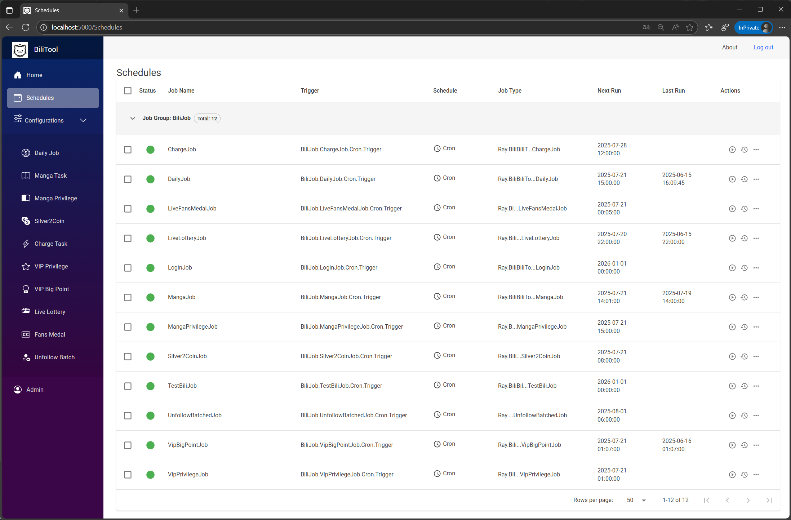
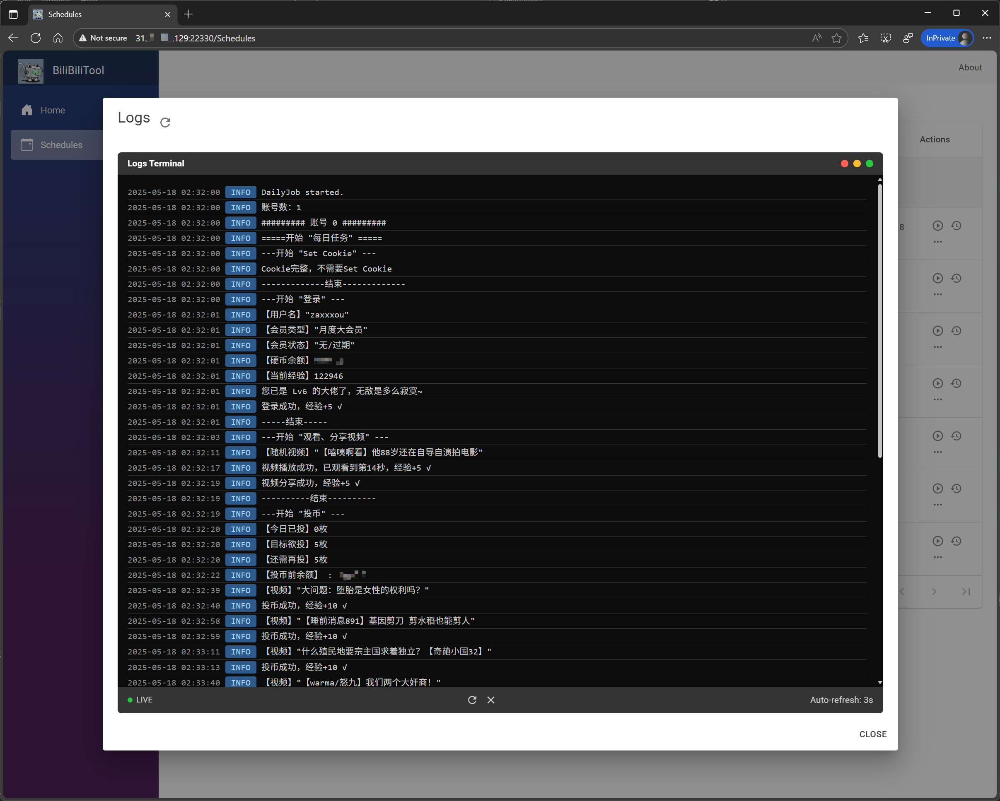
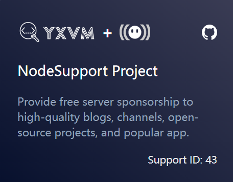

<div align="center">

<h1 align="center">

BiliTool

</h1>

[](https://github.com/RayWangQvQ/BiliBiliToolPro/stargazers)
[](https://github.com/RayWangQvQ/BiliBiliToolPro/network)
[](https://github.com/RayWangQvQ/BiliBiliToolPro/issues)
[](https://github.com/RayWangQvQ/BiliBiliToolPro/graphs/contributors)
[](https://github.com/RayWangQvQ/BiliBiliToolPro/releases)
[](https://github.com/RayWangQvQ/BiliBiliToolPro/releases)
[](https://github.com/RayWangQvQ/BiliBiliToolPro/blob/main/LICENSE)

</div>

**BiliTool 是一个自动执行任务的工具，当我们忘记做某项任务时，它会像一个贴心小助手，按照我们预先吩咐它的命令，在指定频率、时间范围内帮助我们完成计划的任务。**
**BiliTool is an automated task execution tool that acts as a helpful assistant, following pre-configured commands to complete planned tasks within specified frequencies and timeframes when we forget to do them.**

主要功能如下：

- **扫码登录，自动更新cookie**
- **每日获取满额升级经验（登录、投币、点赞、分享视频）（支持指定支持up主）**
- **直播间挂机**
- **每天漫画签到**
- **每天直播签到**
- **直播中心银瓜子兑换为硬币**
- **每月领取大会员赠送的 5 张 B 币券和福利（忘记或者不领就浪费了哦）**
- **每月领取大会员漫画福利**
- **月底在 B 币券过期前进行充电（支持指定想要支持的up主，如果没有喜欢的up，也可以为自己充个电啊，做个用爱为自己发电的人~）**
- **直播中心天选时刻自动参与抽奖**
- **批量取关**
- **大会员大积分任务**
- **支持多账号**
- **理论上支持所有远端的日志推送（默认支持推送到Telegram、企业微信、钉钉、PushPlus、Server酱、钉钉、酷推，另外也支持自定义推送到任意api）**
---
[目录]

<!-- TOC depthFrom:2 -->

- [1. 如何使用](#1-如何使用)
    - [1.1. 部署 BiliTool](#11-部署-bilitool)
        - [1.1.1. 方式一：Docker 或 Podman 容器化运行（推荐）](#111-方式一docker-或-podman-容器化运行推荐)
        - [1.1.2. 方式二：青龙](#112-方式二青龙)
        - [1.1.3. 方式三：下载程序包到本地或服务器运行](#113-方式三下载程序包到本地或服务器运行)
        - [1.1.4. 方式四：Chart部署](#114-方式四chart部署)
    - [1.2. 消息推送（可选）](#12-消息推送可选)
- [2. 功能任务说明](#2-功能任务说明)
- [3. 个性化自定义配置](#3-个性化自定义配置)
- [4. 多账号支持](#4-多账号支持)
- [5. 常见问题](#5-常见问题)
- [6. 版本发布及更新](#6-版本发布及更新)
- [7. 成为开源贡献成员](#7-成为开源贡献成员)
    - [7.1. 贡献代码](#71-贡献代码)
    - [7.2. 贡献文档](#72-贡献文档)
- [8. 捐赠支持](#8-捐赠支持)
- [9. 其他](#9-其他)

<!-- /TOC -->

---
**Github 仓库地址：[RayWangQvQ/BiliBiliToolPro](https://github.com/RayWangQvQ/BiliBiliToolPro)**

**注意：**

- **本应用仅用于学习和测试，作者本人并不对其负责，请于运行测试完成后自行删除，请勿滥用！**
- **所有代码都是开源且透明的，任何人均可查看，程序不会保存或滥用任何用户的个人信息**
- **应用内几乎所有功能都开放为了配置（如任务开关、日期、id等），详细信息可阅读配置文档**

运行图示：

<p align="center">
    
    
</p>

## 1. 如何使用

BiliTool 实现自动完成任务的原理，是通过调用一系列开放的api实现的。

**要使用 BiliTool，很简单，按照下面教程部署完成，运行后扫码登录即可。**

### 1.1. 部署 BiliTool

支持多种部署方式，以下选择任一适合自己的方式即可。

#### 1.1.1. 方式一：Docker 或 Podman 容器化运行（推荐）

[>>Docker 部署说明](docker/README.md)

[>>Podman 部署说明](podman/README.md)

#### 1.1.2. 方式二：青龙

[>>青龙部署教程](qinglong/README.md)

#### 1.1.3. 方式三：下载程序包到本地或服务器运行

[>>本地部署说明](docs/runInLocal.md)

#### 1.1.4. 方式四：Chart部署

[>>Chart部署说明](helm/README.md)

### 1.2. 消息推送（可选）

如果配置了推送，执行成功后，指定的接收端会收到推送消息，推送效果如下所示：

<p align="center">
    
</p>

目前默认支持**Telegram推送、PushPlus推送、企业微信应用推送、企业微信推送、钉钉推送、Microsoft Teams推送、Server酱推送和酷推QQ推送**（以上顺序即为个人推荐的排序），如果需要推送到其他端，也可以配置为任意的可以接受消息的Api地址，关于如何配置推送请详见下面的**个性化自定义配置**章节。

## 2. 功能任务说明

这里的**任务**是指一组功能的集合，是工具每次运行的最小单位。

任务列表如下：

| 任务名 | Code | 功能 | 推荐运行频率 | 备注 |
| :----: | :----: | :----: | :----: | :----: |
| 扫码登录 | Login | 试用bili app扫码登录，用于第一次运行时初始化cookie，或cookie过期时的更新。不同平台会将cookie存储到不同地方，青龙存储到环境变量中，其他会存储到cookies.json中 | 手动 | |
| 每日任务 | Daily | 完成每日任务获取满额65点经验（登录、观看视频、分享视频、投币），以及签到、领福利和充电等附属功能 | 每天一次 | |
| 天选时刻抽奖 | LiveLottery | 直播中心天选时刻抽奖 | 建议每天运行0-4次 | 对应Actions工作流默认是关闭的，需要添加key为`ISOPENLIVELOTTERYTASK`、值为`true`的secret来手动开启；大部分抽奖都需要关注主播，介意的不要开启 |
| 批量取关 | UnfollowBatched | 批量取关指定分组下的所有关注（主要用于清理天选抽奖而产生的关注） | 需要时手动运行 | 需要通过配置指定2个参数：`GroupName`（分组名称，如`天选时刻`）和`Count`（目标取关个数，-1表示全部），应用会倒序从后往前取关指定个数 |
| 大会员大积分 | VipBigPoint | 大会员大积分任务（签到、浏览、观看） | 每天凌晨一点运行 | |
| 直播间挂机 | LiveFansMedal | 直播间挂机 | 每天一次 | |
| 测试Cookie | Test | 测试Cookie是否正常 | 需要时手动运行 | 主要用于调试 |

## 3. 个性化自定义配置

[>>点击查看配置说明文档](docs/configuration.md)

## 4. 多账号支持

部署成功后，直接去运行扫码登录任务，扫码成功后，应用会自动更新或添加cookie。

青龙平台会添加环境变量里，Key 为 `Ray_BiliBiliCookies__0`、`Ray_BiliBiliCookies__1`、`Ray_BiliBiliCookies__2`...

其他平台默认会添加到名为cookies.json的账号配置文件中：
```
{
  "BiliBiliCookies": [
    "cookie1",
    "cookie2",
    "...",
  ],
}

```

## 5. 常见问题

[>>点击查看常见问题文档](docs/questions.md)

[Issues（议题）](https://github.com/RayWangQvQ/BiliBiliToolPro/issues)板块可以用来提交**Bug**和**建议**；

[Discussions（讨论）](https://github.com/RayWangQvQ/BiliBiliToolPro/discussions)板块可以用来**提问**和**讨论**。

大部分问题其实都可以在文档、议题和讨论中找到答案。

所以如果你有疑问，

* 请先确认是否可以通过升级到最新版本解决
* 然后搜索文档（特别是配置说明文档和常见问题文档）、议题和讨论，查看是否已有其他人遇到相同问题、是否已有解决方案

如果确认还未解决，可以自己提交 Issue，或发布 Discussions 与大家一起探讨，我会尽快确认并解决。

（关于如何正确的提交Issue，请详见**常见问题文档**）。

## 6. 版本发布及更新

当前正处于稳定的迭代开发中，详细待更新和计划内容可参见 [Projects](https://github.com/RayWangQvQ/BiliBiliToolPro/projects) 和 [Issues](https://github.com/RayWangQvQ/BiliBiliToolPro/issues) 。

想要有重要更新时收到通知的话，可以把仓库右上角的`Star`按钮点亮。

## 7. 成为开源贡献成员

### 7.1. 贡献代码

如果你有好的想法，欢迎向仓库贡献你的代码，贡献步骤：

* 搜索查看 Issue，确定是否已有人提过同类问题
* 对于不确定的主题，为避免code结束后PR不被接受，可以先新建 Issue，描述问题或建议，讨论清楚后再动手编码
* 如果确认自己可以解决，请 Fork 仓库后，在**develop 分支**进行编码开发，完成后**提交 PR 到 develop 分支**

我会尽快进行代码审核，测试成功后会合并入 main 主分支，提前感谢您的贡献。

### 7.2. 贡献文档

文档部分由于我个人精力有限（写文档比写代码累多了），所以有些地方写的很简略，甚至有遗漏和错别字，不能贡献代码的朋友也欢迎来一起维护文档，欢迎 PR 来纠正我，一样都算是对开源做贡献了。

## 8. 捐赠支持

个人维护开源不易

如果觉得我写的程序对你小有帮助

或者，就是单纯的想集资给我买瓶霸王增发液

那么下面的赞赏码可以扫一扫啦

（赞赏时记得留下【昵称】和【留言】~ 另外我发现很多留言想要进群或者加好友的，一定一定要记得留下微信号哈，微信赞赏页面是看不到微信号的）

**☟☟☟ 扫码自动赞赏 1 元：☟☟☟**


> 项目中的优先支持的UP主的配置项，默认是作者的 UpId （只是作为了 JSON 配置文件的默认值，代码是干净的），需要更改的话，直接修改相应配置即可（secrets或环境变量等各种方式都行）。
当然，不改的话，也算是另一种捐赠支持作者的方式啦。

感谢支持~

## 9. 其他

`API`参考：

- [www.bilibili.com](https://www.bilibili.com/)

- [SocialSisterYi/bilibili-API-collect](https://github.com/SocialSisterYi/bilibili-API-collect)

- [JunzhouLiu/BILIBILI-HELPER](https://github.com/JunzhouLiu/BILIBILI-HELPER)

❤️Thanks to `JetBrain` for the free certificate support:

<p align="center">
    
</p>

❤️Thanks to [YxVM](https://yxvm.com/aff.php?aff=668) & [NodeSeekDev](https://github.com/NodeSeekDev/NodeSupport) for sponsoring the server for testing support:

<p align="center">
    <a href="https://yxvm.com/aff.php?aff=668">
        
    </a>
</p>

[](https://www.star-history.com/#RayWangQvQ/BiliBiliToolPro&Date)
