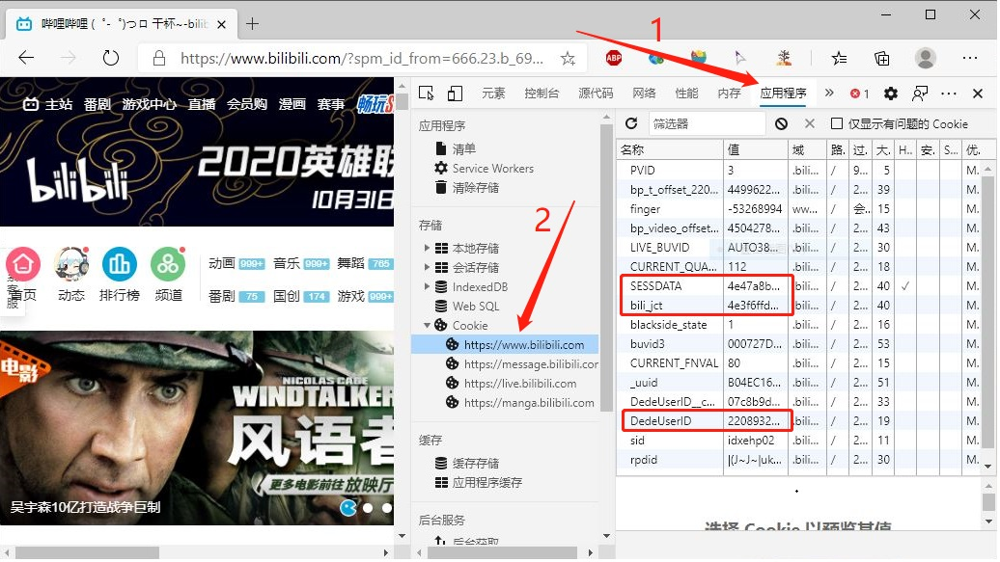
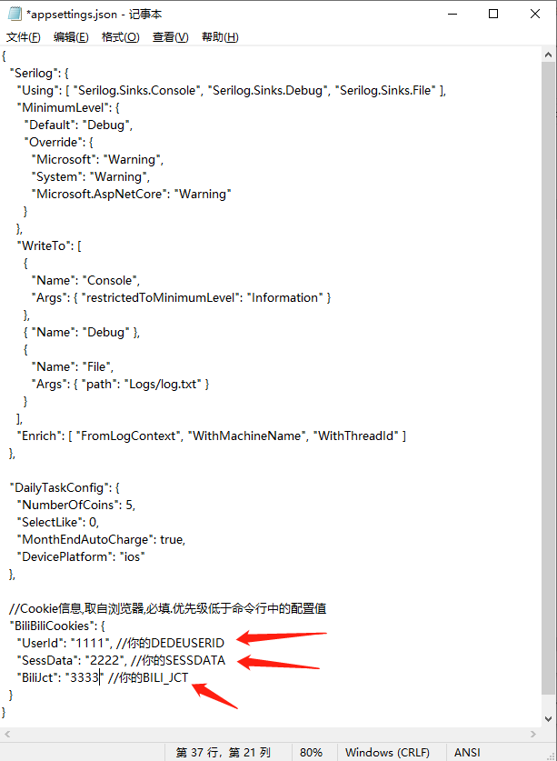
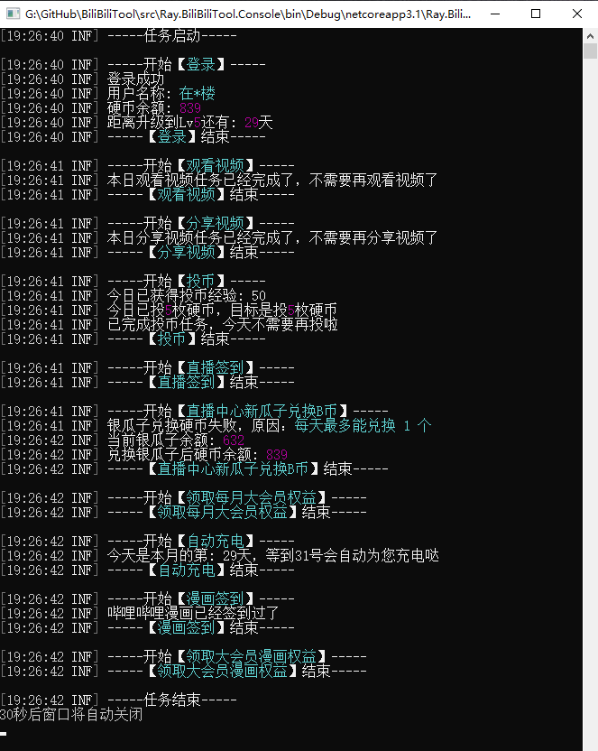

<div align="center">

<h1 align="center">

BiliBiliTool

</h1>

[](https://github.com/RayWangQvQ/BiliBiliToolPro/stargazers)
[](https://github.com/RayWangQvQ/BiliBiliToolPro/network)
[](https://github.com/RayWangQvQ/BiliBiliToolPro/issues)
[](https://github.com/RayWangQvQ/BiliBiliToolPro/graphs/contributors)
[](https://github.com/RayWangQvQ/BiliBiliToolPro/releases)

[](https://github.com/RayWangQvQ/BiliBiliToolPro/blob/main/LICENSE)

</div>

[目录]

<!-- TOC depthFrom:2 -->

- [1. 如何使用](#1-如何使用)
    - [1.1. 第一步：获取自己的 Cookie](#11-第一步获取自己的-cookie)
    - [1.2. 第二步：配置 Cookie 并运行 BiliBiliTool](#12-第二步配置-cookie-并运行-bilibilitool)
        - [1.2.1. 方式一：xxx](#121-方式一xxx)
        - [1.2.2. 方式二：下载程序包到本地或服务器运行](#122-方式二下载程序包到本地或服务器运行)
        - [1.2.3. 方式三：腾讯云函数SCF](#123-方式三腾讯云函数scf)
        - [1.2.4. 方式四：docker容器化运行（推荐）](#124-方式四docker容器化运行推荐)
- [2. 功能任务说明](#2-功能任务说明)
- [3. 个性化自定义配置](#3-个性化自定义配置)
- [4. 多账号支持](#4-多账号支持)
- [5. 常见问题](#5-常见问题)
- [6. 版本发布及更新](#6-版本发布及更新)
- [7. 成为开源贡献成员](#7-成为开源贡献成员)
    - [7.1. 贡献代码](#71-贡献代码)
    - [7.2. 贡献文档](#72-贡献文档)
- [8. 捐赠支持](#8-捐赠支持)
- [9. API 参考](#9-api-参考)

<!-- /TOC -->

**BiliBiliTool 是一个 B 站自动执行任务的工具，当我们忘记做 B 站的某项任务时，它会像一个小助手一样，按照我们预先吩咐她的命令，在指定时间、按照指定频率，帮助我们自动完成计划的任务。**

比如，当我们忘记领取自己的大会员福利时，她会帮助我们在月初自动领取；当我们忘记完成每日任务时，她会辅助我们自动完成所有任务，获取每日的满额65点经验值，快速升级 Lv6 ；当然我们也可以用她来支持我们喜欢的up主，拒绝白嫖~

详细功能如下：

- **每日获取满额升级经验（登录、投币、点赞、分享视频）（支持指定支持up主）**
- **每天漫画签到**
- **每天直播签到**
- **直播中心银瓜子兑换为硬币**
- **每月领取大会员赠送的 5 张 B 币券和福利（忘记或者不领就浪费了哦）**
- **每月领取大会员漫画福利**
- **月底在 B 币券过期前进行充电（支持指定想要支持的up主，如果没有喜欢的up，也可以为自己充个电啊，做个用爱为自己发电的人~）**
- **直播中心天选时刻自动参与抽奖**
- **批量取关**
- **支持多账号**
- **理论上支持所有远端的日志推送（默认支持推送到Telegram、企业微信、钉钉、PushPlus、Server酱、钉钉、酷推，另外也支持自定义推送到任意api）**

还有其他一些辅助小功能，大家可以自己去自由探索~


**Github 仓库地址：[RayWangQvQ/BiliBiliTool](https://github.com/RayWangQvQ/BiliBiliToolPro)**

**注意：**

- **本应用仅用于学习和测试，作者本人并不对其负责，请于运行测试完成后自行删除，请勿滥用！**
- **所有代码都是开源且透明的，任何人均可查看，程序不会保存或滥用任何用户的个人信息**
- **应用内几乎所有功能都开放为了配置（如任务开关、日期、upId等），请仔细阅读配置文档，自己对自己的配置负责**

_（如果图片挂了，是因为 GitHub 的服务器在国外，经常会刷不出，有梯子的可以架起梯子，没有的也可以先参考 [我的博客](https://www.cnblogs.com/RayWang/p/13909784.html)，但博客内容不保证最新)_

## 1. 如何使用

BiliBiliTool 实现自动完成任务的原理，是通过调用一系列 B 站开放的api实现的。

BiliBiliTool 就是收集了一系列api，通过每日自动运行程序，依次调用接口，来实现各任务的。

**要使用 BiliBiliTool，我们只需要做两步：获取自己的 Cookie 作为配置，然后将其输入 BiliBiliTool 并运行即可。**

### 1.1. 第一步：获取自己的 Cookie

- 浏览器打开并登录 [bilibili 网站](https://www.bilibili.com/)
- 登录成功后，访问 `https://api.bilibili.com/x/web-interface/nav`，按 **F12** 打开"开发者工具"，按 **F5** 刷新一下
- 在"开发者工具"面板中，点击 **网络（Network）**，在左侧的请求列表中，找到名称为 `nav` 的接口，点击它
- 依次查找 **Headers** ——> **RequestHeader** ——> **cookie**，可以看到很长一串以英文分号分隔的字符串，复制整个这个cookie字符串（不要使用右键复制，请使用 Ctrl+C 复制，部分浏览器右键可能会进行 UrlDecode ），保存它们到记事本，待会儿会用到。



### 1.2. 第二步：配置 Cookie 并运行 BiliBiliTool

运行 BiliBiliTool 主要有 5 种方式：
* Github Actions
* 下载Release包到本地或服务器运行
* 云函数部署
* docker容器化运行
* 青龙运行

熟悉 GitHub 的朋友，推荐使用方式一，可以实现线上的每天自动运行，不需自己动手，一劳永逸。

想先快速运行一下尝个鲜、或是要部署到自己服务器的朋友，可以跳转到方式二 Release 包运行，操作简单快速。

云函数则可以作为 GitHub Actions 的替代平台，优点是触发器独立灵活、可以国内ip，缺点是日志浏览很不人性。

熟悉docker的朋友，可以跳转到方式四 docker容器化运行，以后因为可能涉及到需要持久话的功能，Serverless就不太方便，所以有能力、有条件的话还是建议使用docker。

已经部署好了青龙面板跑其他自动任务的朋友，也可以直接在青龙面板中跑BiliBiliTool。

以下 5 种方式任选一种适合自己的即可。

#### 1.2.1. 方式一：xxx
暂时删掉该方式避避风头，详情见 [552号议题](https://github.com/RayWangQvQ/BiliBiliTool/issues/552)。

也建议所有还在使用该方式运行的朋友，暂时先替换为下面的其他运行方式，避免造成不必要的损失。

#### 1.2.2. 方式二：下载程序包到本地或服务器运行

如果是 DotNet 开发者，直接 clone 源码然后 vs 打开解决方案，配置 Cookie 后即可直接本地进行运行和调试。

对于不是开发者的朋友，可以通过下载 Release 包到本地或任意服务器运行，步骤如下。
<details>

Ⅰ. **下载应用文件**

点击 [BiliBiliTool/release](https://github.com/RayWangQvQ/BiliBiliToolPro/releases)，下载已发布的最新版本。

* 如果本地已安装 `.NET 6.0` 环境：

请下载 `net-dependent.zip` 文件，本文件依赖本地运行库（runtime-dependent），所以文件包非常小（不到1M）。

P.S.这里的运行环境指的是 `.NET Runtime 6.0.0` ，安装方法可详见 [常见问题](docs/questions.md) 中的 **本地或服务器如何安装.net环境**

* 如果不希望安装或不知如何安装.net运行环境：

请根据操作系统下载对应的 zip 文件，此文件已自包含（self-contained）运行环境，但相较不包含运行时的文件略大（20M 左右，Github 服务器在国外，下载可能比较慢）。

如，Windows系统请下载 `win-x86-x64.zip` ，其他以此类推。


Ⅱ. **解压并填写配置**

下载并解压后，找到 appsettings.json 文件，使用记事本编辑，将之前获取到的 Cookie 字符串填入指定位置，保存后关闭：



Ⅲ. **运行**

* Windows 系统

对于已安装.net环境，且使用的是依赖包，可在当前目录下执行命令：`dotnet Ray.BiliBiliTool.Console.dll`，或者直接双击运行名称为 start.bat 的批处理文件，均可运行。

对于使用自包含运行环境版本的，可直接双击运行名称为 Ray.BiliBiliTool.Console.exe 的可执行文件。

* Linux 系统

对于已安装.net环境，且使用的是依赖包，同上，可在终端中执行命令：`dotnet Ray.BiliBiliTool.Console.dll`

对于使用独立包的，可在终端中执行命令：`Ray.BiliBiliTool.Console`。

其他系统依此类推，运行结果图示如下：



除了修改配置文件，也可以通过添加环境变量或在启动命令后附加参数来实现配置，详细方法可参考下面的**配置说明**章节。

</details>

#### 1.2.3. 方式三：腾讯云函数SCF

[>>腾讯云函数部署说明](tencentScf/README.md)

#### 1.2.4. 方式四：docker容器化运行（推荐）

[>>docker部署说明](docker/README.md)

#### 1.2.5. 方式五：青龙运行

[>>青龙部署教程](qinglong/README.md)


如果配置了推送，执行成功后接收端会收到推送消息，推送效果如下所示：


目前默认支持**PushPlus推送、企业微信推送、钉钉推送、Telegram推送、Server酱推送和酷推QQ推送**（以上顺序即为个人推荐的排序），如果需要推送到其他端，也可以配置为任意的可以接受消息的Api地址，关于如何配置推送请详见下面的**个性化自定义配置**章节。

## 2. 功能任务说明
这里的**任务**是指一组功能的集合，是工具每次运行的最小单位。工具启动后会根据我们输入的任务编码，运行相应的任务，如：

```
dotnet Ray.BiliBiliTool.Console.dll --runTasks=Daily
```

程序启动后，会执行任务Code为 `Daily` 的`每日经验任务`。

可以通过使用 `&` 符拼接多个任务，程序启动后会按顺序依次执行指定的任务集合，如

```
dotnet Ray.BiliBiliTool.Console.dll --runTasks=Daily&LiveLottery
```

会依次运行`每日任务`和`天选抽奖任务`。

一般来说，每个任务都有一个 GitHub Actions 的工作流脚本（workflow）对应，划分的依据主要是根据功能需求，其次是触发频率（比如，有些每天只需运行一次，有些需要允许多次）。

任务列表如下：

| 任务名 | Code | 功能 | 默认WorkFlow文件 | GithHub Environments | 推荐运行频率 | 备注 |
| :----: | :----: | :----: | :----: | :----: | :----: | :----: |
| 每日任务 | Daily | 完成每日任务获取满额65点经验（登录、观看视频、分享视频、投币），以及签到、领福利和充电等附属功能 | bilibili-daily-task.yml | Production | 每天一次 | |
| 天选时刻抽奖 | LiveLottery | 直播中心天选时刻抽奖 | live-lottery-task.yml | LiveLottery | 建议每天运行0-4次内 | 对应Actions工作流默认是关闭的，需要添加key为`ISOPENLIVELOTTERYTASK`、值为`true`的secret来手动开启；大部分抽奖都需要关注主播，介意的不要开启 |
| 批量取关 | UnfollowBatched | 批量取关指定分组下的所有关注（主要用于清理天选抽奖而产生的关注） | unfollow-batched-task.yml | 无 | 需要时手动运行 | 需要通过配置指定2个参数：`GroupName`（分组名称，如`天选时刻`）和`Count`（目标取关个数，-1表示全部），应用会倒序从后往前取关指定个数 |
| 测试Cookie | Test | 测试Cookie是否正常 | 无，可以使用empty-task.yml来运行 | 无 | 需要时手动运行 | 主要用于调试 |
| 空模板 | 无（只用于 GitHub Actions ） | 用于 GitHub Actions 运行指定的任意任务 | empty-task.yml | 无 | 需要时手动运行 | 需要通过配置指定要运行的任务Code（多个使用英文逗号分隔），主要用于调试 |

## 3. 个性化自定义配置

[>>点击查看配置说明文档](docs/configuration.md)

## 4. 多账号支持

对于 GitHub Actions 托管的，可以通过添加 Key 为 `COOKIESTR2` 和 `COOKIESTR3` 的 Secret ，来支持最多 3 个账号。

对于其他本地或 docker 托管的，因配置项 `BiliBiliCookies` 被设计为一个字符串数组，所以理论可以添加任意个数的账号。例如，使用环境变量配置的话，可以添加 Key 为 `Ray_BiliBiliCookies__2`、`Ray_BiliBiliCookies__3`、`Ray_BiliBiliCookies__4`...的环境变量，以此类推。

## 5. 常见问题

[>>点击查看常见问题文档](docs/questions.md)

[issues（议题）](https://github.com/RayWangQvQ/BiliBiliToolPro/issues)板块可以用来提交**Bug**和**建议**；

[discussions（讨论）](https://github.com/RayWangQvQ/BiliBiliToolPro/discussions)板块可以用来**提问**和**讨论**。

大部分问题其实都可以在文档、议题和讨论中找到答案。

所以如果你有疑问，

* 请先确认是否可以通过升级到最新版本解决
* 然后搜索文档（特别是配置说明文档和常见问题文档）、议题和讨论，查看是否已有其他人遇到相同问题、是否已有解决方案

如果确认还未解决，可以自己提交 issue，或发布 discussions 与大家一起探讨，我会尽快确认并解决。

（关于如何正确的提交issue，请详见**常见问题文档**）。

## 6. 版本发布及更新

当前正处于稳定的迭代开发中，正常情况下每 2 周会发布一个小版本，详细待更新和计划内容可参见 [projects](https://github.com/RayWangQvQ/BiliBiliToolPro/projects) 和 [issues](https://github.com/RayWangQvQ/BiliBiliTool/issues) 。

关于新版本发布后，如何同步最新的内容到自己 Fork 的仓库，可参考**常见问题文档**中的 《**我 Fork 之后如何同步原作者的更新内容？**》章节。

建议每个人都开启自动同步更新，因为越新的版本功能越完善、对账号来说也越安全。

也建议把右上角的 Star 点一下，这样有重要更新时就会有邮件推送了。

## 7. 成为开源贡献成员

### 7.1. 贡献代码
如果你有好的想法，欢迎向仓库贡献你的代码，贡献步骤：

* 搜索查看 issue，确定是否已有人提过同类问题

* 确认没有同类 issue 后，自己可新建 issue，描述问题或建议

* 如果想自己解决，请 fork 仓库后，在**devlop 分支**进行编码开发，完成后**提交 pr 到 devlop 分支**，并标注解决的 issue 编号

我会尽快进行代码审核，测试成功后会合并入 main 主分支，提前感谢您的贡献。

### 7.2. 贡献文档
文档部分由于我个人精力有限（写文档比写代码累多了），所以有些地方写的很简略，有些地方甚至有遗漏和错别字，不能贡献代码的朋友也欢迎来一起维护文档，欢迎 PR 来纠正我，一样都算是对开源做贡献了。

## 8. 捐赠支持

[>>捐赠留言及回复](docs/donate-list.md)

个人维护开源不易

如果觉得我写的程序对你小有帮助

或者，就是单纯的想集资给我买瓶霸王增发液

那么下面的赞赏码可以扫一扫啦

（赞赏时记得留下【昵称】和【留言】~ 另外我发现很多留言想要进群或者加好友的，一定一定要记得留下微信号哈，微信赞赏页面是看不到微信号的）

**☟☟☟ 扫码自动赞赏 1 元：☟☟☟**


另外，应用中的优先支持的UP主的配置项，默认是作者的 UpId （只是作为了 json 配置文件的默认值，代码是干净的），需要更改的话，直接修改相应配置即可（secrets或环境变量等各种方式都行）。

当然，不改的话，也算是另一种捐赠支持作者的方式啦。

感谢支持~

## 9. API 参考
- [www.bilibili.com](https://www.bilibili.com/)

- [SocialSisterYi/bilibili-API-collect](https://github.com/SocialSisterYi/bilibili-API-collect)

- [JunzhouLiu/BILIBILI-HELPER](https://github.com/JunzhouLiu/BILIBILI-HELPER)
