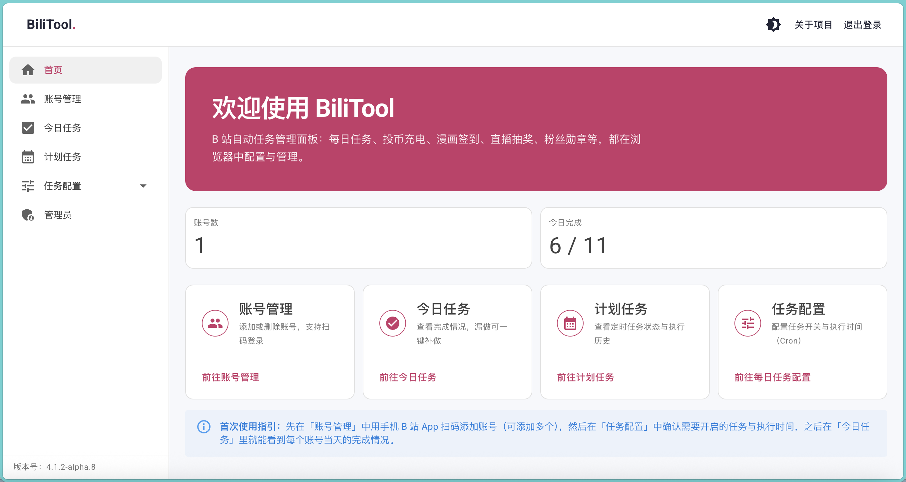
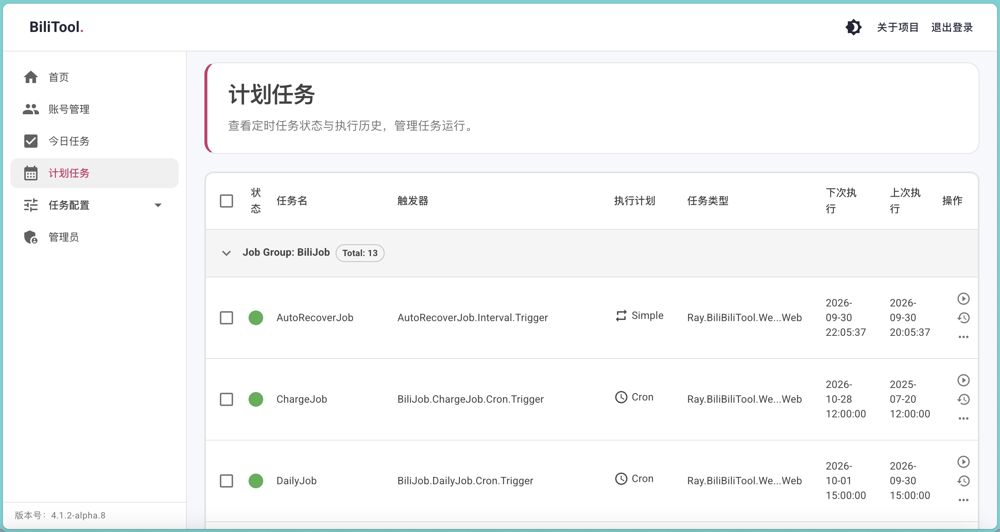
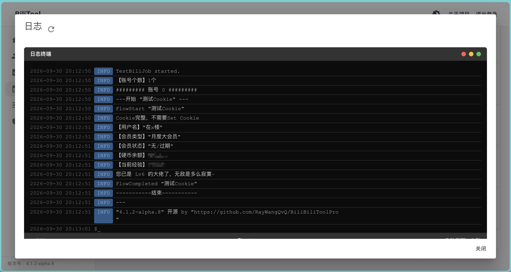
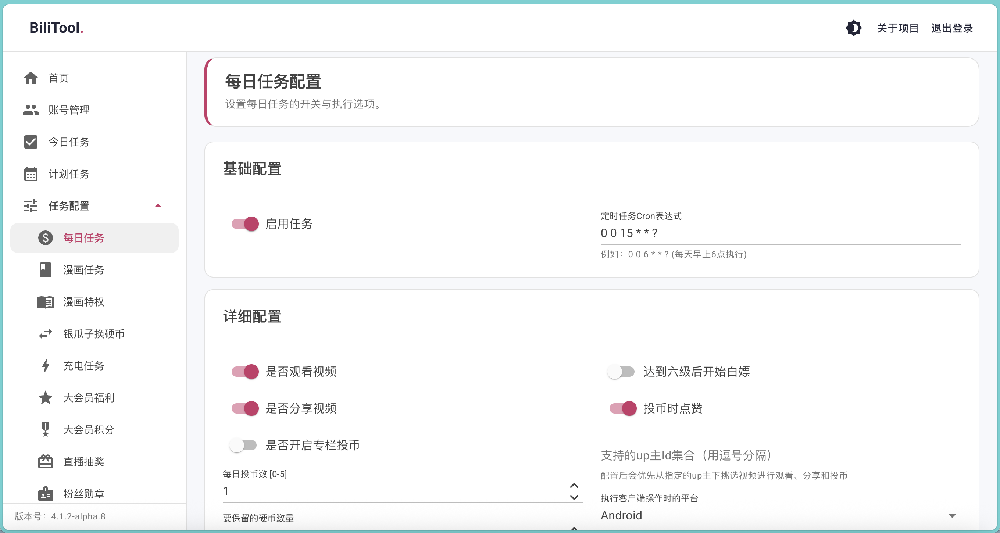
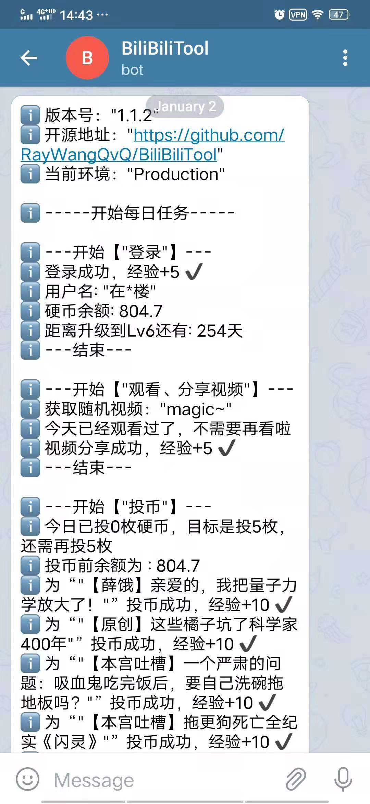
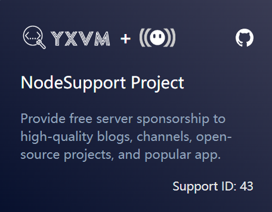

<div align="center">

# BiliTool

Automate recurring Bilibili tasks across one or more accounts.

[](https://github.com/RayWangQvQ/BiliBiliToolPro/stargazers)
[](https://github.com/RayWangQvQ/BiliBiliToolPro/network)
[](https://github.com/RayWangQvQ/BiliBiliToolPro/issues)
[](https://github.com/RayWangQvQ/BiliBiliToolPro/graphs/contributors)
[](https://github.com/RayWangQvQ/BiliBiliToolPro/releases)
[](https://github.com/RayWangQvQ/BiliBiliToolPro/releases)
[](LICENSE)

<a href="https://trendshift.io/repositories/3329">
  
</a>

</div>

BiliTool runs scheduled Bilibili activities through the platform's APIs. Use the Web panel to manage accounts, configuration, schedules, and execution logs, or run tasks with the Console host and your preferred scheduler.

It supports QR-code login and cookie updates, multiple Bilibili accounts, daily experience tasks, live-room and manga activities, VIP benefits, B-coin voucher charging, batch unfollowing, and optional notifications. Each activity can be configured independently; availability depends on your account and Bilibili's current services.

> [!IMPORTANT]
> This project is intended for learning and testing. Review the tasks and configuration before running them, use it responsibly, and comply with Bilibili's terms. Do not expose account cookies or other secrets in issues or public configuration.

<p align="center">
  
  <br>
  
  <br>
  
  <br>
  
</p>

## Get started

Choose one deployment guide, start the application, and run the **Login** task to add a Bilibili account by scanning its QR code. Then configure the tasks and schedules you want to use.

| Environment | Guide |
| --- | --- |
| Containers | [Docker](platforms/docker/README.md) · [Podman](platforms/podman/README.md) · [Helm / Kubernetes](platforms/helm/README.md) |
| Automation panels | [Qinglong](platforms/qinglong/README.md) · [Baihu](platforms/baihu/README.md) · [Daidai](platforms/daidai/README.md) |
| Local machine or server | [Download and run the application](docs/runInLocal.md) |
| Other platforms | [Tencent SCF](platforms/tencentScf/README.md) · [Krew](platforms/krew/README.md) · [GitHub Actions (archived recipe)](platforms/gitHubActions/README.md) |

The GitHub Actions task workflows are stored under `platforms/gitHubActions/bak/`, not in the active repository workflows. That guide describes an archived recipe, **not** a ready-to-enable deployment.

For settings, environment variables, and task-specific options, see the [configuration guide](docs/configuration.md). For troubleshooting, see the [FAQ](docs/questions.md).

## Available tasks

A **task** is a runnable unit of work. Some tasks contain several individual activities; enable only the ones you need.

| Task | Console code | What it does | Suggested frequency |
| --- | --- | --- | --- |
| QR-code login | `Login` | Adds an account or refreshes an expired cookie | Manually, when needed |
| Daily tasks | `Daily` | Handles login, video viewing, sharing, and coin contributions for daily experience | Once a day |
| Live-room lottery | `LiveLottery` | Enters eligible live-room lotteries; some require following the host | Up to four times a day |
| Batch unfollow | `UnfollowBatched` | Unfollows accounts in a configured group | Manually |
| VIP points | `VipBigPoint` | Completes eligible VIP points activities | Once a day |
| Fan medal | `LiveFansMedal` | Runs live-room fan-medal activities | Once a day |
| Manga | `Manga` | Checks in and reads manga | Once a day |
| VIP manga benefits | `MangaPrivilege` | Claims eligible manga benefits | Once a day |
| Silver-to-coin exchange | `Silver2Coin` | Exchanges live-room silver seeds for coins | Once a day |
| B-coin charging | `Charge` | Uses an eligible VIP B-coin voucher to support a creator | Once a day |
| VIP benefits | `VipPrivilege` | Claims eligible VIP benefits | Once a day |
| Cookie check | `Test` | Checks whether a cookie is usable | Manually |

Task eligibility, rewards, and timing are controlled by Bilibili and may change. Check the [configuration guide](docs/configuration.md) for switches, schedules, and creator IDs.

## Multiple accounts

Run the **Login** task again to add another Bilibili account. Where the cookie is stored depends on the host:

- **Web panel:** accounts are managed in the panel and stored in `config/BiliBiliTool.db`.
- **Qinglong:** cookies are saved as environment variables such as `Ray_BiliBiliCookies__0`, `Ray_BiliBiliCookies__1`, and so on.
- **Console and other non-Web hosts:** the default local account file is `cookies.json`:

```json
{
  "BiliBiliCookies": [
    "cookie1",
    "cookie2"
  ]
}
```

The **panel administrator** login is separate from the Bilibili accounts used for tasks. Treat both administrator credentials and Bilibili cookies as secrets.

## Notifications

Optional execution notifications support Telegram, PushPlus, WeCom, DingTalk, Microsoft Teams, ServerChan, CoolPush, and custom API endpoints. Delivery depends on the provider and your configuration. See [notification settings](docs/configuration.md) for setup.

<p align="center">
  
</p>

## Help and releases

Before reporting a problem, update to the latest release and search the [FAQ](docs/questions.md), [configuration guide](docs/configuration.md), [issues](https://github.com/RayWangQvQ/BiliBiliToolPro/issues), and [discussions](https://github.com/RayWangQvQ/BiliBiliToolPro/discussions). Open an issue for a reproducible bug or feature request; use discussions for questions and ideas. Never post cookies, tokens, or passwords.

Follow [releases](https://github.com/RayWangQvQ/BiliBiliToolPro/releases) for published versions and the [issue tracker](https://github.com/RayWangQvQ/BiliBiliToolPro/issues) for ongoing work. Merges to `main` produce preview Docker images; stable releases are published separately.

## Contribute

Code and documentation contributions are welcome:

For test naming, levels, and safe local execution, see the [testing guide](docs/testing.md).

1. Search existing issues before starting. For substantial or uncertain changes, open an issue to discuss the approach first.
2. Fork the repository and make changes based on `main`.
3. Open a pull request targeting `main` with a clear title and description. After review and successful checks, maintainers squash-merge accepted changes.

Documentation fixes, clarifications, and corrections are just as valuable as code changes.

## Support the project

If BiliTool helps you, you can support its maintenance through the donation QR code below. Include a name and message if you would like the maintainer to recognize your donation.


Some creator-ID settings use the maintainer's Bilibili ID as a **default configuration value**. You can change those settings through the configuration file, secrets, or environment variables to support a different creator.

## Acknowledgments and references

- [Bilibili](https://www.bilibili.com/)
- [SocialSisterYi/bilibili-API-collect](https://github.com/SocialSisterYi/bilibili-API-collect)
- [JunzhouLiu/BILIBILI-HELPER](https://github.com/JunzhouLiu/BILIBILI-HELPER)

Thanks to JetBrains for a free open-source license:

<p align="center">
  
</p>

Thanks to [YxVM](https://yxvm.com/aff.php?aff=668), [NodeSeekDev](https://github.com/NodeSeekDev/NodeSupport), and [DartNode](https://dartnode.com?aff=FriskyGopher833) for supporting the project's test servers.

<p align="center">
  <a href="https://yxvm.com/aff.php?aff=668"></a>
</p>

[](https://dartnode.com "Powered by DartNode")

Thanks to everyone who has starred this project:

[](https://www.star-history.com/#RayWangQvQ/BiliBiliToolPro&Date)
