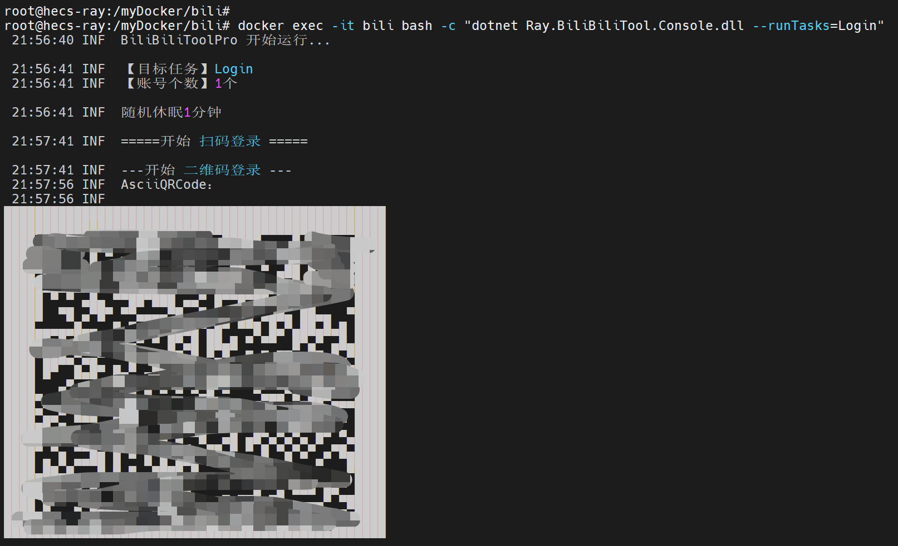

# Docker 使用说明
<!-- TOC depthFrom:2 -->

- [1. 前期工作](#1-前期工作)
- [2. 方式一：一键脚本(推荐)](#2-方式一一键脚本推荐)
- [3. 方式二：手动Docker Compose](#3-方式二手动docker-compose)
    - [3.1. 启动](#31-启动)
    - [3.2. 其他命令参考](#32-其他命令参考)
- [4. 方式三：手动Docker指令](#4-方式三手动docker指令)
    - [4.1. Docker启动](#41-docker启动)
    - [4.2. 其他指令参考](#42-其他指令参考)
    - [4.3. 使用Watchtower更新容器](#43-使用watchtower更新容器)
- [5. 登录](#5-登录)
- [6. 自己构建镜像（非必须）](#6-自己构建镜像非必须)
- [7. 其他](#7-其他)

<!-- /TOC -->
## 1. 前期工作

请确认已安装了Docker所需环境（[Docker](https://docs.docker.com/get-docker/)和[Docker Compose](https://docs.docker.com/compose/cli-command/)）

Linux一键安装命令:
`curl -fsSL https://get.docker.com | bash -s docker --mirror Aliyun`

Window系统推荐使用Docker Desktop，官方下载安装包安装。

安装完成后，请执行`docker --version`检查`Docker`是否安装成功，请执行`docker compose version`检查`Docker Compose`是否安装成功。

## 2. 方式一：一键脚本(推荐) 

仅支持linux系统

```
wget "https://ghproxy.com/https://raw.githubusercontent.com/RayWangQvQ/BiliBiliToolPro/main/docker/install.sh" && chmod +x install.sh && ./install.sh
```

## 3. 方式二：手动Docker Compose

### 3.1. 启动

```
# 创建目录
mkdir bili && cd bili

# 下载
wget https://raw.githubusercontent.com/RayWangQvQ/BiliBiliToolPro/main/src/Ray.BiliBiliTool.Console/appsettings.json
wget https://raw.githubusercontent.com/RayWangQvQ/BiliBiliToolPro/main/docker/sample/cookies.json
wget https://raw.githubusercontent.com/RayWangQvQ/BiliBiliToolPro/main/docker/sample/docker-compose.yml

# 启动
docker compose up -d

# 查看启动日志
docker logs -f bili
```

最终文件结构如下：

```
bili
├── appsettings.json
├── cookies.json
└── docker-compose.yml
```

### 3.2. 其他命令参考

```
# 启动 docker-compose
docker compose up -d

# 停止 docker-compose
docker compose stop

# 查看实时日志
docker logs -f bili

# 进入容器
docker exec -it bili /bin/bash

# 手动更新容器
docker compose pull && docker compose up -d
```

## 4. 方式三：手动Docker指令

### 4.1. Docker启动

```
# 生成并运行容器
docker pull ghcr.io/raywangqvq/bilibili_tool_pro
docker run -d --name="bili" \
    -v /bili/Logs:/app/Logs \
    -e Ray_DailyTaskConfig__Cron="0 15 * * *" \
    -e Ray_LiveLotteryTaskConfig__Cron="0 22 * * *" \
    -e Ray_UnfollowBatchedTaskConfig__Cron="0 6 1 * *" \
    -e Ray_VipBigPointConfig__Cron="7 1 * * *" \
    ghcr.io/raywangqvq/bilibili_tool_pro

# 查看实时日志
docker logs -f bili
```

其中，`cookie`需要替换为自己真实的cookie字符串

### 4.2. 其他指令参考

```
# 启动容器
docker start bili

# 停止容器
docker stop bili

# 重启容器
docker restart bili

# 删除容器
docker rm bili

# 进入容器
docker exec -it bili /bin/bash
```

### 4.3. 使用Watchtower更新容器
```
docker run --rm \
    -v /var/run/docker.sock:/var/run/docker.sock \
    containrrr/watchtower \
    --run-once --cleanup \
    bili
```

## 5. 登录

在宿主机运行`docker exec -it bili bash -c "dotnet Ray.BiliBiliTool.Console.dll --runTasks=Login"`

扫码进行登录。



## 6. 自己构建镜像（非必须）

目前我提供和维护的镜像：

- DockerHub: `[zai7lou/bilibili_tool_pro](https://hub.docker.com/repository/docker/zai7lou/bilibili_tool_pro)`
- GitHub: `[bilibili_tool_pro](https://github.com/RayWangQvQ/BiliBiliToolPro/pkgs/container/bilibili_tool_pro)`

如果有需要（大部分都不需要），可以使用源码自己构建镜像，如下：

在有项目的Dockerfile的目录运行

`docker build -t TARGET_NAME .`

 `TARGET_NAME`为镜像名称和版本，可以自己起个名字

## 7. 其他

代码编译和发布环境: mcr.microsoft.com/dotnet/sdk:6.0

代码运行环境: mcr.microsoft.com/dotnet/runtime:6.0

apt-get 包源用的国内网易的

如果下载`github`资源有问题，可以尝试添加或删除代理url`https://ghproxy.com/`
