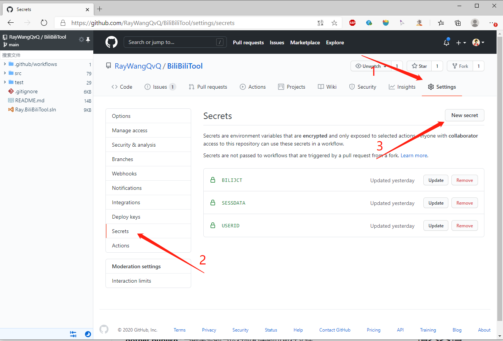
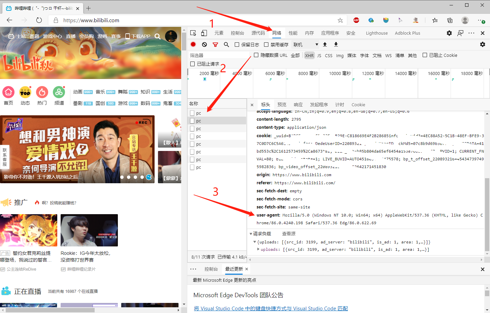
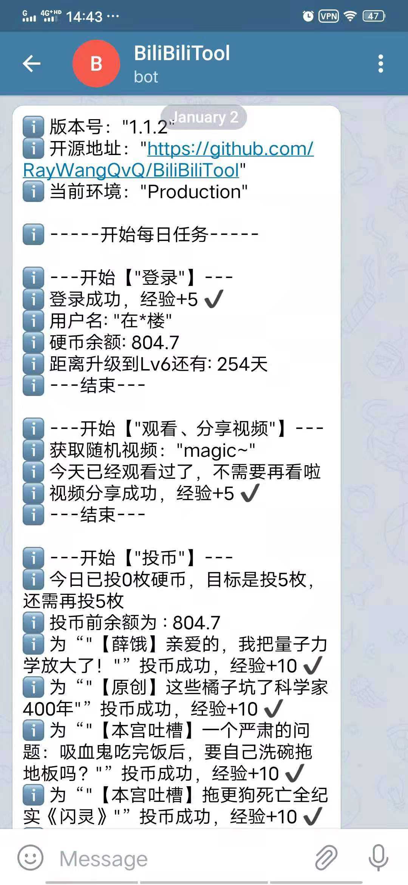
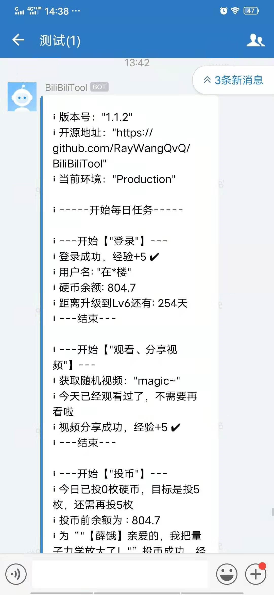
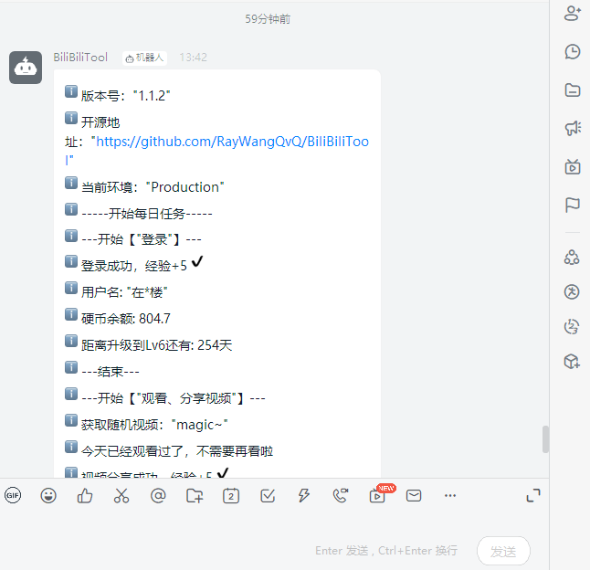
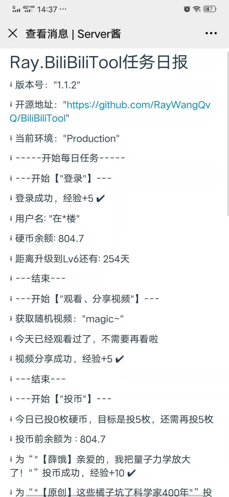

# 配置说明

**[目录]**

<!-- TOC depthFrom:2 insertAnchor:true -->

- [1. 配置方式](#1-配置方式)
    - [1.1. 方式一：修改配置文件](#11-方式一修改配置文件)
    - [1.2. 方式二：命令启动时通过命令行参数配置](#12-方式二命令启动时通过命令行参数配置)
    - [1.3. 方式三：添加环境变量（推荐）](#13-方式三添加环境变量推荐)
    - [1.4. 方式四：托管在GitHub Actions上，使用GitHub Secrets配置](#14-方式四托管在github-actions上使用github-secrets配置)
- [2. 优先级](#2-优先级)
- [3. 详细配置说明](#3-详细配置说明)
    - [3.1. Cookie字符串](#31-cookie字符串)
    - [3.2. 安全相关的配置](#32-安全相关的配置)
        - [3.2.1. 是否跳过执行任务](#321-是否跳过执行任务)
        - [3.2.2. 随机睡眠的最大时长](#322-随机睡眠的最大时长)
        - [3.2.3. 两次调用B站Api之间的间隔秒数](#323-两次调用b站api之间的间隔秒数)
        - [3.2.4. 间隔秒数所针对的HttpMethod](#324-间隔秒数所针对的httpmethod)
        - [3.2.5. 请求B站接口时头部传递的User-Agent](#325-请求b站接口时头部传递的user-agent)
        - [3.2.6. WebProxy（代理）](#326-webproxy代理)
    - [3.3. 每日任务相关](#33-每日任务相关)
        - [3.3.1. 每日投币数量](#331-每日投币数量)
        - [3.3.2. 投币时是否同时点赞](#332-投币时是否同时点赞)
        - [3.3.3. 优先选择支持的up主Id集合](#333-优先选择支持的up主id集合)
        - [3.3.4. 每月几号自动充电](#334-每月几号自动充电)
        - [3.3.5. 充电对象](#335-充电对象)
        - [3.3.6. 每月几号自动领取会员权益](#336-每月几号自动领取会员权益)
        - [3.3.7. 每月几号进行直播中心银瓜子兑换硬币](#337-每月几号进行直播中心银瓜子兑换硬币)
    - [3.4. 天选时刻抽奖相关](#34-天选时刻抽奖相关)
        - [3.4.1. 根据关键字排除奖品](#341-根据关键字排除奖品)
        - [3.4.2. 根据关键字指定奖品](#342-根据关键字指定奖品)
        - [3.4.3. 天选抽奖后是否自动分组关注的主播](#343-天选抽奖后是否自动分组关注的主播)
    - [3.5. 批量取关相关](#35-批量取关相关)
        - [3.5.1. 想要批量取关的分组名称](#351-想要批量取关的分组名称)
        - [3.5.2. 批量取关的人数](#352-批量取关的人数)
    - [3.6. 推送相关](#36-推送相关)
        - [3.6.1. Telegram机器人](#361-telegram机器人)
            - [3.6.1.1. botToken](#3611-bottoken)
            - [3.6.1.2. chatId](#3612-chatid)
        - [3.6.2. 企业微信机器人](#362-企业微信机器人)
            - [3.6.2.1. webHookUrl](#3621-webhookurl)
        - [3.6.3. 钉钉机器人](#363-钉钉机器人)
            - [3.6.3.1. webHookUrl](#3631-webhookurl)
        - [3.6.4. Server酱](#364-server酱)
            - [3.6.4.1. TurboScKey（Server酱SCKEY）](#3641-turbosckeyserver酱sckey)
        - [3.6.5. 酷推](#365-酷推)
            - [3.6.5.1. sKey](#3651-skey)
        - [3.6.6. 推送到自定义Api](#366-推送到自定义api)
            - [3.6.6.1. api](#3661-api)
            - [3.6.6.2. placeholder](#3662-placeholder)
            - [3.6.6.3. bodyJsonTemplate](#3663-bodyjsontemplate)
        - [3.6.7. PushPlus[推荐]](#367-pushplus推荐)
            - [3.6.7.1. PushPlus的Token](#3671-pushplus的token)
            - [3.6.7.2. PushPlus的Topic](#3672-pushplus的topic)
            - [3.6.7.3. PushPlus的Channel](#3673-pushplus的channel)
            - [3.6.7.4. PushPlus的Webhook](#3674-pushplus的webhook)
    - [3.7. 日志相关](#37-日志相关)
        - [3.7.1. Console日志输出等级](#371-console日志输出等级)
        - [3.7.2. Console日志输出样式](#372-console日志输出样式)

<!-- /TOC -->

<a id="markdown-1-配置方式" name="1-配置方式"></a>
## 1. 配置方式

<a id="markdown-11-方式一修改配置文件" name="11-方式一修改配置文件"></a>
### 1.1. 方式一：修改配置文件
推荐使用Release包在本地运行的朋友使用，直接打开文件，将对应的配置值填入，保存即可生效。

默认有3个配置文件：`appsettings.json`、`appsettings.Development.json`、`appsettings.Production.json`，分别对应默认、开发与生产环境。

如果运行环境为开发环境，则`appsettings.Development.json`优先级高于`appsettings.json`，即`appsettings.Development.json`里的配置会覆盖默认配置（不是全部覆盖，`appsettings.Development.json`里加了几个就覆盖几个）；

如果运行环境为生产环境，则`appsettings.Production.json`优先级高于`appsettings.json`，即`appsettings.Production.json`里的配置会覆盖默认配置（同样不是全部覆盖，`appsettings.Production.json`里加了几个就覆盖几个）。

对于不是开发人员的大部分人来说，只需要关注`appsettings.Production.json`即可，因为非调试状态下运行的默认环境就是生产环境。此时如需自定义配置，推荐在`appsettings.Production.json`文件中进行修改（并且以后都只修改`appsettings.Production.json`文件，`appsettings.json`只作为默认的全量模板而存在）

<a id="markdown-12-方式二命令启动时通过命令行参数配置" name="12-方式二命令启动时通过命令行参数配置"></a>
### 1.2. 方式二：命令启动时通过命令行参数配置
在使用命令行启动时，可使用`-key=value`的形式附加配置，所有可用的命令行参数均在 [命令行参数映射](../src/Ray.BiliBiliTool.Console/commandLineMappings.json) 文件中。

* 使用跨平台的依赖包

各个系统只要安装了net5环境，均可使用dotnet命令启动，命令样例：

```
dotnet Ray.BiliBiliTool.Console.dll -cookieStr=abc -numberOfCoins=5
```

* Windows系统

使用自包含包（win-x86-x64.zip），命令样例：

```
Ray.BiliBiliTool.Console.exe -cookieStr=abc -numberOfCoins=5
```

* Linux系统

使用自包含包（linux.zip），命令样例：

```
Ray.BiliBiliTool.Console -cookieStr=abc -numberOfCoins=5
```

如映射文件所展示，支持使用命令行配置的配置项并不多，也不建议大量地使用该种方式进行配置。使用包运行的朋友，除了改配置文件和命令行参数配置外，还可以使用环境变量进行配置，这也是推荐的做法，如下。

<a id="markdown-13-方式三添加环境变量推荐" name="13-方式三添加环境变量推荐"></a>
### 1.3. 方式三：添加环境变量（推荐）

所有的配置项均可以通过添加环境变量来进行配置，以Windows下依赖net5的系统为例：

```
# 添加环境变量作为配置：
set Ray_RunTasks=Daily
set Ray_BiliBiliCookies__1=abc
set Ray_BiliBiliCookies__2=efg
set Ray_DailyTaskConfig__NumberOfCoins=3

# 开始运行程序：
dotnet Ray.BiliBiliTool.Console.dll
```

注意区分单下划线和双下划线，linux系统使用 `export` 关键字代替 `set` 。

<a id="markdown-14-方式四托管在github-actions上使用github-secrets配置" name="14-方式四托管在github-actions上使用github-secrets配置"></a>
### 1.4. 方式四：托管在GitHub Actions上，使用GitHub Secrets配置

使用GitHub Actions，可以通过添加Secret实现配置。

比如，配置微信推送的SCKEY，可以添加如下Secret：

Secret Name：`PUSHSCKEY`

Secret Value：`123abc`

这些 Secrets 会通过 workflow 里的yml脚本映射为环境变量，在应用启动时作为环境变量配置源传入程序当中，所以使用 GitHub Secrets 配置的本质是使用环境变量配置。



<a id="markdown-2-优先级" name="2-优先级"></a>
## 2. 优先级

以上 4 种配置源，其优先级由低到高依次是：json文件 < 环境变量(和Github Secrets) < 命令行。

即，如果既在配置文件中写入了配置值，又在命令行启动时使用命令行参数指定了配置值，则最后会使用命令行的。

**对于使用 Github Action 线上运行的朋友，建议只使用 Secrets 进行配置。** 因为 Fork 项目后，不会拷贝源仓库中的 Secrets，可自由的在自己的仓库中进行私人配置。当有新版本发布时，同步仓库会很顺滑，不会影响到已配置的值。

当然， Fork 之后自己改了 appsettings.json 文件再提交，也是可以实现配置的。但是一则你的配置值将被暴露出来（别人可通过访问你的仓库里的配置查看到值），二是以后如果需要 PR 源仓库的更新到自己仓库，则要注意保留自己的修改不要被同步操作覆盖。

<a id="markdown-3-详细配置说明" name="3-详细配置说明"></a>
## 3. 详细配置说明

<a id="markdown-31-cookie字符串" name="31-cookie字符串"></a>
### 3.1. Cookie字符串
没有它，程序的运行就没有意义，所以它是必填项。

| TITLE | CONTENT | 示例 |
| ---------- | -------------- | -------------- |
| 配置Key | `BiliBiliCookies__1` | |
| 值域   | 字符串，英文分号分隔，来自浏览器抓取 | |
| 默认值   | 空 | |
| 环境变量 | `Ray_BiliBiliCookies__1` | Windows：`set Ray_BiliBiliCookies__1=abc=123;def=456;` Linux:`export Ray_BiliBiliCookies__1=abc=123;def=456;` |
| GitHub Secrets | `COOKIESTR` | Name:`COOKIESTR`  Value: `abc=123;def=456;`|

|   TITLE   | CONTENT   | 示例 |
| ---------- | -------------- | -------------- |
| 配置Key | `BiliBiliCookies__2` | |
| 值域   | 字符串，英文分号分隔，来自浏览器抓取 | |
| 默认值   | 空 | |
| 环境变量  | `Ray_BiliBiliCookies__2` | Windows：`set Ray_BiliBiliCookies__2=abc=123;def=456;` Linux:`export Ray_BiliBiliCookies__2=abc=123;def=456;` |
| GitHub Secrets  | `COOKIESTR2` | Name:`COOKIESTR2`  Value: `abc=123;def=456;`|

**...**
**...**
**...**

<a id="markdown-32-安全相关的配置" name="32-安全相关的配置"></a>
### 3.2. 安全相关的配置
<a id="markdown-321-是否跳过执行任务" name="321-是否跳过执行任务"></a>
#### 3.2.1. 是否跳过执行任务
用于特殊情况下，通过配置灵活的开启和关闭整个应用.
配置为关闭后，程序会跳过所有任务，不会调用B站任何接口。

|   TITLE   | CONTENT   | 示例 |
| ---------- | -------------- | -------------- |
| 配置Key | `Security__IsSkipDailyTask` | |
| 值域   | [true,false] | |
| 默认值   | false | |
| 环境变量 | `Ray_Security__IsSkipDailyTask` | `set Ray_Security__IsSkipDailyTask=true` |
| GitHub Secrets | `ISSKIPDAILYTASK` | Name:`ISSKIPDAILYTASK`  Value: `true`|

若想要彻底关闭，即Actions不运行，点击Actions进入Workflows列表，点击相应任务（如`bilibili-daily-task.yml`）的Workflow，在搜索框右侧有一个三个点的设置按钮，点击按钮后，在弹出的下拉列表里选中`Disable workflow`项即可。

<a id="markdown-322-随机睡眠的最大时长" name="322-随机睡眠的最大时长"></a>
#### 3.2.2. 随机睡眠的最大时长
用于设置程序启动后，随机睡眠时间的最大上限值，单位为分钟。

默认为10，即程序每天运行后会随机睡眠1到10分钟。这样可以避免程序每天准点地在同一时间运行，太像机器。

配置为0则不进行睡眠。

|   TITLE   | CONTENT   |
| ---------- | -------------- |
| 配置Key | `Security__RandomSleepMaxMin` |
| 值域   | 数字 |
| 默认值   | 10 |
| 环境变量 | `Ray_Security__RandomSleepMaxMin` |
| GitHub Secrets | `RANDOMSLEEPMAXMIN`|

<a id="markdown-323-两次调用b站api之间的间隔秒数" name="323-两次调用b站api之间的间隔秒数"></a>
#### 3.2.3. 两次调用B站Api之间的间隔秒数
因为有朋友反馈，程序在1到2秒内连续调用B站的Api过快，担心会被B站的安全策略检测到，影响自己的账号安全。

所以我添加这个安全策略的配置，可以设置两次Api请求之间的最短时间间隔。

举例来说，之前的5次投币可能是在1秒之内完成的，现在通过配置间隔时间，可以将其变为投币一次后，经过4到5秒才会投下一个，提升程序的演技，让它表现的就像真人在投币一样，骗过BiliBili~ 

|   TITLE   | CONTENT   |
| ---------- | -------------- |
| 配置Key | `Security__IntervalSecondsBetweenRequestApi` |
| 值域   | [0,+] |
| 默认值   | 3 |
| 环境变量   | `Ray_Security__IntervalSecondsBetweenRequestApi` |
| GitHub Secrets | `INTERVALSECONDSBETWEENREQUESTAPI` |


<a id="markdown-324-间隔秒数所针对的httpmethod" name="324-间隔秒数所针对的httpmethod"></a>
#### 3.2.4. 间隔秒数所针对的HttpMethod
间隔秒数所针对的HttpMethod类型，服务于上一个配置。服务器一般对GET请求不是很敏感，建议只针对POST请求做间隔就可以了。

|   TITLE   | CONTENT   |
| ---------- | -------------- |
| 配置Key | `Security__IntervalMethodTypes` |
| 值域   | [GET,POST]，多个以英文逗号分隔 |
| 默认值   | POST |
| 环境变量   | `Ray_Security__IntervalMethodTypes` |
| GitHub Secrets  | `INTERVALMETHODTYPES` |

<a id="markdown-325-请求b站接口时头部传递的user-agent" name="325-请求b站接口时头部传递的user-agent"></a>
#### 3.2.5. 请求B站接口时头部传递的User-Agent

|   TITLE   | CONTENT   |
| ---------- | -------------- |
| 配置Key | `Security__UserAgent` |
| 值域   | 字符串，可以F12从自己的浏览器获取 |
| 默认值   | Mozilla/5.0 (Macintosh; Intel Mac OS X 10_15_3) AppleWebKit/537.36 (KHTML, like Gecko) Chrome/87.0.4280.66 Safari/537.36 Edg/87.0.664.41 |
| 环境变量   | `Ray_Security__UserAgent` |
| GitHub Secrets  | `USERAGENT`|

获取浏览器中自己的UA的方法见下图：




<a id="markdown-326-webproxy代理" name="326-webproxy代理"></a>
#### 3.2.6. WebProxy（代理）
支持需要账户密码的代理。

|   TITLE   | CONTENT   |
| ---------- | -------------- |
| 配置Key | `Security__WebProxy` |
| 值域   | 字符串，形如：user:password@host:port |
| 默认值   | 无 |
| 环境变量   | `Ray_Security__WebProxy` |
| GitHub Secrets  | `WEBPROXY`|

<a id="markdown-33-每日任务相关" name="33-每日任务相关"></a>
### 3.3. 每日任务相关
<a id="markdown-331-每日投币数量" name="331-每日投币数量"></a>
#### 3.3.1. 每日投币数量
每天投币的总目标数量，因为投币获取经验只与次数有关，所以程序每次投币只会投1个，也就是说该配置也表示每日投币次数。

|   TITLE   | CONTENT   |
| ---------- | -------------- |
| 配置Key | `DailyTaskConfig__NumberOfCoins` |
| 值域   | [0,5]，为安全考虑，程序内部还会做验证，最大不能超过5 |
| 默认值   | 5 |
| 环境变量   | `Ray_DailyTaskConfig__NumberOfCoins` |
| GitHub Secrets  | `NUMBEROFCOINS` |

<a id="markdown-332-投币时是否同时点赞" name="332-投币时是否同时点赞"></a>
#### 3.3.2. 投币时是否同时点赞

|   TITLE   | CONTENT   |
| ---------- | -------------- |
| 配置Key | `DailyTaskConfig__SelectLike` |
| 值域   | [true,false] |
| 默认值   | false |
| 环境变量   | `Ray_DailyTaskConfig__SelectLike` |
| GitHub Secrets  | `SELECTLIKE` |

<a id="markdown-333-优先选择支持的up主id集合" name="333-优先选择支持的up主id集合"></a>
#### 3.3.3. 优先选择支持的up主Id集合
通过填入自己选择的up主ID，以后观看、分享和投币，都会优先从配置的up主下面挑选视频，如果没有找到,则会去你的**特别关注**列表中随机再获取，再然后会去**普通关注**列表中随机获取，最后会去排行榜中随机获取。

当前不再推荐使用该配置，建议通过添加到**特别关注**列表来实现优先支持。

**注意：该配置的默认值是作者的upId，如需换掉的话，直接更改即可。**

|   TITLE   | CONTENT   |
| ---------- | -------------- |
| 配置Key | `DailyTaskConfig__SupportUpIds` |
| 值域   | up主ID，多个用英文逗号分隔，默认是作者本人的UpId，如需删除可以配置为空格字符串或“-1”，也可以配置为其他人的UpId |
| 默认值   | 作者的upId |
| 环境变量   | `Ray_DailyTaskConfig__SupportUpIds` |
| GitHub Secrets  | `SUPPORTUPIDS` |

获取UP主的Id方法：打开bilibili，进入欲要选择的UP主主页，在url中和简介中，都可获得该UP主的Id，如下图所示：


<a id="markdown-334-每月几号自动充电" name="334-每月几号自动充电"></a>
#### 3.3.4. 每月几号自动充电
使用大会员免费赠送的B币券自动充电，如不使用，每个月结束会自动失效。没有B币券或B币券余额不足2，不会进行充电。

|   TITLE   | CONTENT   |
| ---------- | -------------- |
| 配置Key | `DailyTaskConfig__DayOfAutoCharge` |
| 值域   | [-1,31]，-1表示不指定，默认月底最后一天；0表示不充电 |
| 默认值   | -1 |
| 环境变量   | `Ray_DailyTaskConfig__DayOfAutoCharge` |
| GitHub Secrets  | `DAYOFAUTOCHARGE` |

<a id="markdown-335-充电对象" name="335-充电对象"></a>
#### 3.3.5. 充电对象
充电对象的upId，需要配合前一个DayOfAutoCharge配置项使用。-1表示不指定，默认为自己充电；其他Id则会尝试为配置的UpId充电。

**注意：该配置的默认值是作者的upId，如果你已认证通过了创作身份（即可以为自己充电），则建议将其改为为自己充电（配置为-1即可），也可以配置为某个自己指定的创作者upId。

|   TITLE   | CONTENT   |
| ---------- | -------------- |
| 配置Key | `DailyTaskConfig__AutoChargeUpId` |
| 值域   | up的Id字符串，默认是作者本人的UpId；-1表示不指定，为自己充电；其他Id则会尝试为配置的UpId充电 |
| 默认值   | 作者的upId |
| 环境变量   | `Ray_DailyTaskConfig__AutoChargeUpId` |
| GitHub Secrets  | `AUTOCHARGEUPID` |

<a id="markdown-336-每月几号自动领取会员权益" name="336-每月几号自动领取会员权益"></a>
#### 3.3.6. 每月几号自动领取会员权益

|   TITLE   | CONTENT   |
| ---------- | -------------- |
| 配置Key | `DailyTaskConfig__DayOfReceiveVipPrivilege` |
| 值域   | [-1,31]，-1表示不指定，默认每月1号；0表示不领取 |
| 默认值   | 1 |
| 环境变量   | `Ray_DailyTaskConfig__DayOfReceiveVipPrivilege` |
| GitHub Secrets  | `DAYOFRECEIVEVIPPRIVILEGE` |

<a id="markdown-337-每月几号进行直播中心银瓜子兑换硬币" name="337-每月几号进行直播中心银瓜子兑换硬币"></a>
#### 3.3.7. 每月几号进行直播中心银瓜子兑换硬币

|   TITLE   | CONTENT   |
| ---------- | -------------- |
| 配置Key | `DailyTaskConfig__DayOfExchangeSilver2Coin` |
| 值域   | [-1,31]，-1表示不指定，默认每月最后一天；-2表示每天；0表示不进行兑换 |
| 默认值   | -1 |
| 环境变量   | `Ray_DailyTaskConfig__DayOfExchangeSilver2Coin` |
| GitHub Secrets  | `DayOfExchangeSilver2Coin` |

<a id="markdown-34-天选时刻抽奖相关" name="34-天选时刻抽奖相关"></a>
### 3.4. 天选时刻抽奖相关

<a id="markdown-341-根据关键字排除奖品" name="341-根据关键字排除奖品"></a>
#### 3.4.1. 根据关键字排除奖品

|   TITLE   | CONTENT   |
| ---------- | -------------- |
| 配置Key | `LiveLotteryTaskConfig__ExcludeAwardNames` |
| 值域   | 一串字符串，多个关键字使用`\|`符号隔开 |
| 默认值   | `舰\|船\|航海\|代金券\|自拍\|照\|写真\|图` |
| 环境变量   | `Ray_LiveLotteryTaskConfig__ExcludeAwardNames` |
| GitHub Secrets  | `EXCLUDEAWARDNAMES` |

<a id="markdown-342-根据关键字指定奖品" name="342-根据关键字指定奖品"></a>
#### 3.4.2. 根据关键字指定奖品

|   TITLE   | CONTENT   |
| ---------- | -------------- |
| 配置Key | `LiveLotteryTaskConfig__IncludeAwardNames` |
| 值域   | 一串字符串，多个关键字使用`\|`符号隔开 |
| 默认值   | 空 |
| 环境变量   | `Ray_LiveLotteryTaskConfig__IncludeAwardNames` |
| GitHub Secrets  | `INCLUDEAWARDNAMES` |

<a id="markdown-343-天选抽奖后是否自动分组关注的主播" name="343-天选抽奖后是否自动分组关注的主播"></a>
#### 3.4.3. 天选抽奖后是否自动分组关注的主播

|   TITLE   | CONTENT   |
| ---------- | -------------- |
| 配置Key | `LiveLotteryTaskConfig__AutoGroupFollowings` |
| 值域   | [true,false] |
| 默认值   | true |
| 环境变量   | `Ray_LiveLotteryTaskConfig__AutoGroupFollowings` |
| GitHub Secrets  | `AUTOGROUPFOLLOWINGS`  Value: `true`|

<a id="markdown-35-批量取关相关" name="35-批量取关相关"></a>
### 3.5. 批量取关相关

<a id="markdown-351-想要批量取关的分组名称" name="351-想要批量取关的分组名称"></a>
#### 3.5.1. 想要批量取关的分组名称

|   TITLE   | CONTENT   |
| ---------- | -------------- |
| 配置Key | `UnfollowBatchedTaskConfig__GroupName` |
| 值域   | 字符串 |
| 默认值   | 天选时刻 |
| 环境变量   | `Ray_UnfollowBatchedTaskConfig__GroupName` |
| GitHub Secrets  | 无，在unfollow-batched-task.yml工作流中通过input输入 |

<a id="markdown-352-批量取关的人数" name="352-批量取关的人数"></a>
#### 3.5.2. 批量取关的人数

|   TITLE   | CONTENT   |
| ---------- | -------------- |
| 配置Key | `Ray_UnfollowBatchedTaskConfig__Count` |
| 值域   | 数字，[-1,+]，-1表示全部 |
| 默认值   | 5 |
| 环境变量   | `Ray_UnfollowBatchedTaskConfig__Count` |
| GitHub Secrets  | 无，在unfollow-batched-task.yml工作流中通过input输入 |

<a id="markdown-36-推送相关" name="36-推送相关"></a>
### 3.6. 推送相关
v1.0.x仅支持推送到Server酱，v1.1.x之后重新定义了推送地概念，将推送仅看作不同地日志输出端，与Console、File没有本质区别。

配置多个，多个端均会收到日志消息。推荐Telegram、企业微信、Server酱。

<a id="markdown-361-telegram机器人" name="361-telegram机器人"></a>
#### 3.6.1. Telegram机器人

<a id="markdown-3611-bottoken" name="3611-bottoken"></a>
##### 3.6.1.1. botToken
点击 https://core.telegram.org/api#bot-api 查看如何创建机器人并获取到机器人的botToken。

|   TITLE   | CONTENT   |
| ---------- | -------------- |
| 配置Key | `Serilog__WriteTo__3__Args__botToken` |
| 意义 | 用于将日志输出到Telegram机器人 |
| 值域   | 一串字符串 |
| 默认值   | 空 |
| 环境变量   |  |
| GitHub Secrets  | `PUSHTGTOKEN`|

<a id="markdown-3612-chatid" name="3612-chatid"></a>
##### 3.6.1.2. chatId
点击 https://api.telegram.org/bot{TOKEN}/getUpdates 获取到与机器人的chatId（需要用上面获取到的Token替换进链接里的{TOKEN}后访问）

P.S.访问链接需要能访问“外网”，有vpn的挂vpn。

|   TITLE   | CONTENT   |
| ---------- | -------------- |
| 配置Key | `Serilog__WriteTo__3__Args__chatId` |
| 值域   | 一串字符串 |
| 默认值   | 空 |
| 环境变量   | `Ray_Serilog__WriteTo__3__Args__chatId` |
| 命令行示范   | 无 |
| GitHub Secrets  | `PUSHTGCHATID`|

<a id="markdown-362-企业微信机器人" name="362-企业微信机器人"></a>
#### 3.6.2. 企业微信机器人
在群内添加机器人，获取到机器人的WebHook地址，添加到配置中。



<a id="markdown-3621-webhookurl" name="3621-webhookurl"></a>
##### 3.6.2.1. webHookUrl

|   TITLE   | CONTENT   |
| ---------- | -------------- |
| 配置Key | `Serilog__WriteTo__4__Args__webHookUrl` |
| 值域   | 一串字符串 |
| 默认值   | 空 |
| 环境变量   | `Ray_Serilog__WriteTo__4__Args__webHookUrl` |
| 命令行示范   | 无 |
| GitHub Secrets  | `PUSHWEIXINURL`|

<a id="markdown-363-钉钉机器人" name="363-钉钉机器人"></a>
#### 3.6.3. 钉钉机器人
在群内添加机器人，获取到机器人的WebHook地址，添加到配置中。

机器人的安全策略，当前不支持加签，请使用关键字策略，推荐关键字：`Ray` 或 `BiliBili`



<a id="markdown-3631-webhookurl" name="3631-webhookurl"></a>
##### 3.6.3.1. webHookUrl

|   TITLE   | CONTENT   |
| ---------- | -------------- |
| 配置Key | `Serilog__WriteTo__5__Args__webHookUrl` |
| 值域   | 一串字符串 |
| 默认值   | 空 |
| 环境变量   | `Ray_Serilog__WriteTo__5__Args__webHookUrl` |
| GitHub Secrets  | `PUSHDINGURL`|

<a id="markdown-364-server酱" name="364-server酱"></a>
#### 3.6.4. Server酱
官网： http://sc.ftqq.com/9.version 



<a id="markdown-3641-turbosckeyserver酱sckey" name="3641-turbosckeyserver酱sckey"></a>
##### 3.6.4.1. TurboScKey（Server酱SCKEY）
获取方式请参考官网。

|   TITLE   | CONTENT   |
| ---------- | -------------- |
| 配置Key | `Serilog__WriteTo__6__Args__turboScKey` |
| 值域   | 一串字符串 |
| 默认值   | 空 |
| 环境变量   | `Ray_Serilog__WriteTo__6__Args__turboScKey=abcdefg` |
| GitHub Secrets  | `PUSHSERVERTSCKEY` |

<a id="markdown-365-酷推" name="365-酷推"></a>
#### 3.6.5. 酷推
https://cp.xuthus.cc/
<a id="markdown-3651-skey" name="3651-skey"></a>
##### 3.6.5.1. sKey
该平台可能还在完善当中，对接时我发现其接口定义不规范，且机器人容易被封，所以不推荐使用，且不接受提酷推推送相关bug。

|   TITLE   | CONTENT   |
| ---------- | -------------- |
| 配置Key | `Serilog__WriteTo__7__Args__sKey` |
| 值域   | 一串字符串 |
| 默认值   | 空 |
| 环境变量   | `Ray_Serilog__WriteTo__7__Args__sKey` |
| GitHub Secrets  | `PUSHCOOLSKEY` |

<a id="markdown-366-推送到自定义api" name="366-推送到自定义api"></a>
#### 3.6.6. 推送到自定义Api
这是我简单封装了一个通用的推送接口，可以推送到任意的api地址，如果有自己的机器人或自己的用于接受日志的api，可以根据需要自定义配置。
<a id="markdown-3661-api" name="3661-api"></a>
##### 3.6.6.1. api

|   TITLE   | CONTENT   |
| ---------- | -------------- |
| 配置Key | `Serilog__WriteTo__8__Args__api` |
| 值域   | 一串字符串 |
| 默认值   | 空 |
| 环境变量   | `Ray_Serilog__WriteTo__8__Args__api` |
| GitHub Secrets  | `PUSHOTHERAPI` |
<a id="markdown-3662-placeholder" name="3662-placeholder"></a>
##### 3.6.6.2. placeholder

|   TITLE   | CONTENT   |
| ---------- | -------------- |
| 配置Key | `Serilog__WriteTo__8__Args__placeholder` |
| 值域   | 一串字符串 |
| 默认值   | 空 |
| 环境变量   | `Ray_Serilog__WriteTo__8__Args__placeholder` |
| GitHub Secrets  | `PUSHOTHERPLACEHOLDER` |
<a id="markdown-3663-bodyjsontemplate" name="3663-bodyjsontemplate"></a>
##### 3.6.6.3. bodyJsonTemplate

|   TITLE   | CONTENT   |
| ---------- | -------------- |
| 配置Key | `Serilog__WriteTo__8__Args__bodyJsonTemplate` |
| 值域   | 一串字符串 |
| 默认值   | 空 |
| 环境变量   | `Ray_Serilog__WriteTo__8__Args__bodyJsonTemplate` |
| GitHub Secrets  | `PUSHOTHERBODYJSONTEMPLATE` |

<a id="markdown-367-pushplus推荐" name="367-pushplus推荐"></a>
#### 3.6.7. PushPlus[推荐]
官网： http://www.pushplus.plus/doc/ 

<a id="markdown-3671-pushplus的token" name="3671-pushplus的token"></a>
##### 3.6.7.1. PushPlus的Token
获取方式请参考官网。

|   TITLE   | CONTENT   |
| ---------- | -------------- |
| 配置Key | `Serilog__WriteTo__9__Args__token` |
| 值域   | 一串字符串 |
| 默认值   | 空 |
| 环境变量   | `Ray_Serilog__WriteTo__9__Args__token` |
| GitHub Secrets  | `PUSHPLUSTOKEN` |

<a id="markdown-3672-pushplus的topic" name="3672-pushplus的topic"></a>
##### 3.6.7.2. PushPlus的Topic
获取方式请参考官网。

|   TITLE   | CONTENT   |
| ---------- | -------------- |
| 配置Key | `Serilog__WriteTo__9__Args__topic` |
| 值域   | 一串字符串 |
| 默认值   | 空 |
| 环境变量   | `Ray_Serilog__WriteTo__9__Args__topic` |
| GitHub Secrets  | `PUSHPLUSTOPIC` |

<a id="markdown-3673-pushplus的channel" name="3673-pushplus的channel"></a>
##### 3.6.7.3. PushPlus的Channel
获取方式请参考官网。

|   TITLE   | CONTENT   |
| ---------- | -------------- |
| 配置Key | `Serilog__WriteTo__9__Args__channel` |
| 值域   | 一串字符串，[wechat,webhook,cp,sms,mail] |
| 默认值   | 空 |
| 环境变量   | `Ray_Serilog__WriteTo__9__Args__channel` |
| GitHub Secrets  | `PUSHPLUSCHANNEL` |

<a id="markdown-3674-pushplus的webhook" name="3674-pushplus的webhook"></a>
##### 3.6.7.4. PushPlus的Webhook
获取方式请参考官网。

webhook编码(不是地址)，在官网平台设定，仅在channel使用webhook渠道和CP渠道时需要填写

|   TITLE   | CONTENT   |
| ---------- | -------------- |
| 配置Key | `Serilog__WriteTo__9__Args__webhook` |
| 值域   | 一串字符串 |
| 默认值   | 空 |
| 环境变量   | `Ray_Serilog__WriteTo__9__Args__webhook` |
| 命令行示范   |  |
| GitHub Secrets  | `PUSHPLUSWEBHOOK` |


<a id="markdown-37-日志相关" name="37-日志相关"></a>
### 3.7. 日志相关

<a id="markdown-371-console日志输出等级" name="371-console日志输出等级"></a>
#### 3.7.1. Console日志输出等级
这里的日志等级指的是 Console 的等级，即 GitHub Actions 里和微信推送里看到的日志。

为了美观， BiliBiliTool 默认只输出最低等级为 Information 的日志，保证只展示最精简的信息。

但是经过几轮反馈发现，这样会造成 GitHub Actions 运行的朋友遇到异常时无法查看详细日志信息（本地运行的朋友可以通过日志文件看到详细的日志信息）。

所以就将日志等级开放为配置了，通过更改等级，可以指定日志输出的详细程度。

BiliBiliTool 使用 Serilog 作为日志组件，所以其值域与 Serilog 的日志等级选项相同，这里只建议在需要调试时改为`Debug`，应用会输出详细的调试日志信息，包括每次调用B站Api的请求参数与返回数据。

|   TITLE   | CONTENT   |
| ---------- | -------------- |
| 配置Key | `Serilog__WriteTo__0__Args__restrictedToMinimumLevel` |
| 值域   | [Information,Debug] |
| 默认值   | 1 |
| 环境变量   | `Ray_Serilog__WriteTo__0__Args__restrictedToMinimumLevel` |
| GitHub Secrets  | `CONSOLELOGLEVEL` |

<a id="markdown-372-console日志输出样式" name="372-console日志输出样式"></a>
#### 3.7.2. Console日志输出样式
这里的日志样式指的是 Console 的等级，即 GitHub Actions 里和微信推送里看到的日志。

通过更改模板样式，可以指定日志输出的样式，比如不输出时间和等级，做到最精简的样式。

BiliBiliTool 使用 Serilog 作为日志组件，所以可以参考 Serilog 的日志样式模板。


|   TITLE   | CONTENT   |
| ---------- | -------------- |
| 配置Key | `Serilog__WriteTo__0__Args__outputTemplate` |
| 值域   | 字符串 |
| 默认值   | `[{Timestamp:HH:mm:ss} {Level:u3}] {Message:lj}{NewLine}{Exception}` |
| 环境变量   | `Ray_Serilog__WriteTo__0__Args__outputTemplate` |
| GitHub Secrets  | `CONSOLELOGTEMPLATE` |

