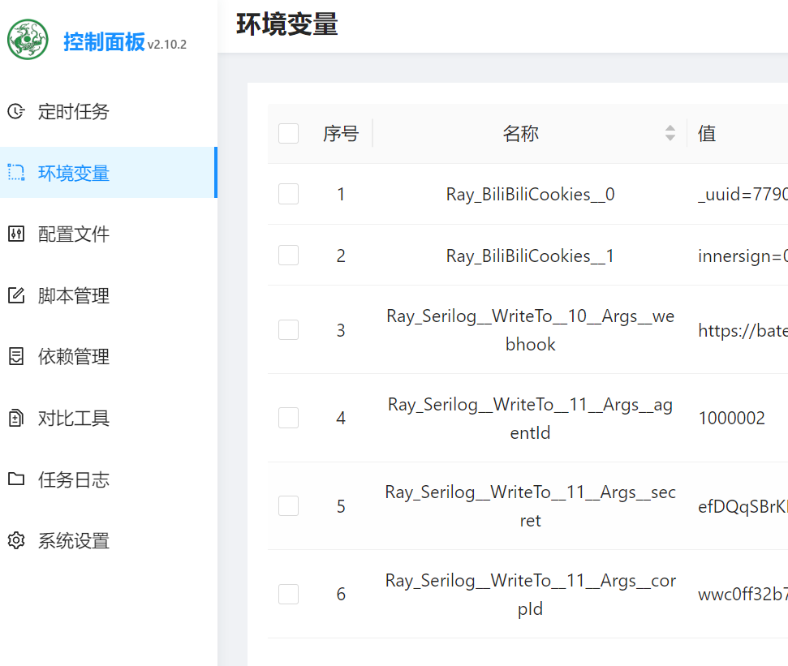
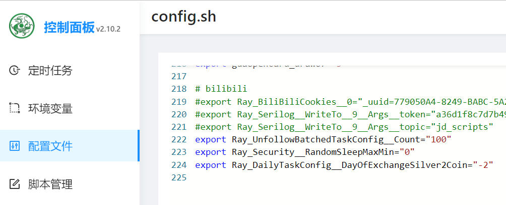
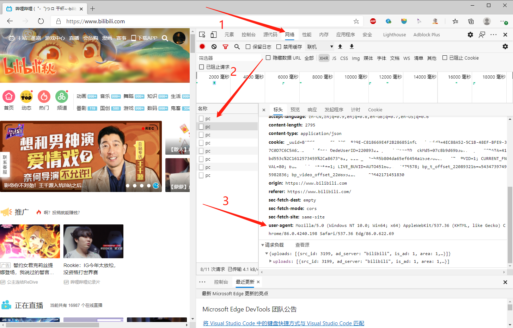
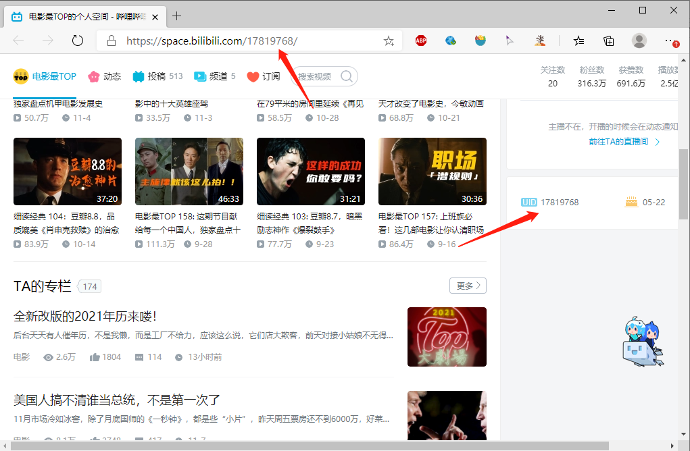
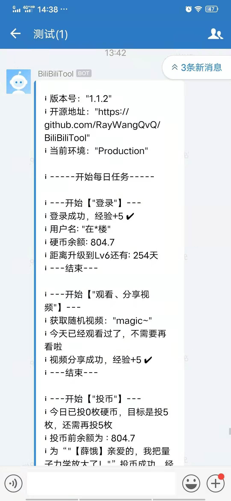
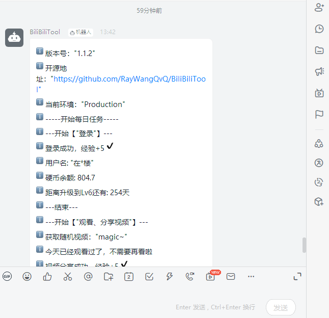
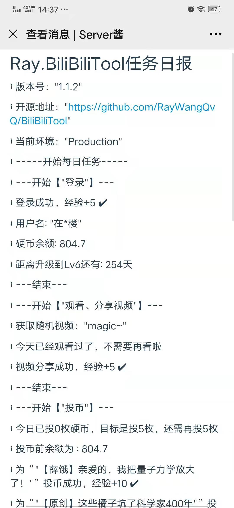

# Configuration

This guide covers configuration sources, their precedence, and individual settings. The examples use environment variables; for the Console application, prefix configuration variables with `Ray_` as described below.

## Contents

- [1. Configuration methods](#1-configuration-methods)
  - [1.1. Configuration files](#11-configuration-files)
  - [1.2. Command-line arguments](#12-command-line-arguments)
  - [1.3. Environment variables](#13-environment-variables-recommended)
  - [1.4. QingLong panel](#14-qinglong-panel)
- [2. Precedence](#2-precedence)
- [3. Settings reference](#3-settings-reference)
  - [3.1. Cookies](#31-cookies)
  - [3.2. Security](#32-security)
  - [3.3. Daily tasks](#33-daily-tasks)
  - [3.4. Live lottery](#34-live-lottery)
  - [3.5. Batch unfollowing](#35-batch-unfollowing)
  - [3.6. VIP big points](#36-vip-big-points)
  - [3.7. B-coin coupon charging](#37-free-b-coin-coupon-charging)
  - [3.8. Notifications](#38-notifications)
  - [3.9. Logging and scheduling](#39-logging-and-scheduling)
  - [3.10. Automatic recovery](#310-automatic-recovery)

<a id="markdown-1-配置方式" name="1-配置方式"></a>
## 1. Configuration methods

<a id="markdown-11-方式一修改配置文件" name="11-方式一修改配置文件"></a>
### 1.1. Configuration files

For a local release package, edit the applicable `appsettings.json` file in the application directory. The Console project also has `appsettings.Development.json` and `appsettings.Production.json`; the latter applies when the environment is `Production`. Settings from an environment-specific file override the base file. Save your changes before starting the application.

<a id="markdown-12-方式二命令启动时通过命令行参数配置" name="12-方式二命令启动时通过命令行参数配置"></a>
### 1.2. Command-line arguments

The available short argument aliases are defined in [the command-line mapping](../src/Ray.BiliBiliTool.Config/Constants.cs). Use `--key=value` (not the old single-dash form). For example:

```bash
dotnet Ray.BiliBiliTool.Console.dll --cookieStr1="SESSDATA=..." --numberOfCoins=5
```

On Windows with a self-contained release, use `.\Ray.BiliBiliTool.Console.exe` instead of `dotnet Ray.BiliBiliTool.Console.dll`; on Linux, use `./Ray.BiliBiliTool.Console`. Only a subset of options has short aliases, so configuration files or environment variables are generally more convenient. See [local installation](runInLocal.md) for current release package names.

<a id="markdown-13-方式三添加环境变量推荐" name="13-方式三添加环境变量推荐"></a>
### 1.3. Environment variables (recommended)

Use double underscores (`__`) to separate nested configuration keys. For example, on Linux:

```bash
# Web configuration
export BiliBiliCookies__1="SESSDATA=..."
export DailyTaskConfig__NumberOfCoins="3"
dotnet Ray.BiliBiliTool.Web.dll
```

```bash
# Console configuration
export Ray_RunTasks="Daily"
export Ray_BiliBiliCookies__1="SESSDATA=..."
export Ray_BiliBiliCookies__2="SESSDATA=..."
export Ray_DailyTaskConfig__NumberOfCoins="3"
dotnet Ray.BiliBiliTool.Console.dll
```

The Console loader accepts both `Ray_`-prefixed and unprefixed environment variables; use `Ray_` to keep Console settings distinct. On Windows `cmd`, use `set` rather than `export`. Quote cookies: unquoted semicolons are shell command separators. Web tasks use the Web scheduler; setting `RunTasks` is for Console.

<a id="markdown-14-方式四托管在青龙面板上使用面板的环境变量页或配置文件页进行配置" name="14-方式四托管在青龙面板上使用面板的环境变量页或配置文件页进行配置"></a>
### 1.4. QingLong panel

QingLong ultimately passes settings as environment variables. In its **Environment Variables** page (recommended), enter a name such as `Ray_BiliBiliCookies__1` and the cookie as the value.



Alternatively, add exports on its **Configuration Files** page:

```bash
export Ray_BiliBiliCookies__1="_uuid=abc..."
export Ray_Serilog__WriteTo__9__Args__token="abcde"
```



Changes to the configuration-file page may require restarting the QingLong container; use the environment-variable page for changes that take effect without that restart.

<a id="markdown-2-优先级" name="2-优先级"></a>
## 2. Precedence

For Console, configuration is loaded in this order: `appsettings.json` → `appsettings.{Environment}.json` → development user secrets (in Development) → `Ray_`-prefixed environment variables → unprefixed environment variables → command-line arguments → optional `cookies.json`. Later providers override earlier ones for the same key. QingLong's two entry methods both supply environment variables; they are not an additional precedence level.

<a id="markdown-3-详细配置说明" name="3-详细配置说明"></a>
## 3. Settings reference

The keys below use the environment-variable spelling. Prefix them with `Ray_` for the Console/QingLong examples (for instance, `Ray_BiliBiliCookies__1`). Defaults can differ between Console and Web; where relevant, both are shown. Refer to the respective `src/Ray.BiliBiliTool.Console/appsettings.json` and `src/Ray.BiliBiliTool.Web/appsettings.json` for the active application defaults.

<a id="markdown-31-cookie字符串" name="31-cookie字符串"></a>
### 3.1. Cookies

Provide at least one Bilibili account cookie; additional numbered entries allow multiple accounts. Obtain the semicolon-separated cookie string from your browser and keep it private.

| Field | Value | Example |
| --- | --- | --- |
| Configuration key | `BiliBiliCookies__1` | `export Ray_BiliBiliCookies__1="abc=123;def=456;"` |
| Accepted value | Cookie string, separated by ASCII semicolons | `abc=123;def=456;` |
| Default | Empty | |

| Field | Value | Example |
| --- | --- | --- |
| Configuration key | `BiliBiliCookies__2` | `export Ray_BiliBiliCookies__2="abc=123;def=456;"` |
| Accepted value | Another semicolon-separated cookie string | `abc=123;def=456;` |
| Default | Empty | |

<a id="markdown-32-安全相关的配置" name="32-安全相关的配置"></a>
### 3.2. Security

<a id="markdown-321-是否跳过执行任务" name="321-是否跳过执行任务"></a>
#### 3.2.1. Skip tasks

Set this to `true` to stop Console task execution before calling Bilibili APIs. This is useful for temporarily disabling a scheduled run.

| Field | Value | Example |
| --- | --- | --- |
| Configuration key | `Security__IsSkipDailyTask` | `export Ray_Security__IsSkipDailyTask=true` |
| Accepted value | `true` or `false` | |
| Default | `false` (Console) | |

<a id="markdown-322-随机睡眠的最大时长" name="322-随机睡眠的最大时长"></a>
#### 3.2.2. Maximum random sleep

The Console waits a random number of minutes up to this limit before running tasks; `0` disables the delay. `Login` and `Test` runs skip it.

| Field | Value |
| --- | --- |
| Configuration key | `Security__RandomSleepMaxMin` |
| Accepted value | Nonnegative number of minutes |
| Default | `0` in Console `appsettings.json` |

<a id="markdown-323-两次调用b站api之间的间隔秒数" name="323-两次调用b站api之间的间隔秒数"></a>
#### 3.2.3. Time between Bilibili API requests

Controls the interval between consecutive matching requests to avoid sending them too quickly.

| Field | Value |
| --- | --- |
| Configuration key | `Security__IntervalSecondsBetweenRequestApi` |
| Accepted value | Nonnegative number of seconds |
| Default | `20` |

<a id="markdown-324-间隔秒数所针对的httpmethod" name="324-间隔秒数所针对的httpmethod"></a>
#### 3.2.4. HTTP methods subject to the interval

Comma-separate the methods whose requests should be spaced out. Use `POST` alone if you do not need to delay GET requests.

| Field | Value |
| --- | --- |
| Configuration key | `Security__IntervalMethodTypes` |
| Accepted value | `GET`, `POST`, or `GET,POST` |
| Default | `GET,POST` (Console) |

<a id="markdown-325-请求b站接口时头部传递的user-agent" name="325-请求b站接口时头部传递的user-agent"></a>
#### 3.2.5. Browser User-Agent

Sent in requests to Bilibili. You can inspect your own browser's value using its developer tools:

| Field | Value |
| --- | --- |
| Configuration key | `Security__UserAgent` |
| Accepted value | User-Agent string |
| Default | `Mozilla/5.0 (Windows NT 10.0; Win64; x64) AppleWebKit/537.36 (KHTML, like Gecko) Chrome/124.0.0.0 Safari/537.36 Edg/124.0.0.0` |



<a id="markdown-326-app请求b站接口时头部传递的user-agent" name="326-app请求b站接口时头部传递的user-agent"></a>
#### 3.2.6. App User-Agent

Sent for app-style requests. Do not replace it with a browser User-Agent unless the endpoint requires one.

| Field | Value |
| --- | --- |
| Configuration key | `Security__UserAgentApp` |
| Accepted value | User-Agent string |
| Default | `Mozilla/5.0 (Linux; Android 12; SM-S9080 Build/V417IR; wv) AppleWebKit/537.36 (KHTML, like Gecko) Version/4.0 Chrome/91.0.4472.114 Mobile Safari/537.36 os/android model/SM-S9080 build/7760700 osVer/12 sdkInt/32 network/2 BiliApp/7760700 mobi_app/android channel/bili innerVer/7760710 c_locale/zh_CN s_locale/zh_CN disable_rcmd/0 7.76.0 os/android model/SM-S9080 mobi_app/android build/7760700 channel/bili innerVer/7760710 osVer/12 network/2` |


<a id="markdown-327-webproxy代理" name="327-webproxy代理"></a>
#### 3.2.7. Web proxy

Supports proxies with or without credentials.

| Field | Value |
| --- | --- |
| Configuration key | `Security__WebProxy` |
| Accepted value | `http://host:port` or `user:password@host:port` (the authenticated form adds `http://` internally) |
| Default | Empty (no proxy) |

<a id="markdown-33-每日任务相关" name="33-每日任务相关"></a>
### 3.3. Daily tasks

<a id="markdown-331-是否开启观看视频任务" name="331-是否开启观看视频任务"></a>
#### 3.3.1. Watch videos

Disabling this may also prevent the extra 10-point check-in task in the VIP big-points workflow from completing automatically.

| Field | Value |
| --- | --- |
| Configuration key | `DailyTaskConfig__IsWatchVideo` |
| Accepted value | `true` or `false` |
| Default | `true` |

<a id="markdown-332-是否开启分享视频任务" name="332-是否开启分享视频任务"></a>
#### 3.3.2. Share videos

| Field | Value |
| --- | --- |
| Configuration key | `DailyTaskConfig__IsShareVideo` |
| Accepted value | `true` or `false` |
| Default | `true` |

<a id="markdown-333-每日投币数量" name="333-每日投币数量"></a>
#### 3.3.3. Daily coins

Sets the daily target. Each donation uses one coin because experience depends on the number of donations; the program caps the daily count at five.

| Field | Value |
| --- | --- |
| Configuration key | `DailyTaskConfig__NumberOfCoins` |
| Accepted value | Integer `0`–`5` |
| Default | `5` |

`DailyTaskConfig__NumberOfProtectedCoins` additionally specifies how many coins to keep in reserve (`0` by default; a nonnegative integer). The current daily-task configuration also supports `DailyTaskConfig__DevicePlatform` (`android` by default, or `ios`) for client operations.

<a id="markdown-334-投币时是否同时点赞" name="334-投币时是否同时点赞"></a>
#### 3.3.4. Like when donating a coin

| Field | Value |
| --- | --- |
| Configuration key | `DailyTaskConfig__SelectLike` |
| Accepted value | `true` or `false` |
| Default | `true` in Console and Web `appsettings.json` |

<a id="markdown-335-优先选择支持的up主id集合" name="335-优先选择支持的up主id集合"></a>
#### 3.3.5. Preferred creators

Specify creator IDs to prioritize their videos for watching, sharing, and coin donations. If none is available, the program falls back to special follows, regular follows, and then rankings. Leave the list empty or set it to `-1` for no preferred creator.

| Field | Value |
| --- | --- |
| Configuration key | `DailyTaskConfig__SupportUpIds` |
| Accepted value | Comma-separated creator IDs; empty or `-1` for none |
| Default | Empty in Console and Web `appsettings.json` |

Find a creator's ID on their Bilibili profile page:



<a id="markdown-336-每月几号自动领取会员权益" name="336-每月几号自动领取会员权益"></a>
#### 3.3.6. Day to claim VIP privileges

This legacy daily-task setting described `-1` as unspecified (the first day of the month), `0` as disabled, and `1`–`31` as the chosen day. Its scheduling check is now commented out in the VIP privilege service. The current Console/Web configuration instead has a separate `VipPrivilegeConfig__Cron` schedule; do not rely on the old key to schedule the job.

| Field | Legacy value |
| --- | --- |
| Configuration key | `DailyTaskConfig__DayOfReceiveVipPrivilege` |
| Accepted value | `-1`–`31` (`0` disables claiming) |
| Documented legacy default | `1` |

<a id="markdown-337-每月几号进行直播中心银瓜子兑换硬币" name="337-每月几号进行直播中心银瓜子兑换硬币"></a>
#### 3.3.7. Day to exchange silver seeds for coins

The former daily-task schedule used `-1` for the last day of the month, `-2` for daily, and `0` to disable exchange. Current Console/Web settings schedule the separate silver-to-coin job with `Silver2CoinTaskConfig__Cron`.

| Field | Legacy value |
| --- | --- |
| Configuration key | `DailyTaskConfig__DayOfExchangeSilver2Coin` |
| Accepted value | `-2`, `-1`, `0`, or day `1`–`31` |
| Documented legacy default | `-1` |

<a id="markdown-338-lv6后开启硬币白嫖模式" name="338-lv6后开启硬币白嫖模式"></a>
#### 3.3.8. Save coins after level 6

When enabled, a level-6 account does not donate coins.

| Field | Value |
| --- | --- |
| Configuration key | `DailyTaskConfig__SaveCoinsWhenLv6` |
| Accepted value | `true` or `false` |
| Default | `false` |

<a id="markdown-339-是否开启专栏投币" name="339-是否开启专栏投币"></a>
#### 3.3.9. Donate coins to articles

| Field | Value |
| --- | --- |
| Configuration key | `DailyTaskConfig__IsDonateCoinForArticle` |
| Accepted value | `true` or `false` |
| Default | `false` |

<a id="markdown-34-天选时刻抽奖相关" name="34-天选时刻抽奖相关"></a>
### 3.4. Live lottery

<a id="markdown-341-根据关键字排除奖品" name="341-根据关键字排除奖品"></a>
#### 3.4.1. Exclude prizes by keyword

| Field | Value |
| --- | --- |
| Configuration key | `LiveLotteryTaskConfig__ExcludeAwardNames` |
| Accepted value | Keywords separated with `\|` |
| Default | `舰\|船\|航海\|代金券\|自拍\|照\|写真\|图\|提督` |

<a id="markdown-342-根据关键字指定奖品" name="342-根据关键字指定奖品"></a>
#### 3.4.2. Include prizes by keyword

| Field | Value |
| --- | --- |
| Configuration key | `LiveLotteryTaskConfig__IncludeAwardNames` |
| Accepted value | Keywords separated with `\|` |
| Default | Empty |

<a id="markdown-343-天选抽奖后是否自动分组关注的主播" name="343-天选抽奖后是否自动分组关注的主播"></a>
#### 3.4.3. Group followed streamers automatically

After entering a lottery, place followed streamers into the lottery follow group.

| Field | Value |
| --- | --- |
| Configuration key | `LiveLotteryTaskConfig__AutoGroupFollowings` |
| Accepted value | `true` or `false` |
| Default | `true` |

<a id="markdown-344-天选筹抽奖主播uid黑名单" name="344-天选筹抽奖主播uid黑名单"></a>
#### 3.4.4. Streamer UID denylist

Do not enter lotteries hosted by these streamer IDs. The default list covers streamers previously reported as failing to deliver prizes.

| Field | Value |
| --- | --- |
| Configuration key | `LiveLotteryTaskConfig__DenyUids` |
| Accepted value | Comma-separated IDs, e.g. `65566781,1277481241` |
| Default | `65566781,1277481241,1643654862,603676925` |

<a id="markdown-35-批量取关相关" name="35-批量取关相关"></a>
### 3.5. Batch unfollowing

<a id="markdown-351-想要批量取关的分组名称" name="351-想要批量取关的分组名称"></a>
#### 3.5.1. Follow group to unfollow

| Field | Value |
| --- | --- |
| Configuration key | `UnfollowBatchedTaskConfig__GroupName` |
| Accepted value | Group name |
| Default | `天选时刻` (lottery group) |

<a id="markdown-352-批量取关的人数" name="352-批量取关的人数"></a>
#### 3.5.2. Number of accounts to unfollow

Accounts are processed in reverse order; `-1` means all.

| Field | Value |
| --- | --- |
| Configuration key | `UnfollowBatchedTaskConfig__Count` |
| Accepted value | Integer `-1` or greater |
| Default | `20` in Console and Web `appsettings.json` |

<a id="markdown-353-取关白名单" name="353-取关白名单"></a>
#### 3.5.3. Retained accounts

These creator IDs are excluded from batch unfollowing.

| Field | Value |
| --- | --- |
| Configuration key | `UnfollowBatchedTaskConfig__RetainUids` |
| Accepted value | Comma-separated IDs |
| Default | Empty in Console and Web `appsettings.json` |

<a id="markdown-36-大积分相关" name="36-大积分相关"></a>
### 3.6. VIP big points

<a id="markdown-361-自定义观看番剧" name="361-自定义观看番剧"></a>
#### 3.6.1. Anime series to watch

| Field | Value |
| --- | --- |
| Configuration key | `VipBigPointConfig__ViewBangumis` |
| Accepted value | Series `ssid` (`season_id`) |
| Default | `33378` (Detective Conan) |

<a id="markdown-37-免费b币券充电" name="37-免费b币券充电"></a>
### 3.7. Free B-coin coupon charging

<a id="markdown-371-充电对象" name="371-充电对象"></a>
#### 3.7.1. Charging recipient

Specify a creator ID for automatic charging. Older behavior allowed charging yourself when unspecified; Bilibili no longer permits self-charging. Use another eligible creator or `-1` to leave the recipient unspecified and use the application's fallback.

| Field | Value |
| --- | --- |
| Configuration key | `ChargeTaskConfig__AutoChargeUpId` |
| Accepted value | Creator ID string or `-1` |
| Default | `-1` in Console `appsettings.json`; empty in Web `appsettings.json` (Console Production overrides it) |

<a id="markdown-38-推送相关" name="38-推送相关"></a>
### 3.8. Notifications

Notifications are Serilog output sinks, alongside console and file logging. You can configure multiple sinks; each configured destination receives messages. Telegram, WeCom, ServerChan, and other supported services use the `Serilog__WriteTo__{index}__Args__...` keys below. Keep tokens and webhook URLs private.

<a id="markdown-381-是否开启每个账号单独推送消息" name="381-是否开启每个账号单独推送消息"></a>
#### 3.8.1. Send one notification per account

When enabled, each account is notified separately; otherwise, multi-account results are combined.

| Field | Value |
| --- | --- |
| Configuration key | `Notification__IsSingleAccountSingleNotify` |
| Accepted value | `true` or `false` |
| Legacy documented default | `true` (not present in current Console/Web `appsettings.json`) |

<a id="markdown-382-telegram机器人" name="382-telegram机器人"></a>
#### 3.8.2. Telegram bot


<a id="markdown-3821-bottoken" name="3821-bottoken"></a>
##### 3.8.2.1. `botToken`

Create a bot and obtain its token using the [Telegram Bot API documentation](https://core.telegram.org/api#bot-api).

| Field | Value |
| --- | --- |
| Configuration key | `Serilog__WriteTo__3__Args__botToken` |
| Purpose | Authenticate the Telegram logging sink |
| Accepted value | String |
| Default | Empty |

<a id="markdown-3822-chatid" name="3822-chatid"></a>
##### 3.8.2.2. `chatId`

After messaging the bot, inspect `https://api.telegram.org/bot{TOKEN}/getUpdates` with your token substituted to find the chat ID. Network access to Telegram is required.

| Field | Value |
| --- | --- |
| Configuration key | `Serilog__WriteTo__3__Args__chatId` |
| Accepted value | String |
| Default | Empty |
| Command-line example | None |

<a id="markdown-3823-proxy" name="3823-proxy"></a>
##### 3.8.2.3. `proxy`

Optional proxy for Telegram notifications.

| Field | Value |
| --- | --- |
| Configuration key | `Serilog__WriteTo__3__Args__proxy` |
| Accepted value | `user:password@host:port` |
| Default | Empty |
| Command-line example | None |

<a id="markdown-383-企业微信机器人" name="383-企业微信机器人"></a>
#### 3.8.3. WeCom group bot

Add a bot to a group and copy its webhook URL into the configuration.



<a id="markdown-3831-webhookurl" name="3831-webhookurl"></a>
##### 3.8.3.1. `webHookUrl`

| Field | Value |
| --- | --- |
| Configuration key | `Serilog__WriteTo__4__Args__webHookUrl` |
| Accepted value | URL string |
| Default | Empty |
| Command-line example | None |

<a id="markdown-384-钉钉机器人" name="384-钉钉机器人"></a>
#### 3.8.4. DingTalk group bot

Add a bot to a group and copy its webhook URL. Signature-based security is not supported here; use keyword-based security (for example, `Ray` or `BiliBili`).



<a id="markdown-3841-webhookurl" name="3841-webhookurl"></a>
##### 3.8.4.1. `webHookUrl`

| Field | Value |
| --- | --- |
| Configuration key | `Serilog__WriteTo__5__Args__webHookUrl` |
| Accepted value | URL string |
| Default | Empty |

<a id="markdown-385-server酱" name="385-server酱"></a>
#### 3.8.5. ServerChan

Service documentation: http://sc.ftqq.com/9.version



<a id="markdown-3851-turbosckeyserver酱sckey" name="3851-turbosckeyserver酱sckey"></a>
##### 3.8.5.1. `turboScKey` (ServerChan key)

Obtain the key from the service.

| Field | Value |
| --- | --- |
| Configuration key | `Serilog__WriteTo__6__Args__turboScKey` |
| Accepted value | String |
| Default | Empty |

<a id="markdown-386-酷推" name="386-酷推"></a>
#### 3.8.6. CoolPush

Service site: https://cp.xuthus.cc/

<a id="markdown-3861-skey" name="3861-skey"></a>
##### 3.8.6.1. `sKey`

This integration was reported to have inconsistent API behavior and bot bans; it is not recommended, and CoolPush notification bug reports may not be supported.

| Field | Value |
| --- | --- |
| Configuration key | `Serilog__WriteTo__7__Args__sKey` |
| Accepted value | String |
| Default | Empty |

<a id="markdown-387-推送到自定义api" name="387-推送到自定义api"></a>
#### 3.8.7. Custom API

Send logs to your own API or bot endpoint using a configurable URL and JSON body.

<a id="markdown-3871-api" name="3871-api"></a>
##### 3.8.7.1. `api`

| Field | Value |
| --- | --- |
| Configuration key | `Serilog__WriteTo__8__Args__api` |
| Accepted value | API URL string |
| Default | Empty |

<a id="markdown-3872-placeholder" name="3872-placeholder"></a>
##### 3.8.7.2. `placeholder`

| Field | Value |
| --- | --- |
| Configuration key | `Serilog__WriteTo__8__Args__placeholder` |
| Accepted value | Placeholder string |
| Default | `#msg#` |

<a id="markdown-3873-bodyjsontemplate" name="3873-bodyjsontemplate"></a>
##### 3.8.7.3. `bodyJsonTemplate`

The placeholder is replaced by a JSON-encoded log message, so do not wrap it in another pair of quotes in the template.

| Field | Value |
| --- | --- |
| Configuration key | `Serilog__WriteTo__8__Args__bodyJsonTemplate` |
| Accepted value | JSON body template string |
| Default | `{"msgtype":"markdown","markdown":{"content":#msg#}}` |

<a id="markdown-388-pushplus推荐" name="388-pushplus推荐"></a>
##### 3.8.7.4. `headers`

Optional HTTP headers for custom notification endpoints. Existing URL and JSON template settings continue to work.

```json
"headers": {
  "Authorization": "Bearer your-api-token",
  "X-Api-Key": "your-api-key"
}
```

For environment variables, use `Ray_Serilog__WriteTo__8__Args__headers__X-Api-Key=your-api-key`.
The index must match the custom API sink in your own configuration. Keep real header values in local configuration.

#### 3.8.8. PushPlus (recommended)

Service documentation: http://www.pushplus.plus/doc/

<a id="markdown-3881-pushplus的token" name="3881-pushplus的token"></a>
##### 3.8.8.1. PushPlus token

Obtain it from the service.

| Field | Value |
| --- | --- |
| Configuration key | `Serilog__WriteTo__9__Args__token` |
| Accepted value | String |
| Default | Empty |

<a id="markdown-3882-pushplus的topic" name="3882-pushplus的topic"></a>
##### 3.8.8.2. PushPlus topic

Optional group code for broadcasting; leave empty to notify only yourself. It is ignored for the `webhook` channel.

| Field | Value |
| --- | --- |
| Configuration key | `Serilog__WriteTo__9__Args__topic` |
| Accepted value | String |
| Default | Empty |

<a id="markdown-3883-pushplus的channel" name="3883-pushplus的channel"></a>
##### 3.8.8.3. PushPlus channel

| Field | Value |
| --- | --- |
| Configuration key | `Serilog__WriteTo__9__Args__channel` |
| Accepted value | `wechat`, `webhook`, `cp`, `sms`, or `mail` |
| Default | Empty |

<a id="markdown-3884-pushplus的webhook" name="3884-pushplus的webhook"></a>
##### 3.8.8.4. PushPlus webhook

This is a webhook *code*, not a URL; set it on the service for the `webhook` or `cp` channel.

| Field | Value |
| --- | --- |
| Configuration key | `Serilog__WriteTo__9__Args__webhook` |
| Accepted value | String |
| Default | Empty |
| Command-line example | None |

<a id="markdown-389-microsoft-teams" name="389-microsoft-teams"></a>
#### 3.8.9. Microsoft Teams

See [Microsoft Teams incoming webhook documentation](https://docs.microsoft.com/en-us/microsoftteams/platform/webhooks-and-connectors/how-to/add-incoming-webhook).

<a id="markdown-3891-microsoft-teams的webhook" name="3891-microsoft-teams的webhook"></a>
##### 3.8.9.1. Teams webhook

Copy the full URL from the Teams channel.

| Field | Value |
| --- | --- |
| Configuration key | `Serilog__WriteTo__10__Args__webhook` |
| Accepted value | URL string |
| Default | Empty |
| Command-line example | None |

<a id="markdown-3810-企业微信应用推送" name="3810-企业微信应用推送"></a>
#### 3.8.10. WeCom app notifications

The `corpId`, `agentId`, and `secret` must all be nonempty to enable this sink. At least one of `toUser`, `toParty`, and `toTag` must be specified; `toUser` defaults to `@all`. See [WeCom application message documentation](https://developer.work.weixin.qq.com/tutorial/application-message).

<a id="markdown-38101-企业微信应用推送的corpid" name="38101-企业微信应用推送的corpid"></a>
##### 3.8.10.1. `corpId`

| Field | Value |
| --- | --- |
| Configuration key | `Serilog__WriteTo__11__Args__corpId` |
| Accepted value | String |
| Default | Empty |
| Command-line example | None |

<a id="markdown-38102-企业微信应用推送的agentid" name="38102-企业微信应用推送的agentid"></a>
##### 3.8.10.2. `agentId`

| Field | Value |
| --- | --- |
| Configuration key | `Serilog__WriteTo__11__Args__agentId` |
| Accepted value | String |
| Default | Empty |
| Command-line example | None |

<a id="markdown-38103-企业微信应用推送的secret" name="38103-企业微信应用推送的secret"></a>
##### 3.8.10.3. `secret`

| Field | Value |
| --- | --- |
| Configuration key | `Serilog__WriteTo__11__Args__secret` |
| Accepted value | String |
| Default | Empty |
| Command-line example | None |

#### 3.8.11. Gotify

The current Serilog configuration also includes a Gotify sink. Supply the host and an application token to use it.

| Field | Value |
| --- | --- |
| Configuration key | `Serilog__WriteTo__12__Args__host` |
| Accepted value | Gotify server URL |
| Default | Empty |

| Field | Value |
| --- | --- |
| Configuration key | `Serilog__WriteTo__12__Args__token` |
| Accepted value | Gotify application token |
| Default | Empty |

<a id="markdown-39-日志相关" name="39-日志相关"></a>
### 3.9. Logging and scheduling

<a id="markdown-391-日志输出等级" name="391-日志输出等级"></a>
#### 3.9.1. Console log level

Serilog's console sink normally starts at `Information`. Change it to `Debug` when troubleshooting; this may expose Bilibili API requests and responses, so redact sensitive values before sharing logs. The application's global minimum level must also allow debug events.

| Field | Value |
| --- | --- |
| Configuration key | `Serilog__WriteTo__0__Args__restrictedToMinimumLevel` |
| Accepted value | Serilog levels, such as `Information` or `Debug` |
| Default | `Information` |

<a id="markdown-392-日志输出样式" name="392-日志输出样式"></a>
#### 3.9.2. Console output template

Set a Serilog output template to change which timestamps, levels, and messages appear in console logs (including logs shown by workflows).

| Field | Value |
| --- | --- |
| Configuration key | `Serilog__WriteTo__0__Args__outputTemplate` |
| Accepted value | Serilog template string |
| Default | `[{Timestamp:HH:mm:ss} {Level:u3}] {Message:lj}{NewLine}{Exception}` |

<a id="markdown-393-定时任务相关" name="393-定时任务相关"></a>
#### 3.9.3. Scheduled jobs

The [Docker/Web deployment](../platforms/docker/README.md) uses Quartz schedules for task jobs. Use Quartz-compatible cron expressions (including a seconds field), not five-field Unix cron. Schedule settings are available in the Web configuration UI as well.

<a id="markdown-394-定时任务" name="394-定时任务"></a>
#### 3.9.4. Cron settings

Each configured `Cron` controls its corresponding job. The original four settings remain available; the current Web application also schedules the additional jobs listed below.

| Environment variable | Scheduled job |
| --- | --- |
| `DailyTaskConfig__Cron` | Daily tasks |
| `LiveLotteryTaskConfig__Cron` | Live lottery |
| `UnfollowBatchedTaskConfig__Cron` | Batch unfollowing |
| `VipBigPointConfig__Cron` | VIP big points |
| `MangaTaskConfig__Cron` | Manga reading |
| `MangaPrivilegeTaskConfig__Cron` | Manga privileges |
| `Silver2CoinTaskConfig__Cron` | Silver-to-coin exchange |
| `ChargeTaskConfig__Cron` | Charging |
| `VipPrivilegeConfig__Cron` | VIP privileges |
| `LiveFansMedalTaskConfig__Cron` | Live fan medals |

<a id="markdown-310-自动补做相关" name="310-自动补做相关"></a>
### 3.10. Automatic recovery

In `Ray.BiliBiliTool.Web` (for example, the [Docker/Web deployment](../platforms/docker/README.md)), the **Today's Tasks** page records daily results. If a task is due but was missed or failed and is still eligible for retry, recovery attempts it automatically. Recovery runs at a fixed interval, not on cron; there is no `AutoRecoverConfig__Cron`.

<a id="markdown-3101-是否开启自动补做" name="3101-是否开启自动补做"></a>
#### 3.10.1. Enable automatic recovery

Disabling recovery stops automatic reruns but does not stop recording task results.

| Field | Value |
| --- | --- |
| Configuration key | `AutoRecoverConfig__IsEnable` |
| Accepted value | `true` or `false` |
| Default | `true` |

<a id="markdown-3102-检查间隔小时数" name="3102-检查间隔小时数"></a>
#### 3.10.2. Check interval in hours

How often to check for missed tasks.

| Field | Value |
| --- | --- |
| Configuration key | `AutoRecoverConfig__IntervalHours` |
| Accepted value | `1`–`24` hours |
| Default | `2` |

<a id="markdown-3103-执行记录保留天数" name="3103-执行记录保留天数"></a>
#### 3.10.3. Execution record retention

Old execution records displayed on **Today's Tasks** are cleaned up after this many days.

| Field | Value |
| --- | --- |
| Configuration key | `AutoRecoverConfig__RecordRetentionDays` |
| Accepted value | `1`–`90` days |
| Default | `3` |
