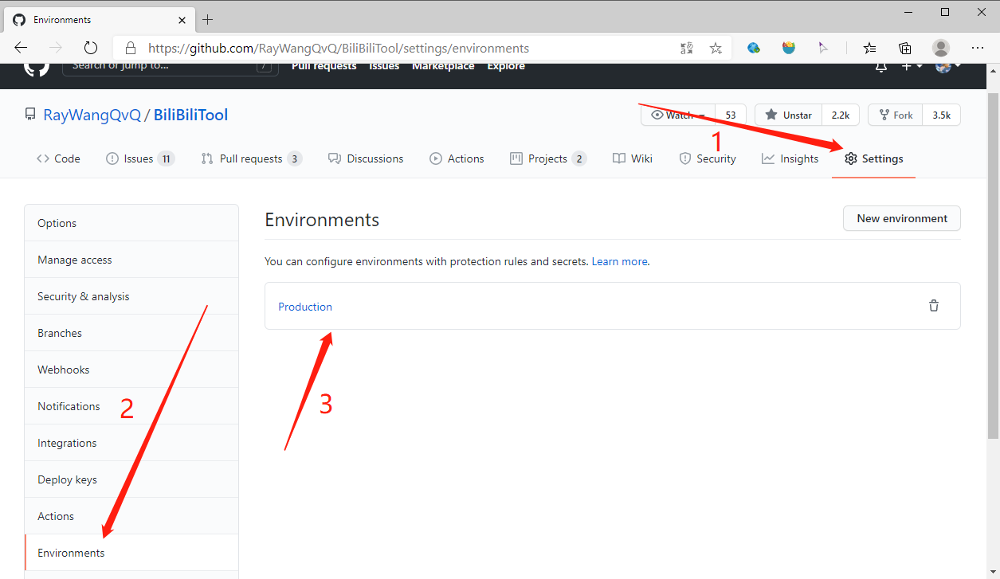
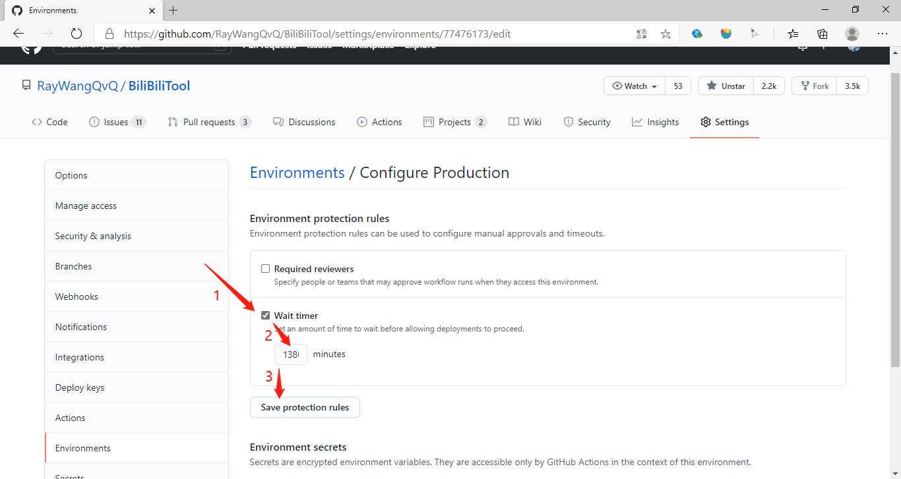
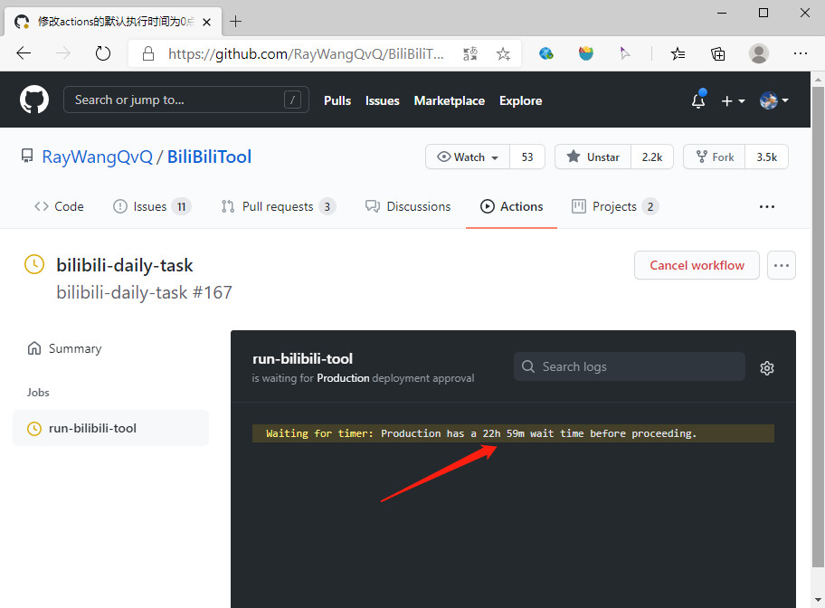
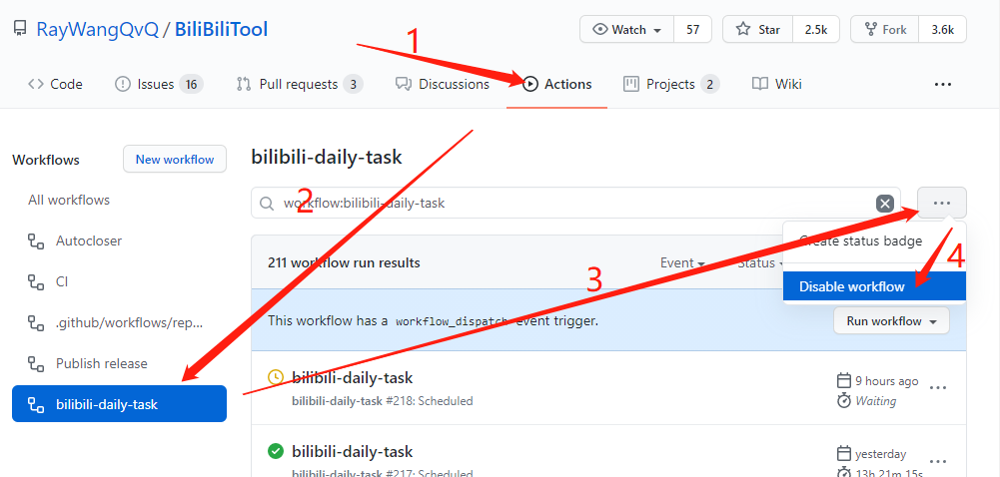

# 常见问题

**[目录]**
<!-- TOC depthFrom:2 -->

- [1. 运行出现异常怎么办？](#1-运行出现异常怎么办)
- [2. 如何提交issue（如何提交Bug或建议）](#2-如何提交issue如何提交bug或建议)
- [3. Actions定时任务没有每天自动运行](#3-actions定时任务没有每天自动运行)
- [4. Actions修改定时任务的执行时间](#4-actions修改定时任务的执行时间)
    - [4.1. 方法一：修改yaml文件中的cron表达式](#41-方法一修改yaml文件中的cron表达式)
    - [4.2. 方法二：添加 GitHub Environments 并设置延时](#42-方法二添加-github-environments-并设置延时)
- [5. 我 Fork 之后怎么同步原作者的更新内容？](#5-我-fork-之后怎么同步原作者的更新内容)
    - [5.1. 方法一：删掉自己的仓库再重新Fork](#51-方法一删掉自己的仓库再重新fork)
    - [5.2. 方法二：使用提供的 Repo Sync 工作流脚本同步](#52-方法二使用提供的-repo-sync-工作流脚本同步)
    - [5.3. 方法三：手动PR同步](#53-方法三手动pr同步)
    - [5.4. 方法四：使用插件 Pull App 同步](#54-方法四使用插件-pull-app-同步)
        - [5.4.1. Pull App 方式一： 源作者内容直接覆盖自己内容](#541-pull-app-方式一-源作者内容直接覆盖自己内容)
        - [5.4.2. Pull App 方式二： 保留自己内容](#542-pull-app-方式二-保留自己内容)
- [6. 本地或服务器如何安装.net环境](#6-本地或服务器如何安装net环境)
- [7. 如何关停Actions运行](#7-如何关停actions运行)
    - [7.1. 方法一：使用配置关停每日任务](#71-方法一使用配置关停每日任务)
    - [7.2. 方法二：关停Actions](#72-方法二关停actions)

<!-- /TOC -->

## 1. 运行出现异常怎么办？
第一步：根据异常信息，请先仔细阅读文档（特别是 [常见问题文档](https://github.com/RayWangQvQ/BiliBiliTool.Docs/blob/main/questions.md) 和 [配置说明文档](https://github.com/RayWangQvQ/BiliBiliTool.Docs/blob/main/configuration.md) ），查找相关信息

第二步：如果文档没有找到，请到 [issues](https://github.com/RayWangQvQ/BiliBiliTool/issues) 下面查找相关问题，看是否有人其他人也遇到类似问题，并确认issue下是否已经有解决方案

第三步：如果仍没有解决，请将日志输出等级配置为Debug，该等级会输出详细的日志信息，修改后请再次运行，并查看详细的日志信息。如何配置请详见 [配置说明文档](https://github.com/RayWangQvQ/BiliBiliTool.Docs/blob/main/configuration.md)

第四步：拿到详细日志后，如果自己无法根据日志信息确定问题，请将日志信息贴到讨论群里，群里会有大佬及时帮忙解答

第五步：如果根据详细日志信息可以确认是 Bug（缺陷），可以到 [issues](https://github.com/RayWangQvQ/BiliBiliTool/issues) 下新建一条 issue 。如何新建issue请见下面的常见问题中的**如何提交issue**，如果是不符合要求的issue，会被关闭，严重的会被删除。

## 2. 如何提交issue（如何提交Bug或建议）
issues 被 GitHub 译为**议题**，用来为开源项目反馈 Bug、提出建议、讨论设计与需求等。

首先先提前感谢所有提交议题的朋友们，你们的反馈和建议会让开源程序优化的越来越好。

但为了使 issues 下面的议题便于维护，便于其他人搜索查找历史议题，避免淹没在一堆无用或重复的 issues 里，请大家自觉遵守下面的提交规范：

Ⅰ. 提交前请先确认自己的议题是否是新的议题（是否在文档中已有说明、是否已经有其他人提过类似的议题），重复议题会被标记为重复并关闭，严重的会被删除

Ⅱ. issue标题请填写完整，语义需清晰，以便在不点击进入详情时，仅根据标题就可以定位到该 issue 所反应的问题

Ⅲ. 如果是提交 bug ，请描述清楚问题，**标明版本号、环境，并贴上详细日志信息（Debug等级的日志信息）**。如果获取Debug等级的日志信息请参见配置说明文档，如果没有日志信息，或日志信息不是Debug等级的日志信息，或在没有日志的情况下描述也不清晰，导致无法复现或无法定位问题，该 issue 会被标记为不清晰的议题，且会被忽略或关闭，严重的会被删除。

## 3. Actions定时任务没有每天自动运行
Fork的仓库，actions默认是关闭的，需要对仓库进行1次操作才会触发webhook。

可以通过在页面上点击创建wiki来触发，也可以通过任意一次提交推送代码来触发。

## 4. Actions修改定时任务的执行时间
每日任务执行的时间，由`.github/workflows/bilibili-daily-task.yml` 中的cron表达式指定，默认为每日的0点整:

```yml
  schedule:
    - cron: '0 16 * * *' 
    # cron表达式，时区是UTC时间，比我们早8小时，如上所表示的是每天0点0分（24点整）
```

若要修改为自己指定的时间执行，有如下两种方式：

### 4.1. 方法一：修改yaml文件中的cron表达式
我们可以直接修改上述该文件中的cron表达式，然后提交。

个人不建议这么做，因为以后更新要注意冲突与覆盖问题，建议使用下面的方法二。

### 4.2. 方法二：添加 GitHub Environments 并设置延时
v1.1.3及之后版本，支持通过添加GitHub Environments来设置延时运行，即在每日0点整触发 Actions 后，会再多执行一个延时操作，延时时长可由我们自己设置。

比如想设置为每天23点执行，只需要将这个延时时常设置为1380分钟（23个小时）即可。方法如下：

* Ⅰ.找到 Production Environments

运行完 bilibili-daily-task.yml 之后，在 `Settings` ——> `Environments` 中会自动多出一个名为 `Production` 的环境，如下图所示：



如果没有，也可以自己手动点击添加。

* Ⅱ.设置延时时长

勾选 Wait timer，并填写延时时长，单位为分钟，如下图所示：



下面给出一些常用的分钟数换算供参考：

   | 时间 | 从0点开始计算的分钟数               |
   | -------------- | --------------------- |
   | 6点整  | 360 |
   | 8点整  | 480 |
   | 9点整  | 540 |
   | 12点整  | 720 |
   | 14点整  | 840 |
   | 18点整  | 1080 |
   | 22点整  | 1320 |
   | 23点整  | 1380 |

注意，Actions 目前本身是有20分钟左右的延时的，是 GitHub 暂未解决的缺陷，属于正常现象。

设置成功后，再次运行 Actions 会发现触发后会自动进入倒计时状态，等倒计时结束后才会真正运行之后的内容，如下图所示：



## 5. 我 Fork 之后怎么同步原作者的更新内容？
Fork 被 GitHub 译为复刻，相当于拷贝了一份源作者的代码到自己的 Repository （仓库）里，Fork 后，源作者更新自己的代码内容（比如发新的版本），一般情况下 Fork 的项目并不会自动更新源作者的修改。

BiliBiliTool内置了自动同步的 actions（即下面的方法二），默认情况下，Fork的仓库会在每周一会自动拉取更新源仓库内容，如想要更新请参考方法二。

这里共提供如下4种方法同步更新的方法：

### 5.1. 方法一：删掉自己的仓库再重新Fork
这是最最最保守的方法，删掉后重新Fork会导致之前配置过的GitHub Secrets和提交的代码更改全部丢掉，只能重新部署。
所以，请把该方法放到保底的位置，即如果你已经尝试了下面所有方法都还不能成功，再保底考虑使用该方法。

### 5.2. 方法二：使用提供的 Repo Sync 工作流脚本同步
> BiliBiliTool提供了一个用于自动同步上游仓库的脚本 [repo-sync.yml](https://github.com/RayWangQvQ/BiliBiliTool/blob/main/.github/workflows/repo-sync.yml)，执行后，会拉取源仓库最新内容直接覆盖掉自己的代码修改内容。该脚本默认开启，且每周一自动执行一次，如要关闭，可以将yml文件里的schedule使用#号注释掉。

脚本内部需要一个Token参数完成授权，我们要做的共两步：1.获取自己的 Token 并添加到 Secrets 中，2.运行脚本。

详细步骤如下：

Ⅰ. [>>点击生成 Token](https://github.com/settings/tokens/new?description=repo-sync&scopes=repo,workflow) ，将生成的 `Token` 复制下来。

Token 只显示一次，没复制只能重新生成。更多关于加密机密的说明可以查看 Github 官方文档：[加密机密](https://docs.github.com/cn/free-pro-team@latest/actions/reference/encrypted-secrets)。


Ⅱ. 将上一步生成的 `Token `添加到 `Github Secrets` 中。

   | GitHub Secrets | CONTENT               |
   | -------------- | --------------------- |
   | Name           | `PAT`                 |
   | Value          | 上一步生成的 `Token ` |


Ⅲ. 手动触发 `workflow` 工作流进行代码同步。


_该脚本是在v1.0.12添加的，如果你的版本低于该版本，没有该yaml文件，也可以直接在自己的 Fork 的仓库下面新建一个，然后将我的文件内容拷贝过去，提交文件，剩下的再继续按照上面流程走就可以了。_

### 5.3. 方法三：手动PR同步
由于大量不懂PR的人乱操作，导致每次更新版本，源仓库都收到大量辣鸡无效的PR请求，现删除了方法三。

### 5.4. 方法四：使用插件 Pull App 同步
需要安装 [ Pull app](https://github.com/apps/pull) 插件。

安装过程中会让你选择要选择那一种方式;

`All repositories`表示同步已经 frok 的仓库以及未来 fork 的仓库；

`Only select repositories`表示仅选择要自己需要同步的仓库，其他 fork 的仓库不会被同步。

根据自己需求选择，实在不知道怎么选择，就选 `All repositories`。

点击 `install`，完成安装。


Pull App 可以指定是否保留自己已经修改的内容，分为下面两种方式，如果你不知道他们的区别，就请选择方式一；如果你知道他们的区别，并且懂得如何解决 git 冲突，可根据需求自由选择任一方式：

#### 5.4.1. Pull App 方式一： 源作者内容直接覆盖自己内容
> 该方式会将源作者的内容直接强制覆盖到自己的仓库中，也就是不会保留自己已经修改过的内容。
步骤如下：

Ⅰ. 确认已安装 [ Pull app](https://github.com/apps/pull) 插件。

Ⅱ. 编辑 [pull.yml](https://github.com/RayWangQvQ/BiliBiliTool/blob/main/.github/pull.yml) 文件，将第 5 行内容修改为 `mergeMethod: hardreset`，然后保存提交。

（默认就是hardreset，如果未修改过，可以不用再次提交）

完成后，上游代码更新后 pull 插件会自动发起 PR 更新**覆盖**自己仓库的代码！

当然也可以立即手动触发同步：`https://pull.git.ci/process/${owner}/${repo}`

#### 5.4.2. Pull App 方式二： 保留自己内容

> 该方式会在上游代码更新后，判断上游更新内容和自己分支代码是否存在冲突，如果有冲突则需要自己手动合并解决（也就是不会直接强制直接覆盖）。如果上游代码更新涉及 workflow 里的文件内容改动，这时也需要自己手动合并解决。

步骤如下：

Ⅰ. 确认已安装 [ Pull app](https://github.com/apps/pull) 插件。

Ⅱ. 编辑 [pull.yml](https://github.com/RayWangQvQ/BiliBiliTool/blob/main/.github/pull.yml) 文件，将第 5 行内容修改为 `mergeMethod: merge`，然后保存提交。

完成后，上游代码更新后 pull 插件就会自动发起 PR 更新自己分支代码！只是如果存在冲突，需要自己手动去合并解决冲突。

当然也可以立即手动触发同步：`https://pull.git.ci/process/${owner}/${repo}`

## 6. 本地或服务器如何安装.net环境
若需手动安装运行环境，请点击 ，分别选择相应平台的`ASP.NET Core Runtime 5.0.0`与`.NET Runtime 5.0.0`的安装包（Installers）进行安装；亦可下载.NET SDK 5.0.100的安装包（上述二者已包含于其中）。

注：若已从  的“Download .NET Runtime”选项进行了下载安装，则仍需根据上述方法补充安装`ASP.NET Core Runtime 5.0.0`（由于该选项仅提供了`.NET Runtime 5.0.0`的安装包）。

## 7. 如何关停Actions运行
推荐做法有两种：一是使用配置关停应用的每日任务，二是关停Actions。

当然，直接删库也是可以的，但是不推荐，除非是已确认以后都不会再使用的情况。因为删库会让已有配置都丢失，且使自动更新版本的Actions失效。

### 7.1. 方法一：使用配置关停每日任务

详情见 [配置说明文档](https://github.com/RayWangQvQ/BiliBiliTool.Docs/blob/main/configuration.md#321-isskipdailytask%E6%98%AF%E5%90%A6%E8%B7%B3%E8%BF%87%E6%89%A7%E8%A1%8C%E4%BB%BB%E5%8A%A1)。

该方法是在应用层面关闭每日任务，即Actions还是会每天运行，只是进入程序后，应用不会去执行每日任务，即不会调用任何接口。如果配置了推送，每天仍能收到推送消息。

### 7.2. 方法二：关停Actions
 
点击Actions进入Workflows列表，点击名称为`bilibili-daily-task`的Workflow，在搜索框右侧有一个三个点的设置按钮，点击按钮后，在弹出的下拉列表里选中`Disable workflow`项即可，如下图所示：


该方法是直接关闭了Actions，即不会触发每天定时的Actions。
