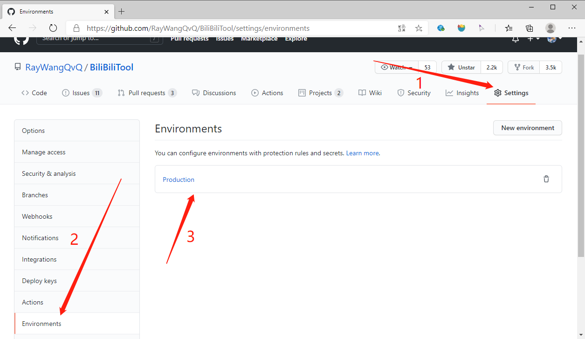
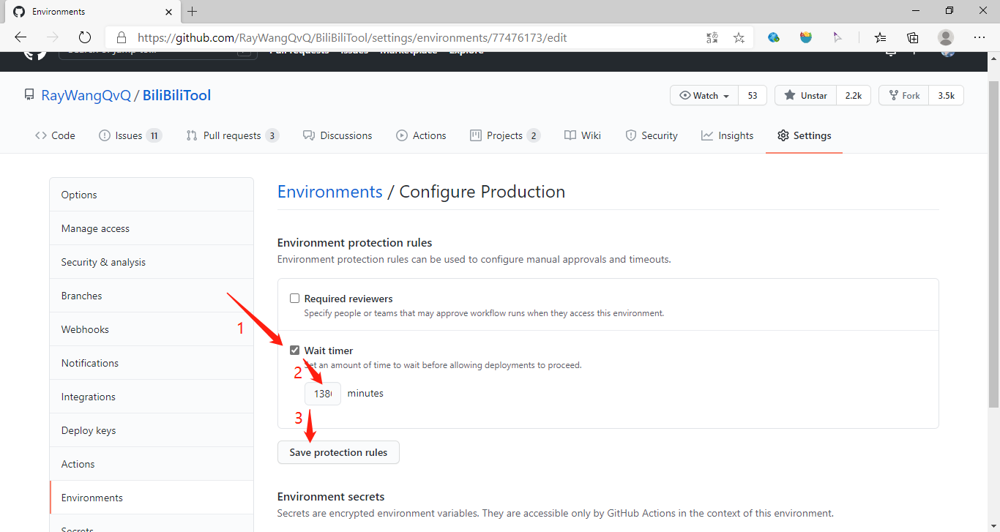
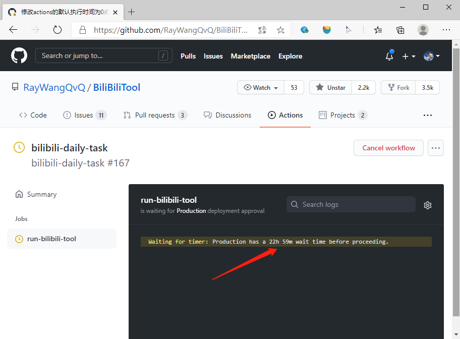
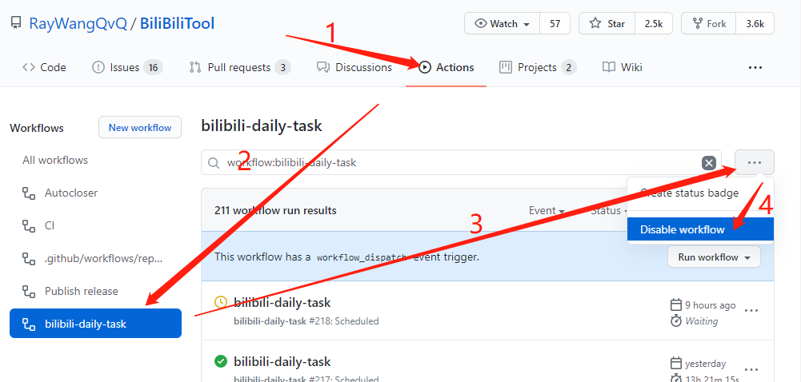

# Frequently asked questions

## Contents

- [1. What should I do if a run fails?](#1-what-should-i-do-if-a-run-fails)
- [2. How do I report a bug or suggest a change?](#2-how-do-i-report-a-bug-or-suggest-a-change)
- [3. Why is my scheduled GitHub Actions run missing?](#3-why-is-my-scheduled-github-actions-run-missing)
- [4. How do I change the scheduled run time?](#4-how-do-i-change-the-scheduled-run-time)
  - [4.1. Edit the workflow cron expression](#41-edit-the-workflow-cron-expression)
  - [4.2. Use a GitHub Environment wait timer](#42-use-a-github-environment-wait-timer)
- [5. How do I sync my fork with upstream?](#5-how-do-i-sync-my-fork-with-upstream)
  - [5.1. Delete and re-fork](#51-delete-and-re-fork)
  - [5.2. Use the included sync workflow](#52-use-the-included-sync-workflow)
  - [5.3. Sync manually without opening an upstream PR](#53-sync-manually-without-opening-an-upstream-pr)
  - [5.4. Use Pull App](#54-use-pull-app)
    - [5.4.1. Replace local changes](#541-replace-local-changes)
    - [5.4.2. Preserve local changes](#542-preserve-local-changes)
- [6. How do I install .NET locally or on a server?](#6-how-do-i-install-net-locally-or-on-a-server)
- [7. How do I stop scheduled runs?](#7-how-do-i-stop-scheduled-runs)
  - [7.1. Skip tasks in the application](#71-skip-tasks-in-the-application)
  - [7.2. Disable the workflow](#72-disable-the-workflow)

<a id="1-运行出现异常怎么办"></a>
## 1. What should I do if a run fails?

1. Read the error and check this FAQ and the [configuration guide](configuration.md).
2. Search [existing issues](https://github.com/RayWangQvQ/BiliBiliToolPro/issues) for the same symptom and any available workaround.
3. If needed, set `Serilog__WriteTo__0__Args__restrictedToMinimumLevel` to `Debug` and rerun; see [console log level](configuration.md#391-console-log-level). Debug logs can contain sensitive request data: remove cookies, tokens, and personal information before posting them.
4. Review the detailed logs and ask in the project's discussion channels if you still cannot identify the cause.
5. If the logs indicate a reproducible defect, [open an issue](https://github.com/RayWangQvQ/BiliBiliToolPro/issues) with the details requested below.

<a id="2-如何提交issue如何提交bug或建议"></a>
## 2. How do I report a bug or suggest a change?

Issues are for bugs, suggestions, design questions, and feature requests. Contributions and clear reports help improve the project. To keep the tracker searchable:

1. Search the docs and [existing issues](https://github.com/RayWangQvQ/BiliBiliToolPro/issues) first. Duplicates may be closed.
2. Write a descriptive title that identifies the issue without requiring the reader to open it.
3. For a bug, include the application version, operating environment, steps to reproduce, expected and actual results, and redacted **Debug-level logs** where available. Without enough information to reproduce or locate the problem, an issue may be closed as unclear.

<a id="3-actions定时任务没有每天自动运行"></a>
## 3. Why is my scheduled GitHub Actions run missing?

Forks may not have scheduled workflows enabled immediately; check your fork's **Actions** tab and enable workflows if prompted. A repository activity such as a commit can also affect when schedules start running. GitHub schedules can be delayed, and schedules in inactive public repositories may be disabled by GitHub.

**This repository does not currently contain the old `bilibili-daily-task.yml` workflow.** Its former daily schedule and the instructions in the next section describe older forks only. The included [fork-sync workflow](../.github/workflows/sync-fork-with-upstream.yml) runs on Monday, Wednesday, and Friday (or on manual dispatch), not every day. For Web deployments, configure task timing through the [Web cron settings](configuration.md#394-cron-settings); these are not GitHub Actions schedules.

<a id="4-actions修改定时任务的执行时间"></a>
## 4. How do I change the scheduled run time?

For an older fork that still has `.github/workflows/bilibili-daily-task.yml`, the former daily run was scheduled at `16:00 UTC` (midnight in UTC+8):

```yaml
schedule:
  - cron: '0 16 * * *'
```

That file is **absent from this repository**. Do not expect a daily Actions task by editing the current [fork-sync workflow](../.github/workflows/sync-fork-with-upstream.yml): it syncs code rather than running Bilibili tasks. For Web task schedules, see [Cron settings](configuration.md#394-cron-settings).

<a id="41-方法一修改yaml文件中的cron表达式"></a>
### 4.1. Edit the workflow cron expression

If your fork has the legacy daily-task workflow, change its `schedule` cron expression and commit the change. GitHub Actions cron uses UTC and five fields. Editing workflow files can create conflicts when syncing upstream changes, so the wait-timer approach below was offered for legacy forks.

<a id="42-方法二添加-github-environments-并设置延时"></a>
### 4.2. Use a GitHub Environment wait timer

In older versions (from v1.1.3) the daily-task workflow used a `Production` environment. After the workflow created it, you could open **Settings → Environments → Production** (or create it), enable **Wait timer**, and enter a delay in minutes. This only delays a job **if its workflow references that environment**; the current repository has no daily-task workflow to delay.



For the legacy midnight UTC+8 trigger, a 1,380-minute wait would aim for 23:00 UTC+8. Example offsets:

| Local time (UTC+8) | Minutes after midnight |
| --- | ---: |
| 06:00 | 360 |
| 08:00 | 480 |
| 09:00 | 540 |
| 12:00 | 720 |
| 14:00 | 840 |
| 18:00 | 1080 |
| 22:00 | 1320 |
| 23:00 | 1380 |



GitHub Actions scheduled starts can also be delayed, so a wait timer does not guarantee an exact start time. Once set, the legacy job enters a countdown before continuing:



<a id="5-我-fork-之后怎么同步原作者的更新内容"></a>
## 5. How do I sync my fork with upstream?

Forking copies the repository to your account; upstream updates do not automatically update your fork unless a sync mechanism is enabled. This repository includes [a sync workflow](../.github/workflows/sync-fork-with-upstream.yml) scheduled at `01:00 UTC` on Monday, Wednesday, and Friday (`09:00 UTC+8`), plus a manual trigger. Choose an approach according to whether you need to preserve your own changes.

<a id="51-方法一删掉自己的仓库再重新fork"></a>
### 5.1. Delete and re-fork

Use this only as a last resort. Deleting the fork discards its repository secrets and commits, requiring you to set it up again. Try the other approaches first.

<a id="52-方法二使用提供的-repo-sync-工作流脚本同步"></a>
### 5.2. Use the included sync workflow

The current workflow is [`.github/workflows/sync-fork-with-upstream.yml`](../.github/workflows/sync-fork-with-upstream.yml), **not** the old `repo-sync.yml`. It checks out the fork, then uses `repo-sync/github-sync@v2` to sync upstream `main` to the fork's `main`; it requires the repository secret `PAT`. Review how this affects local commits before running it.

1. Create a GitHub personal access token with permissions appropriate for updating your fork's repository and workflows. The [legacy token creation link](https://github.com/settings/tokens/new?description=repo-sync&scopes=repo,workflow) preselects `repo` and `workflow` scopes for a classic token. Copy the token when it is shown; you may not be able to view it again. See GitHub's [encrypted secrets documentation](https://docs.github.com/cn/free-pro-team@latest/actions/reference/encrypted-secrets).

   

   

2. Add the token under **Settings → Secrets and variables → Actions** in your fork:

   | Repository secret | Value |
   | --- | --- |
   | Name | `PAT` |
   | Value | The token created in the previous step |

   

   

3. Select **Actions → Sync fork with upstream → Run workflow** to trigger a sync manually, or wait for the scheduled run.

   

The older `repo-sync.yml` instructions applied to releases beginning with v1.0.12; older forks without that file cannot run it unchanged. Use the current workflow file instead if you need this repository's sync setup.

<a id="53-方法三手动pr同步"></a>
### 5.3. Sync manually without opening an upstream PR

The old manual-PR instructions were removed because they caused accidental pull requests **to upstream**. To update your fork manually, use GitHub's **Sync fork** feature or compare upstream changes before merging them **into your fork**; do not open an upstream PR solely to pull upstream updates.

<a id="54-方法四使用插件-pull-app-同步"></a>
### 5.4. Use Pull App

The repository still includes [`.github/pull.yml`](../.github/pull.yml) for [Pull App](https://github.com/apps/pull). During installation, choose **All repositories** to cover current and future forks, or **Only select repositories** to limit access to selected forks. If unsure, review the app's requested permissions before choosing. Then complete the installation:


Pull App can replace your changes or attempt to retain them. Choose the second option only if you can resolve Git conflicts yourself.

<a id="541-pull-app-方式一-源作者内容直接覆盖自己内容"></a>
#### 5.4.1. Replace local changes

1. Install [Pull App](https://github.com/apps/pull).
2. Set `mergeMethod: hardreset` in [`.github/pull.yml`](../.github/pull.yml) and commit it. This is already the checked-in setting.

The app creates an update PR that replaces your fork's changes with upstream content. Historically you could also request processing at `https://pull.git.ci/process/${owner}/${repo}`; availability of this external service is not verified here.

<a id="542-pull-app-方式二-保留自己内容"></a>
#### 5.4.2. Preserve local changes

1. Install [Pull App](https://github.com/apps/pull).
2. Change `mergeMethod: hardreset` to `mergeMethod: merge` in [`.github/pull.yml`](../.github/pull.yml) and commit the change.

The app creates an update PR and attempts to merge upstream changes with your fork. Resolve any conflicts yourself, particularly changes to workflows. The same historical manual-processing URL was `https://pull.git.ci/process/${owner}/${repo}`; check the service before relying on it.

<a id="6-本地或服务器如何安装net环境"></a>
## 6. How do I install .NET locally or on a server?

Follow Microsoft's [.NET installation instructions](https://learn.microsoft.com/zh-cn/dotnet/core/tools/dotnet-install-script). For the current framework-dependent Console release, install a compatible **.NET 10 runtime**; for building from source, the repository pins SDK `10.0.300` in [`global.json`](../global.json). See [running locally](runInLocal.md).

<a id="7-如何关停actions运行"></a>
## 7. How do I stop scheduled runs?

You can stop application tasks without deleting a fork, or disable the corresponding workflow entirely. Deleting a fork removes settings and secrets and is not recommended simply to stop scheduled execution. Note again that this repository does **not** include the old daily-task Actions workflow; the steps below apply if your fork still has one.

<a id="71-方法一使用配置关停每日任务"></a>
### 7.1. Skip tasks in the application

Set [`Security__IsSkipDailyTask`](configuration.md#321-skip-tasks) to `true` for a Console task run. The workflow may still start and the application may still emit logs or notifications, but the Console pre-check stops task execution before calling Bilibili APIs.

<a id="72-方法二关停actions"></a>
### 7.2. Disable the workflow

In your fork's **Actions** tab, select the workflow to stop, open the three-dot menu next to its search box, and choose **Disable workflow**:



That workflow no longer starts on its schedule. The same procedure can be used to disable the currently included fork-sync workflow if you want to stop automatic code synchronization.
