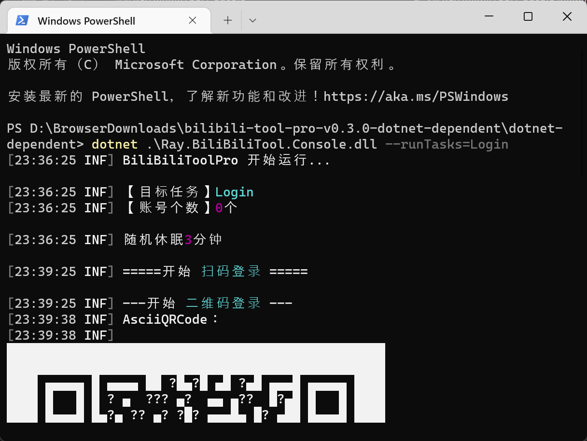

# 下载程序包到本地或服务器运行

<!-- TOC depthFrom:2 -->

- [1. 任意系统，但已安装`.NET 6.0`](#1-任意系统但已安装net-60)
- [2. Win](#2-win)
- [3. Linux:](#3-linux)
- [4. macOS](#4-macos)
- [5. 配置](#5-配置)

<!-- /TOC -->

如果是 DotNet 开发者，直接 Clone 源码，然后 VS 打开解决方案，即可调式和运行。

跑什么任务，可以在`Ray.BiliBiliTool.Console`项目下的`appsettings.json`文件里的`RunTasks`指定。

对于不是开发者的朋友，可以通过下载 [BiliBiliTool/release](https://github.com/RayWangQvQ/BiliBiliToolPro/releases) 到本地或任意服务器运行。

## 1. 任意系统，但已安装`.NET 6.0`

任何操作系统，不管是Win还是Linux还是mac，只要已安装了`.NET 6.0` 环境，均可通过下载`net-dependent.zip`运行。

下载解压后，进入应用目录，执行`dotnet ./Ray.BiliBiliTool.Console.dll --runTasks=Login`

会出现二维码，扫码登录后即可运行各个任务。




P.S.这里的运行环境指的是 `.NET Runtime 6.0.0` ，安装方法可详见 [常见问题](questions.md) 中的 **本地或服务器如何安装.net环境**

## 2. Win

请下载 `win-x86-x64.zip`，此文件已自包含（self-contained）运行环境。

解压后，在应用目录打开cmd或powershell，执行`.\Ray.BiliBiliTool.Console.exe --runTasks=Login`，扫码登录。
也可以直接双击`Ray.BiliBiliTool.Console.exe`来运行，建议使用windows自带的定时任务来执行它

## 3. Linux:

```
wget https://github.com/RayWangQvQ/BiliBiliToolPro/releases/download/0.3.1/bilibili-tool-pro-v0.3.1-linux-x64.zip
unzip bilibili-tool-pro-v0.3.1-linux-x64.zip
cd ./linux-x64/
./Ray.BiliBiliTool.Console --runTasks=Login
```

## 4. macOS
请下载 `osx-x64.zip`，解压后在应用目录运行`./Ray.BiliBiliTool.Console --runTasks=Login`

## 5. 配置

最简单的方式是直接修改应用目录下的`appsettings.json`，详细方法可参考下面的**配置说明**章节。
