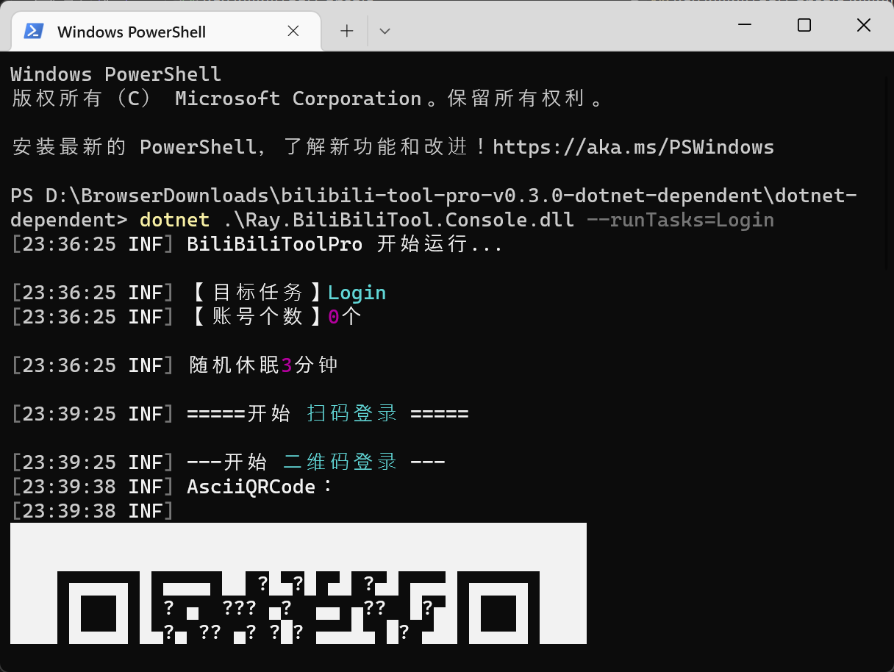
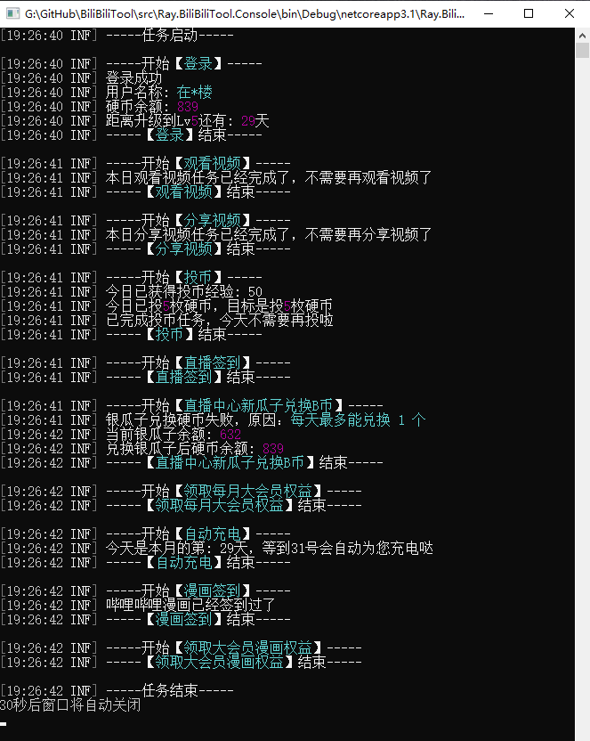

# Run the Console application locally or on a server

Download a package from the [BiliBiliToolPro releases page](https://github.com/RayWangQvQ/BiliBiliToolPro/releases), extract it, and run the executable for your operating system. For a source checkout, install the .NET SDK specified in [`global.json`](../global.json) (`10.0.300` with compatible feature-band roll-forward), open `Ray.BiliBiliTool.sln` in your IDE, or run the Console project with `dotnet run --project src/Ray.BiliBiliTool.Console -- --runTasks=Login`. The Console `RunTasks` setting in `src/Ray.BiliBiliTool.Console/appsettings.json` selects which tasks to run; `--runTasks=Login` starts QR-code login.

## Contents

- [1. Framework-dependent package (.NET 10)](#1-framework-dependent-package-net-10)
- [2. Windows](#2-windows)
- [3. Linux](#3-linux)
- [4. macOS](#4-macos)
- [5. Configuration](#5-configuration)

<a id="1-任意系统但已安装net-100"></a>
## 1. Framework-dependent package (.NET 10)

If you have the **.NET 10 runtime** installed on Linux, download the release asset named `bilibili-tool-pro-v<version>-dotnet-dependent.zip`. The release workflow builds this archive on Linux; the publish script places the application inside a `dotnet-dependent/` directory. Extract it and run:

```bash
cd dotnet-dependent
./Ray.BiliBiliTool.Console --runTasks=Login
```

The current release script publishes a framework-dependent **single-file executable** on the CI host; do not assume the archive contains a `Ray.BiliBiliTool.Console.dll` or a Windows/macOS executable. Use a platform-specific self-contained release below for other operating systems. If working from a build that *does* contain the DLL, `dotnet Ray.BiliBiliTool.Console.dll --runTasks=Login` also works.

Scan the displayed QR code to log in, then select or configure the task you want to run.





See [installing .NET](questions.md#6-how-do-i-install-net-locally-or-on-a-server) for runtime installation help.

<a id="2-win"></a>
## 2. Windows

Download a self-contained Windows release asset for your architecture, such as `bilibili-tool-pro-v<version>-win-x64.zip` or `bilibili-tool-pro-v<version>-win-x86.zip`. Extract it, open Command Prompt or PowerShell in the `win-x64/` or `win-x86/` directory, and run:

```powershell
.\Ray.BiliBiliTool.Console.exe --runTasks=Login
```

Scan the QR code to log in. You can also launch the executable directly and choose a task interactively. For unattended runs, use Windows Task Scheduler and specify the task through `RunTasks` or `--runTasks`.

<a id="3-linux"></a>
## 3. Linux

Download the matching self-contained asset (for example, `bilibili-tool-pro-v<version>-linux-x64.zip`) from [Releases](https://github.com/RayWangQvQ/BiliBiliToolPro/releases). For a known release version, substitute its actual version number below:

```bash
VERSION=1.2.3 # replace with a published release version
curl -fL -O "https://github.com/RayWangQvQ/BiliBiliToolPro/releases/download/${VERSION}/bilibili-tool-pro-v${VERSION}-linux-x64.zip"
unzip "bilibili-tool-pro-v${VERSION}-linux-x64.zip"
cd linux-x64
./Ray.BiliBiliTool.Console --runTasks=Login
```

The old hard-coded `0.3.1` download example is not suitable for current releases. Choose the asset that matches your CPU architecture and distribution (the release script also builds ARM and musl targets).

<a id="4-macos"></a>
## 4. macOS

Download `bilibili-tool-pro-v<version>-osx-x64.zip`, extract it, and from the `osx-x64/` directory run:

```bash
./Ray.BiliBiliTool.Console --runTasks=Login
```

The published `osx-x64` package is for x64 Macs; choose a compatible runtime or build from source if you use a different architecture.

<a id="5-配置"></a>
## 5. Configuration

For the simplest local setup, edit `appsettings.json` in the extracted application directory, or use environment variables. Set `RunTasks` to the desired Console task (for example, `Daily`) if you do not want the interactive task menu. For all configuration methods, cookie settings, and precedence, see the [configuration guide](configuration.md).
