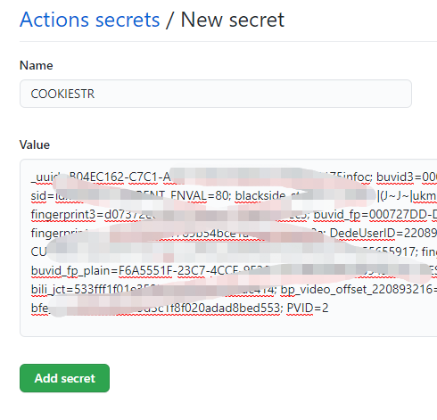
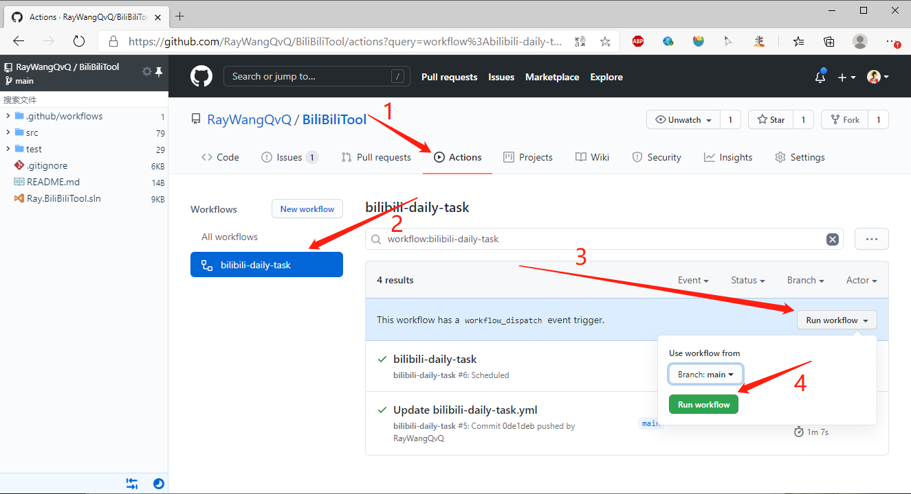
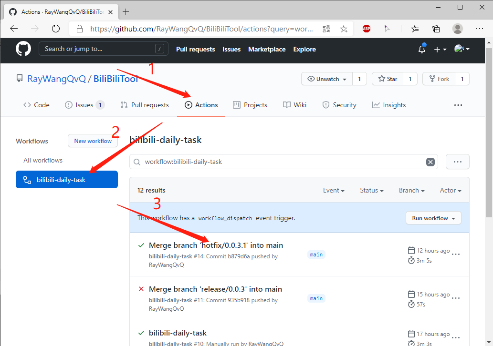
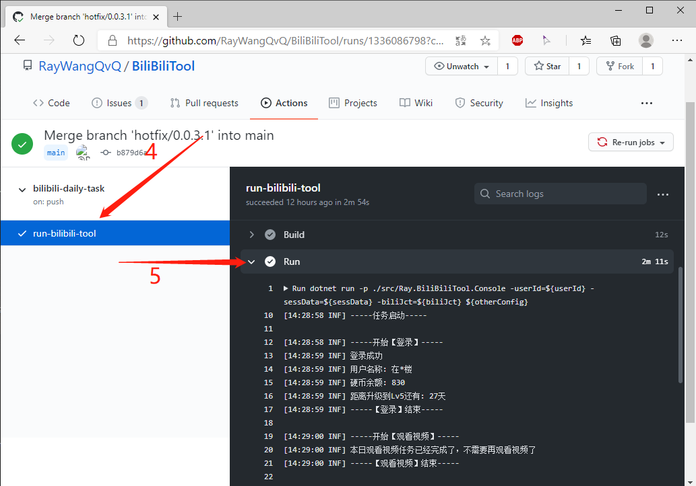

# GitHub Actions 部署

<!-- TOC depthFrom:2 -->

- [介绍](#介绍)
- [步骤](#步骤)
    - [复刻项目](#复刻项目)
    - [添加 Secrets 配置](#添加-secrets-配置)
    - [测试运行 Actions](#测试运行-actions)
- [其他](#其他)

<!-- /TOC -->

## 介绍
GA 是微软（巨硬）收购 G 站之后新增的内置 CI/CD 方案，其核心就是一个可以运行脚本的小型服务器。

有了它，我们就可以实现每天线上自动运行我们的应用程序，通过配置还可以实现版本的自动同步更新。

## 步骤
### 复刻项目
首先点击本页面右上角的 fork 按钮，复刻本项目到自己的仓库

### 添加 Secrets 配置
进入自己 fork 的仓库，点击 Settings-> Secrets-> New Secrets， 添加 1 个 Secrets，其名称为`COOKIESTR`，值为刚才我们保存的 `cookie 字符串`。它们将作为配置项，在应用启动时传入程序。

### 测试运行 Actions
刚 Fork 完，所有 Actions 都是默认关闭的，都配置好后，需要手动点击 Enable 开启 Actions。开启后请手动执行一次工作流，验证是否可以正常工作，操作步骤如下图所示：

运行结束后，请查看运行日志：

## 其他
Actions 的执行策略默认是每天 0 点整触发运行，如要设置为指定的运行时间，请详见下面**常见问题**章节中的《**Actions 如何修改定时任务的执行时间？**》

**建议每个人都设置下每日执行时间！不要使用默认时间！最好也不要设定在整点，错开峰值，避免 G 站的同一个IP在相同时间去请求 B 站接口，导致 IP 被禁！**

**应用运行后，会进行0到30分钟的随机睡眠，是为了使每天定时运行时间在范围内波动。刚开始如果需要频繁调试，建议使用empty-task.yml来调试，或者参考下面的个性化自定义配置章节，将睡眠配置为1分钟，避免每次测试都需要等待半小时**
