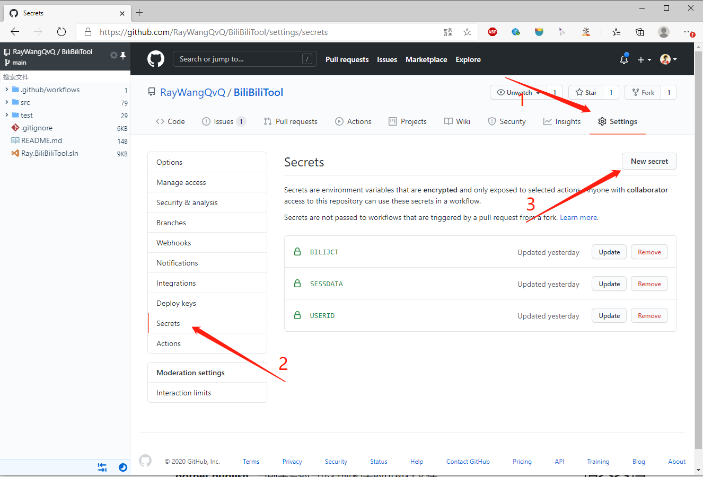
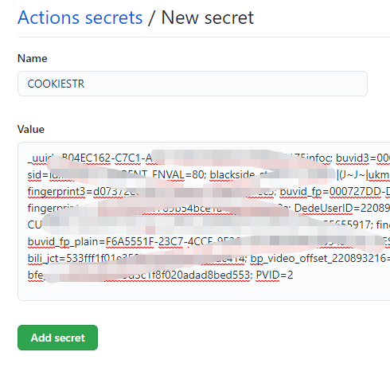
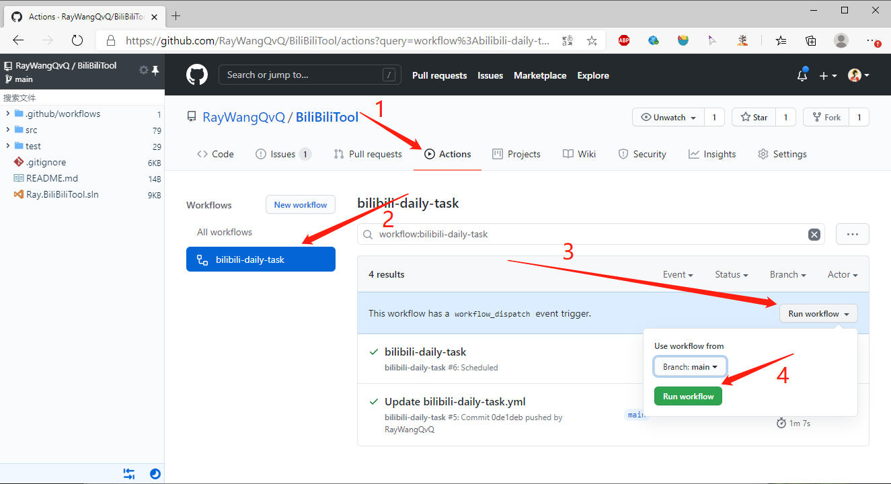
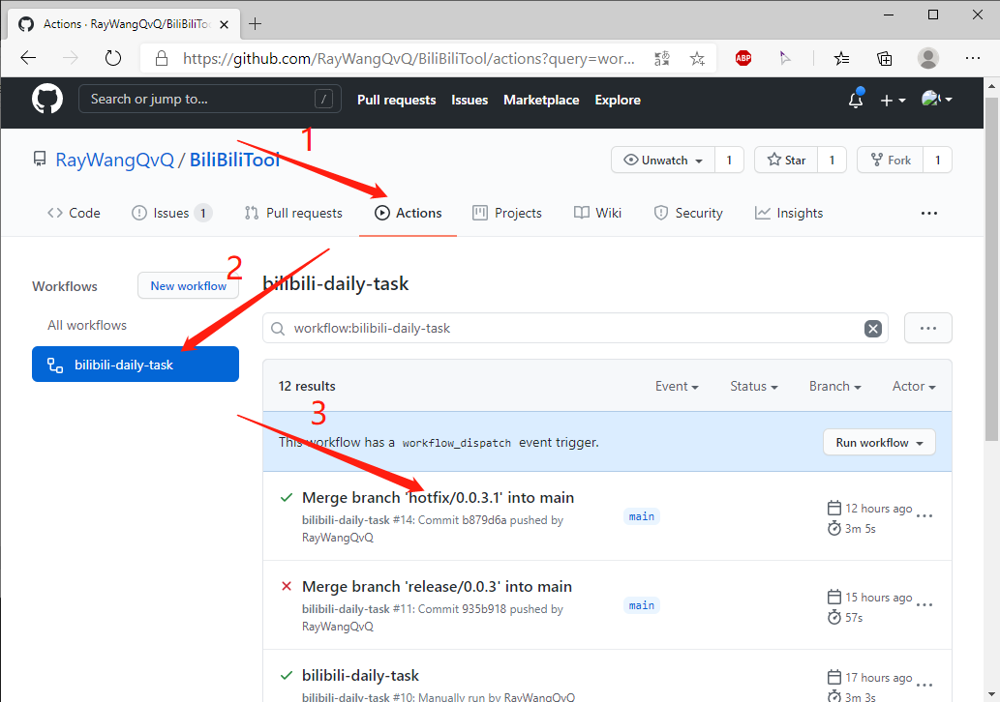
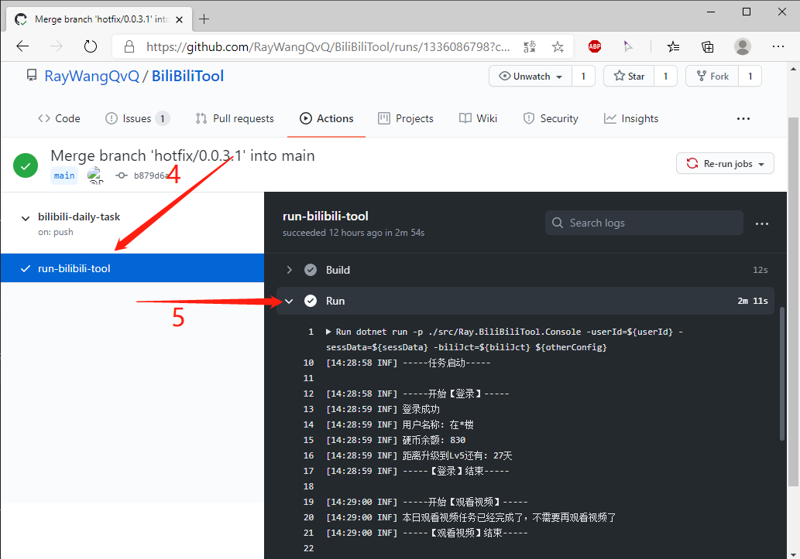

# GitHub Actions task runner (archived)

> **Archived recipe — not deployable as-is.** The Bilibili task workflows exist only under [`bak/`](./bak/), not under `.github/workflows/`. GitHub Actions will not discover or run workflows from `platforms/gitHubActions/bak/`. The root [`.github/workflows/`](../../.github/workflows/) contains CI, release, fork-sync, and Tencent SCF workflows, but no Bilibili daily-task runner. Forking the repository, enabling Actions, and adding `COOKIESTR` **will not** run Bilibili tasks.

This page preserves the original setup intent and screenshots for historical reference; it is not an installation walkthrough for a supported current deployment. The archived [daily](./bak/bilibili-daily-task.yml), [live-lottery](./bak/live-lottery-task.yml), [unfollow](./bak/unfollow-batched-task.yml), and [manual/empty](./bak/empty-task.yml) YAML files need review and updates before anyone could use them. In particular, they install .NET 6 while the project targets .NET 10; the daily task's pre-check references `IsOpenDailyTask` without defining it, and the older workflows use deprecated `::set-output` syntax. Do **not** copy them into `.github/workflows/` and assume they will run.

## Historical setup: fork the repository

The old instructions started by forking the repository. A fork alone contains only the archived task YAML under `bak/`, so there is no task runner to enable. The separate [fork-sync workflow](../../.github/workflows/sync-fork-with-upstream.yml) targets `main` and requires a `PAT` secret; it synchronizes source, **not** task execution.

## Historical setup: configure secrets

The archived daily-task workflow maps the `COOKIESTR` repository secret to `Ray_BiliBiliCookies__1` (and `COOKIESTR2` / `COOKIESTR3` to additional accounts). The old UI path was **Settings → Secrets and variables → Actions → New repository secret**. Treat Cookies as sensitive credentials. **No active task workflow reads these secrets**; do not add them merely to follow this archived guide.

## Historical workflow screenshots

The screenshots below show how the old task workflow was manually started and how its logs appeared. **There is no matching task workflow in the current Actions tab.** Enabling Actions on a fork does not restore it. The existing Tencent SCF deploy workflow is a different deployment target.

## Historical scheduling and startup delay

The archived [daily YAML](./bak/bilibili-daily-task.yml) schedules `0 16 * * *` (16:00 UTC, midnight in UTC+8) and the old instructions recommended avoiding the hour to spread API traffic. The archived [`empty-task.yml`](./bak/empty-task.yml) was a manually triggered test task. Neither runs from its current location. The old instructions also described a 0–30 minute random startup delay, but the console's checked-in `appsettings.json` currently sets `Security:RandomSleepMaxMin` to `0`; do not rely on the old default. A newly written workflow would need its own verified schedule, current .NET setup, and configuration.

For an existing GitHub Actions deployment path, see the separate [SCF deployment guide](../tencentScf/README.md); its workflow deploys a cloud function and is **not** a daily Bilibili task runner.
