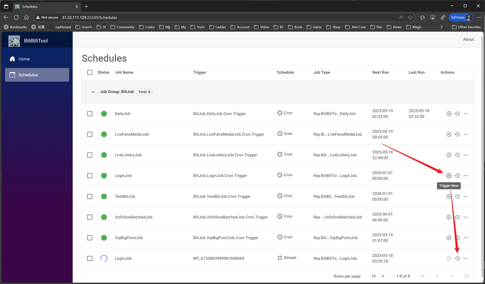
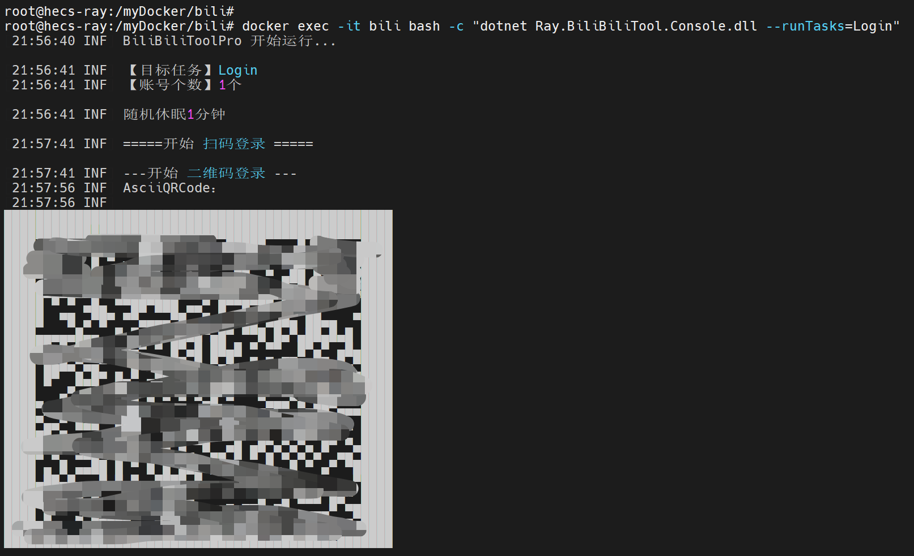

# Podman deployment

Run the Web container with Podman instead of Docker.

## Prerequisites

Install [Podman](https://podman.io/) and check your setup:

```bash
podman -v
podman info
```

On systems that use a Podman machine, initialize and start it first:

```bash
podman machine init
podman machine start
podman info
```

Podman can coexist with Docker and uses similar commands. Create host directories before mounting them; do not assume Podman will create missing bind-mount directories.

## Run the container

### Minimal example

This starts the container without publishing the Web port or persisting its data. Use the full example below for Web access and persistent account storage.

```bash
podman run -itd --name="bili_tool_web" docker.io/zai7lou/bili_tool_web
podman logs -f bili_tool_web
```

### Full example

```bash
mkdir -p /bili_tool_web && cd /bili_tool_web
mkdir -p Logs config
podman run -itd --name="bili_tool_web" \
    -p 22330:8080 \
    -v "$(pwd)/Logs:/app/Logs" \
    -v "$(pwd)/config:/app/config" \
    -e DailyTaskConfig__Cron="0 0 15 * * ?" \
    -e LiveLotteryTaskConfig__Cron="0 0 22 * * ?" \
    -e UnfollowBatchedTaskConfig__Cron="0 0 6 1 * ?" \
    -e VipBigPointConfig__Cron="0 7 1 * * *" \
    -e DailyTaskConfig__NumberOfCoins="5" \
    docker.io/zai7lou/bili_tool_web
podman logs -f bili_tool_web
```

The Web panel stores accounts in `config/BiliBiliTool.db` rather than reading `config/cookies.json`. Re-add accounts held only in an older JSON file through the panel; the file is not migrated or deleted automatically.

```bash
podman ps -a
podman exec -it bili_tool_web /bin/bash
```

## Sign in and add an account

For the full example, open the Web panel on port `22330`. The initial username is `admin` and password is `BiliTool@2233`; change the password on the **Admin** page after first sign-in. Scan the QR code to add your account.





## Build your own image (optional)

The example pulls the [published Docker Hub image (`zai7lou/bili_tool_web`)](https://hub.docker.com/repository/docker/zai7lou/bili_tool_web). To build from source, run this at the repository root (which contains `Dockerfile`):

```bash
podman build -t TARGET_NAME .
```

Replace `TARGET_NAME` with your chosen image name and tag. Podman uses the same Dockerfile as the Docker deployment.
