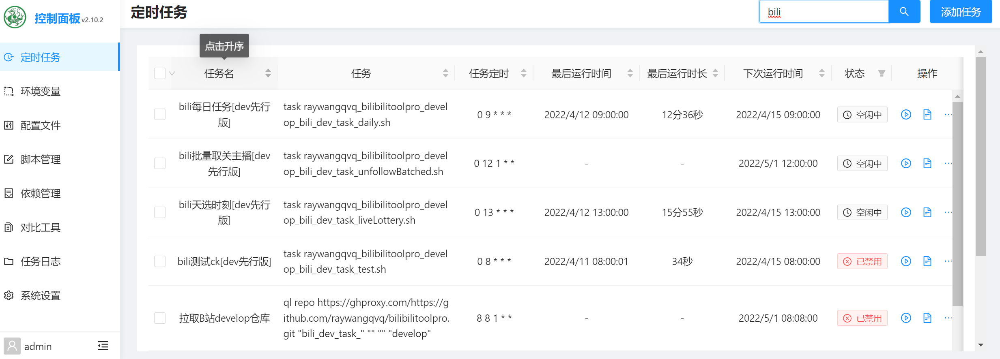
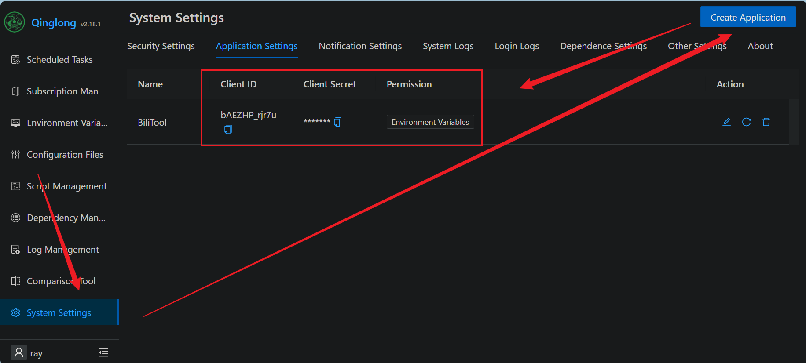
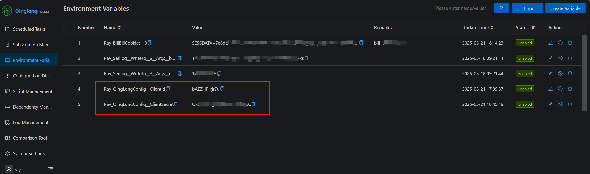
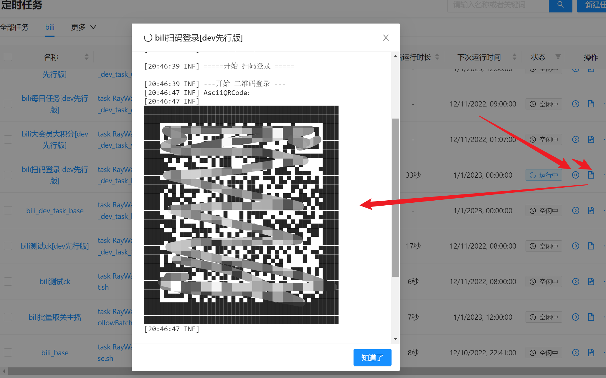
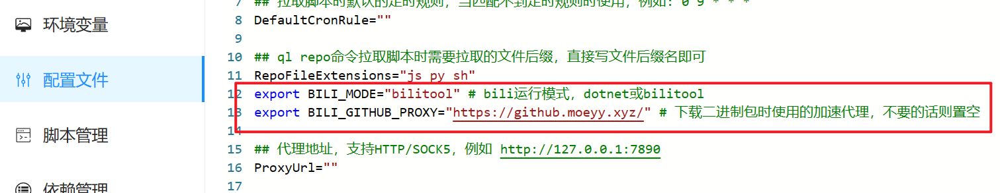

# Run with Qinglong

Qinglong pulls this repository, registers cron tasks from the shell scripts, and runs them using either a .NET 10 SDK installed in the panel container or a prebuilt `bilitool` binary. Start with a working Qinglong panel.

## Set up the repository

### Allow shell scripts

In Qinglong's **Configuration File** page, change `RepoFileExtensions="js py"` to:

```text
RepoFileExtensions="js py sh"
```

Save the configuration.

### Add a repository pull task

Choose **one** of these methods.

**Subscription Management:** Create a subscription with the following fields; leave other settings unchanged:

```text
Name: Bilibili
Type: Public repository
URL: https://github.com/RayWangQvQ/BiliBiliToolPro.git
Schedule type: crontab
Schedule: 2 2 28 * *
Whitelist: bili_task_.+\.sh
File extension: sh
```

Save and run the subscription once.

**Scheduled Tasks:** In **Scheduled Tasks → Add Task**, enter:

```text
Name: Pull Bili repository
Command: ql repo https://github.com/RayWangQvQ/BiliBiliToolPro.git "bili_task_"
Schedule: 2 2 28 * *
```

Save and run the pull task once.

### Check the scheduled tasks

After a successful pull, Qinglong should register the Bilibili task scripts.



## Optional: enable automatic Cookie persistence

To let QR sign-in save Cookies to Qinglong environment variables, set up an application with panel API access. See the [Qinglong API preparation instructions](https://qinglong.online/api/preparation).

1. In Qinglong, go to **System Settings → Application Settings** and create an application.

   

2. Add its two values as environment variables named `Ray_QingLongConfig__ClientId` and `Ray_QingLongConfig__ClientSecret`.

   

## Sign in to Bilibili

Run the **bili扫码登录** (Bili QR sign-in) task in Qinglong. Scan the QR code displayed in its log.



With the application configured, the Cookie is saved to Qinglong's environment variables:


Without it, copy the Cookie printed in the log and add it to the panel's environment variables manually. The first task run may take longer while the runtime is installed.

## Early builds

Repository pulls should use `main`. The former `develop` branch and `dev/bili_dev_task_*` scripts have been removed. For unreleased changes, the alpha channel publishes the `zai7lou/bili_tool_web:alpha` **Docker image**, not a `bilitool` binary. It is a separate Docker deployment, not an alternate Qinglong pull branch.

## Slow GitHub downloads

If GitHub access from the server is slow, you may prefix the repository URL with a proxy, for example:

```text
https://github.moeyy.xyz/https://github.com/RayWangQvQ/BiliBiliToolPro.git
https://gh-proxy.com/https://github.com/RayWangQvQ/BiliBiliToolPro.git
```

Third-party proxy availability is not guaranteed.

## Troubleshooting

### .NET installation fails

`dotnet` mode requires the .NET 10 SDK. The scripts check the installed version and install or upgrade it if needed. Qinglong has Alpine (`whyour/qinglong:latest`) and Debian (`whyour/qinglong:debian`) image variants; check the actual OS version inside your container. On Alpine, the scripts use the `dotnet10-sdk` package when the image is Alpine 3.23 or newer. On an older Alpine image, upgrade it or switch to `bilitool` mode.

SDK detection accepts a single version or multiple SDK-list rows, including installation paths. It still checks `dotnet --version` in the current directory: a `global.json` selection failure or a selected SDK below .NET 10 is not treated as a usable installation merely because `dotnet --list-sdks` contains a newer SDK.

Add these lines in the panel **Configuration File** to use a release binary instead:

```bash
export BILI_MODE="bilitool" # dotnet or bilitool
export BILI_GITHUB_PROXY="https://github.moeyy.xyz/" # optional binary-download proxy; use "" to disable
```



`bilitool` release binaries are published with stable releases; alpha builds publish Docker images only.

### No valid ICU package found

If the task reports `Couldn't find a valid ICU package installed on the system` (see issue #266), add this Qinglong environment variable:

```text
Name: DOTNET_SYSTEM_GLOBALIZATION_INVARIANT
Value: 1
```

### Missing files or unexpected paths

Enter the Qinglong container (`docker exec -it qinglong bash`) and inspect `/ql/data/repo` (or `/ql/repo` on older installations), `/ql/scripts`, and `/ql/shell`. The repository checkout, scheduled scripts, and Qinglong shell scripts respectively live in those locations; verify the paths in your installation rather than relying on a fixed layout.

### Inotify instance limit reached

For `The configured user limit (128) on the number of inotify instances has been reached`, add:

```text
DOTNET_USE_POLLING_FILE_WATCHER=1
```

This changes .NET configuration-change watching from inotify events to polling.
