# Tencent Cloud Function (SCF) deployment

The repository includes a [CustomRuntime configuration](./serverless.yml), bootstrap scripts, a [publish script](./publish.sh), and a [GitHub Actions deployment workflow](../../.github/workflows/deploy-tencent-scf.yml). See [Tencent Cloud's SCF documentation](https://cloud.tencent.com/document/product/583) for platform details.

> **Compatibility check:** This is a console-based deployment, separate from the current Web image. The SCF workflow uses Node.js 16 and `publish.sh` builds the console without explicitly installing .NET 10 in the workflow; check tool availability and supported runtime versions before relying on automatic deployment. Cloud pricing and quotas change: verify the current terms in your own account rather than assuming use is free.

## Create and activate an account

Register with Tencent Cloud and activate SCF in your account. Check its current pricing, quotas, and logging charges before deploying.

## Option 1: deploy from GitHub Actions

This workflow can be triggered manually. Its schedule runs on Monday, Wednesday, and Friday at `02:00 UTC` **only if** `IS_AUTO_DEPLOY_TENCENT_SCF` is set to `true`.

### Fork and obtain credentials

Fork this repository. Follow [Tencent Cloud's authorization guidance](https://cloud.tencent.com/document/product/1154/43006) and create credentials in [CAM API key management](https://console.cloud.tencent.com/cam/capi). Use a suitably restricted identity rather than sharing a root-account key. Save its `SecretId` and `SecretKey` securely.

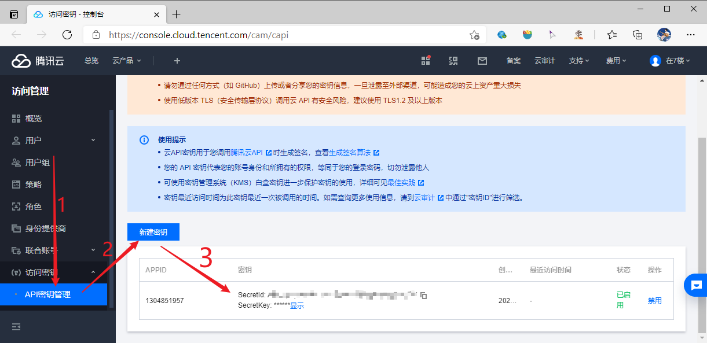

### Configure repository secrets

In your fork's **Settings → Secrets and variables → Actions**, add:

| Secret | Purpose |
| --- | --- |
| `TENCENT_SECRET_ID` | Tencent Cloud `SecretId` |
| `TENCENT_SECRET_KEY` | Tencent Cloud `SecretKey` |
| `TENCENT_SERVERLESS_YML` | Entire customized contents of [`serverless.yml`](./serverless.yml) |
| `IS_AUTO_DEPLOY_TENCENT_SCF` | Set to `true` to enable scheduled deployment; not required for manual dispatch |

Edit a local copy of `serverless.yml` first, especially `inputs.region`, function settings, triggers, and `inputs.environment.variables`. The checked-in example includes a **placeholder** Cookie; replace it with your own secret value before deploying:

```yaml
  environment:
    variables:
      Ray_BiliBiliCookies__1: "your Cookie"
      Ray_Security__RandomSleepMaxMin: 20
      Ray_Security__IntervalSecondsBetweenRequestApi: 20
```

Other console configuration (for example user agent, notifications, or `Ray_DailyTaskConfig__NumberOfCoins`) belongs in this environment-variable map, **not** in individual GitHub secrets such as `NUMBEROFCOINS`. See [configuration](../../docs/configuration.md) for the relevant settings. Keep YAML indentation correct; this [YAML introduction](https://www.runoob.com/w3cnote/yaml-intro.html) may help. See the [component configuration reference](https://github.com/serverless-components/tencent-scf/blob/master/docs/configure.md) for other SCF settings.

**Security note:** The current workflow writes `TENCENT_SERVERLESS_YML` to a file and also echoes its contents in an Actions step. Placing a live Cookie in that secret may expose it in logs unless masking applies. Inspect and harden the workflow before using this approach; do not assume arbitrary secret contents will be redacted. The legacy example's Cookie requirement depends on how your console deployment authenticates.

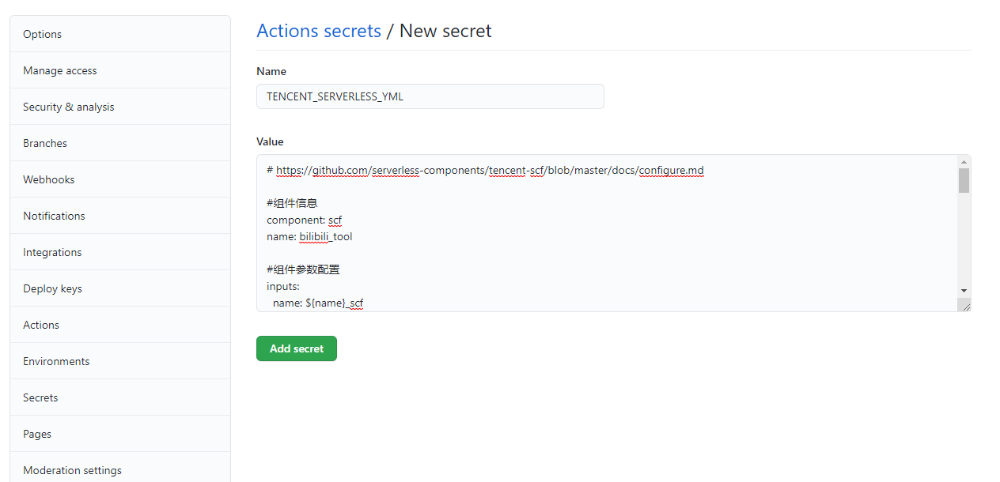

If using automatic deployment, keep your fork up to date separately. The [fork-sync workflow](../../.github/workflows/sync-fork-with-upstream.yml) uses a `PAT` secret; enabling SCF's schedule does not by itself pull upstream changes.

In your fork, open **Actions → Deploy Tencent SCF → Run workflow**. The workflow checks out the repository, installs the Serverless Cloud Framework CLI, runs `platforms/tencentScf/publish.sh`, and calls `scf deploy`. Review its result and check the function in the cloud console.

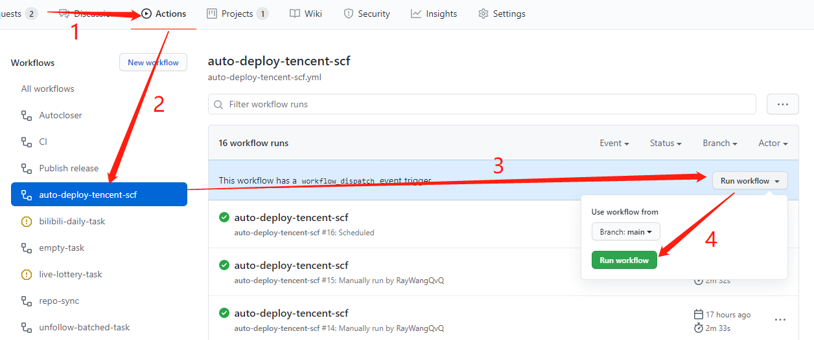

## Option 2: upload a release ZIP

This deploys a fixed version; repeat the upload to update it. Find a `bilibili-tool-pro-v<version>-tencent-scf.zip` asset on the [releases page](https://github.com/RayWangQvQ/BiliBiliToolPro/releases) **if one is available**. The current `scripts/publish.sh` names SCF archives this way; the old guide's `tencent-scf.zip` name belongs to the separate older `platforms/tencentScf/publish.sh`. Verify your chosen release actually includes the SCF asset.

### Create a function

In the [SCF console](https://console.cloud.tencent.com/scf/), go to **Function Service**, select a region, and create a custom function:

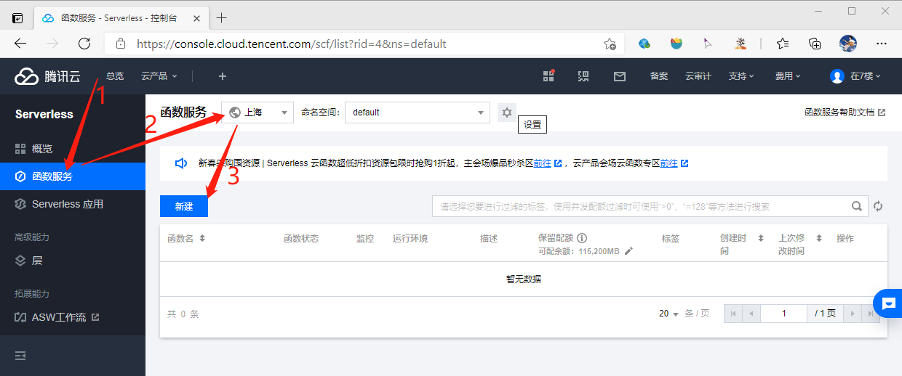

- Creation method: **Custom creation**
- Function name: `bilibili_tool` (example)
- Runtime: **CustomRuntime**
- Upload: local ZIP, selecting the downloaded SCF archive
- Handler: `index.main_handler`

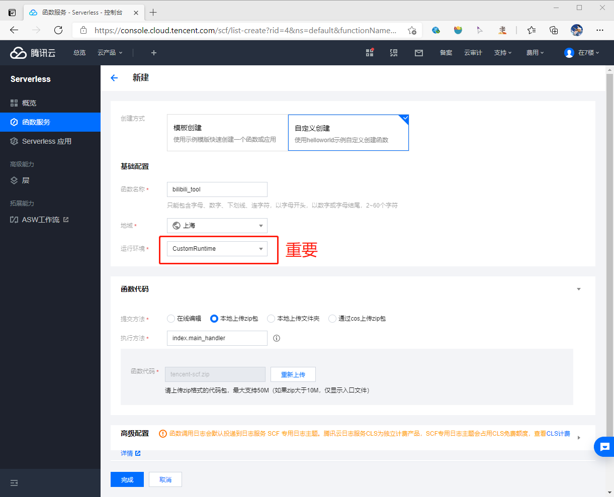

In advanced settings, the legacy example used initialization timeout `30`, execution timeout `86400`, and these environment variables:

| Key | Example value | Purpose |
| --- | --- | --- |
| `Ray_BiliBiliCookies__1` | Your Cookie string | Account credential |
| `Ray_Security__RandomSleepMaxMin` | `0` | Disable random delay while testing |
| `Ray_RunTasks` | `Test` | Run a test task on first invocation |

Check the currently allowed timeout and async limits in your SCF account; do not ignore console validation errors. Once tested, remove `Ray_RunTasks` to let trigger payloads select tasks.

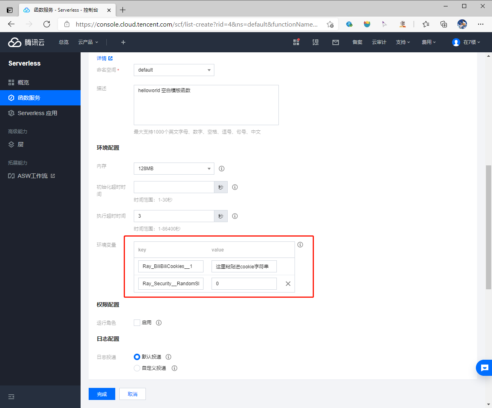

The old procedure also enabled **Async execution** and **Status tracking** in execution settings before creating the function:

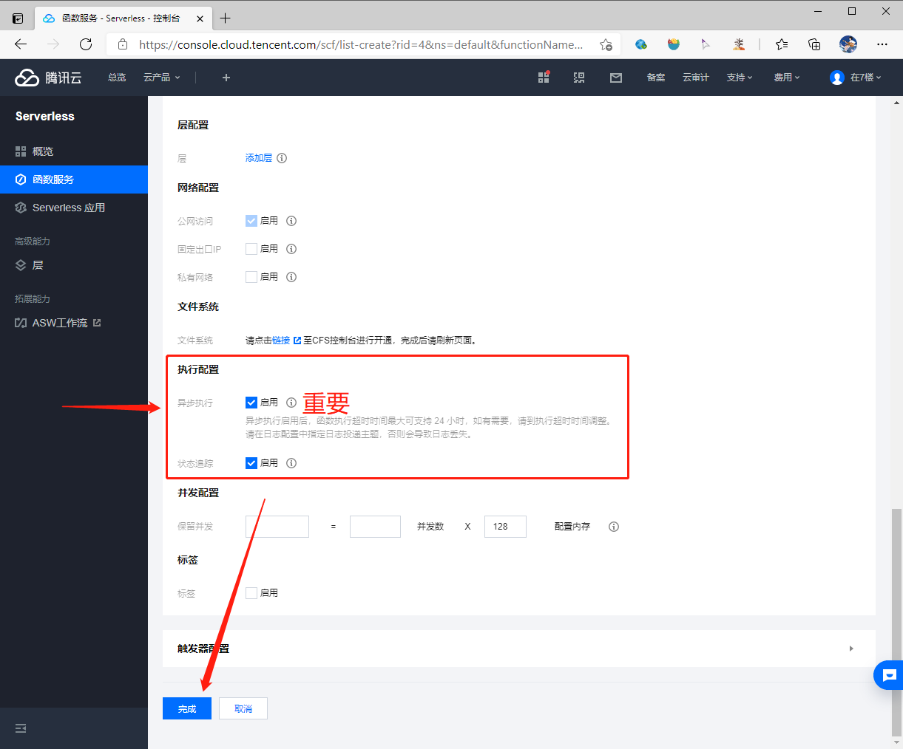

### Test and schedule

Use the **Function Code → Test** control and inspect the output log:

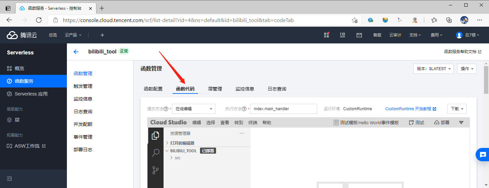

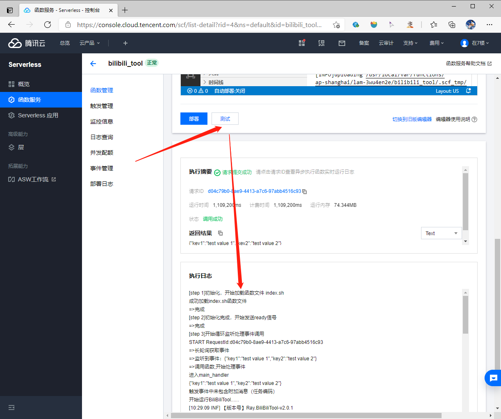

After the test, remove the temporary `Ray_RunTasks=Test` variable. Under **Trigger Management**, create an enabled timer trigger, for example one named `DailyTask`, with a schedule you have checked against the console's cron format and time zone. The former manual example used `10 15 * * *` for a 15:10 daily run; the checked-in [`serverless.yml`](./serverless.yml) uses its own **seven-field** `cronExpression` values, so do not copy expressions between interfaces without checking the expected format. Set the trigger's additional information to `Daily`, or join task codes with `&` (for example `Daily&LiveLottery`). The [runtime handler](./index.sh) reads the trigger message and passes it as `--runTasks`.

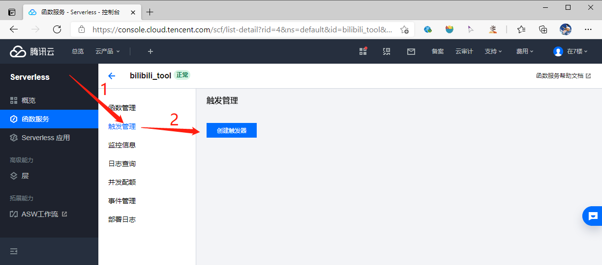

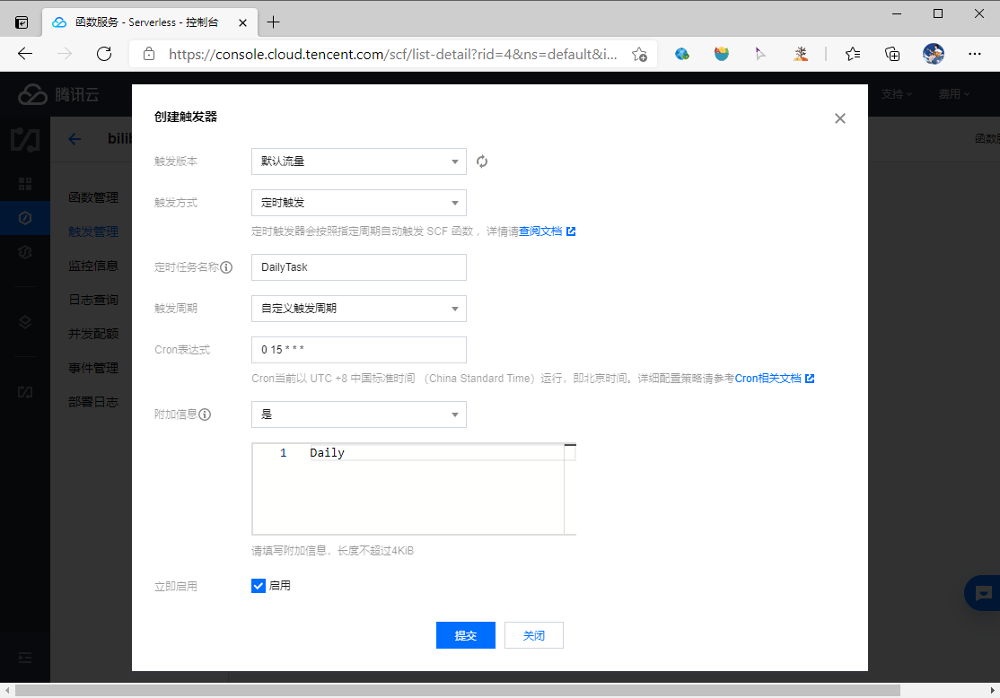

## Logs and cost

SCF logging through Tencent Cloud CLS may incur charges. The following older screenshots show documentation, an example bill, and the CLS interface; they are not a guarantee of a current free allowance:

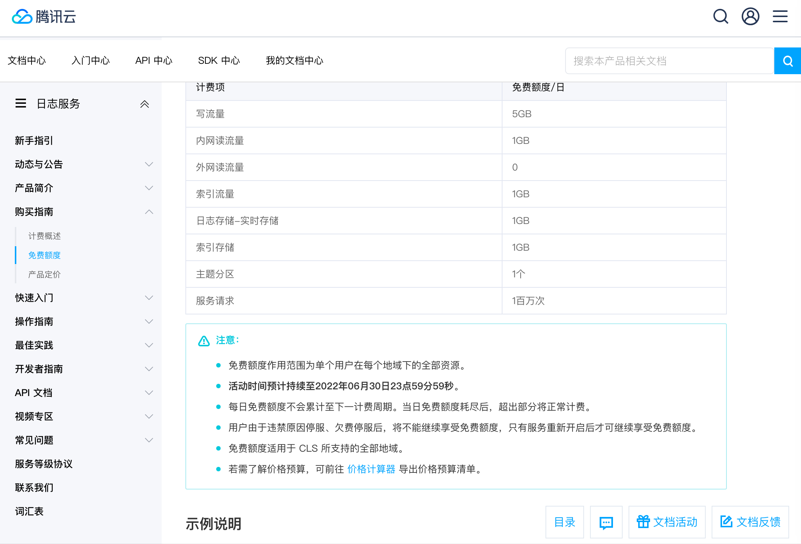

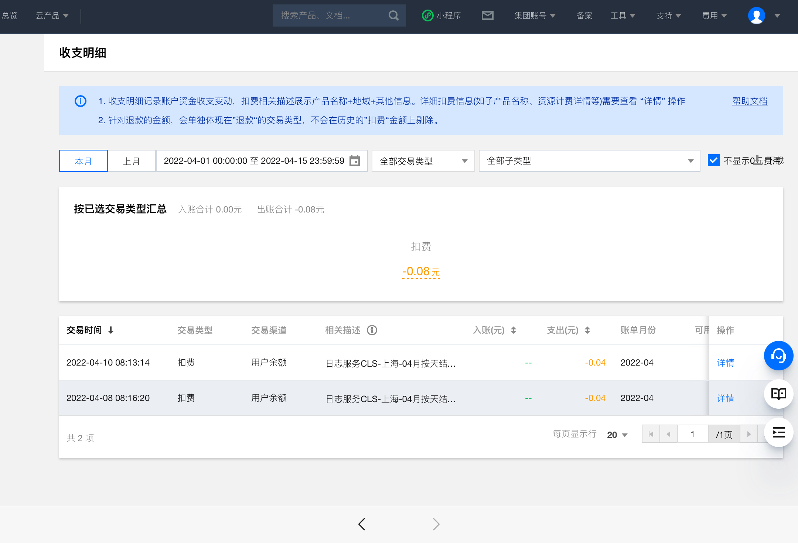

Check [CLS](https://console.cloud.tencent.com/cls/overview), including the **Log Topics** for your function's region:

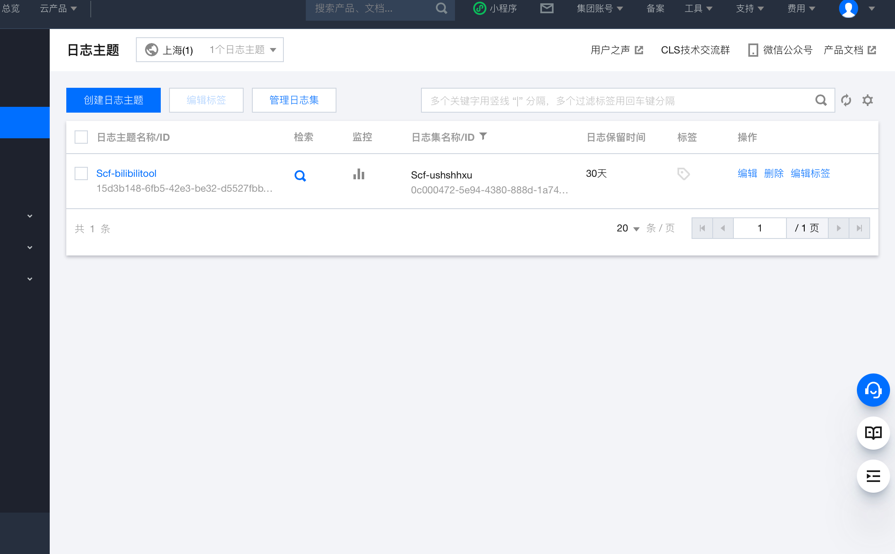

The old guide recommended deleting the function's log topic to prevent log charges. **Do not delete logging blindly:** it removes diagnostic history and may not eliminate every cost. Review current billing and logging settings in your own Tencent Cloud account first.
