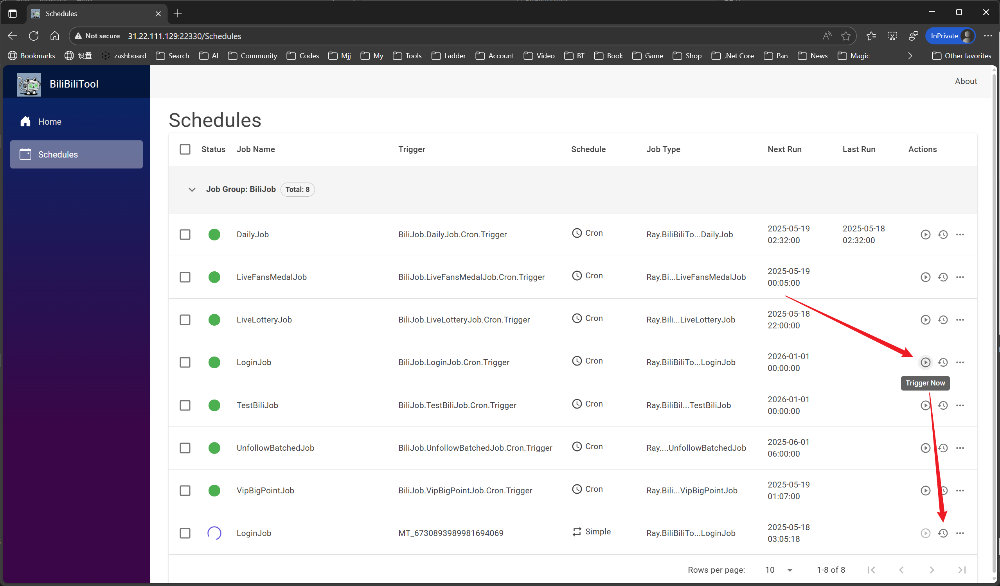

# Podman 使用说明
<!-- TOC depthFrom:2 -->

- [1. 前期工作](#1-前期工作)
    - [1.1. Podman环境](#11-podman环境)
    - [从Docker迁移](#从docker迁移)
- [2. 运行容器](#2-运行容器)
    - [2.1. 极简版](#21-极简版)
    - [2.2. 综合版](#22-综合版)
- [登录](#登录)
- [3. 自己构建镜像（非必须）](#3-自己构建镜像非必须)
- [4. 其他](#4-其他)

<!-- /TOC -->

## 1. 前期工作

### 1.1. Podman环境

请确认已安装了Podman所需环境（[Podman](https://podman.io/)

安装完成后，请执行`podman -v`检查是否安装成功，请执行`podman info`检查虚拟机环境是否正常。

常用命令参考：

```
# 查看版本
podman -v

# 初始化虚拟机
podman machine init

# 启动虚拟机
podman machine start

# 查看信息
podman info
```

### 从Docker迁移

Podman可以和Docker共存，命令也基本可以通用。

但挂载逻辑有点区别，podman挂载时，如果宿主机下没有指定的文件夹，podman不会像docker一样去自动创建文件夹，而是会报异常。

所以在挂载文件夹时，需要先手动在宿主机上mkdir创建文件夹。

## 2. 运行容器

以下提供极简版和综合版两个版本，一个简单一个复杂，供参考

### 2.1. 极简版

```
# 生成并运行容器
podman run -itd --name="bili_tool_web" docker.io/zai7lou/bili_tool_web

# 查看实时日志
podman logs -f bili_tool_web
```

### 2.2. 综合版

```
# 创建文件和文件夹
mkdir -p /bili_tool_web && cd /bili_tool_web
mkdir -p Logs

# 下载appsettings.json
mkdir -p config
cd ./config
wget https://raw.githubusercontent.com/RayWangQvQ/BiliBiliToolPro/main/docker/sample/config/cookies.json
cd ..

# 运行
podman run -itd --name="bili_tool_web" \
    -v ./Logs:/app/Logs \
    -v ./config:/app/config \
    -e DailyTaskConfig__Cron="0 0 15 * * ?" \
    -e LiveLotteryTaskConfig__Cron="0 0 22 * * ?" \
    -e UnfollowBatchedTaskConfig__Cron="0 0 6 1 * ?" \
    -e VipBigPointConfig__Cron="0 7 1 * * *" \
    -e DailyTaskConfig__NumberOfCoins="5"
    docker.io/zai7lou/bili_tool_web

# 查看实时日志
podman logs -f bili
```

其他指令参考：

```
# 查看容器运行状态
podman ps -a

# 进入容器
podman exec -it bili bash
```

## 登录

扫码进行登录。




## 3. 自己构建镜像（非必须）

目前我提供和维护的镜像：`[zai7lou/bilibili_tool_web](https://hub.docker.com/repository/docker/zai7lou/bilibili_tool_web)`;

如果有需要（大部分都不需要），可以使用源码自己构建镜像，如下：

在有项目的Dockerfile的目录运行

`podman build -t TARGET_NAME .`

 `TARGET_NAME`为镜像名称和版本，可以自己起个名字

## 4. 其他

镜像使用的是docker仓库的镜像。
