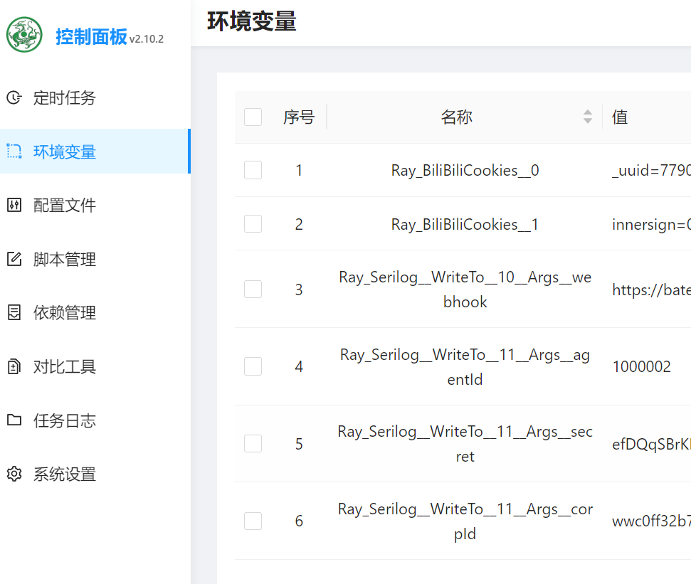

# 在青龙中运行

总体思路是，在青龙容器中安装 dotnet 环境，利用青龙的拉库命令，拉取本仓库源码，添加cron定时任务，定时运行相应的Task。

开始前，请先确保你的青龙面板是运行正常的。

<!-- TOC depthFrom:2 -->

- [1. 步骤](#1-步骤)
    - [1.1. 登录青龙面板并修改配置](#11-登录青龙面板并修改配置)
    - [1.2. 在青龙面板中添加拉库定时任务](#12-在青龙面板中添加拉库定时任务)
        - [1.2.1. 订阅管理](#121-订阅管理)
        - [1.2.2. 定时任务拉库](#122-定时任务拉库)
    - [1.3. 登录](#13-登录)
- [2. 先行版](#2-先行版)
    - [2.1. 订阅管理](#21-订阅管理)
    - [2.2. 定时任务拉库](#22-定时任务拉库)
- [3. GitHub加速](#3-github加速)
- [4. 常见问题](#4-常见问题)
    - [4.1. Couldn't find a valid ICU package installed on the system](#41-couldnt-find-a-valid-icu-package-installed-on-the-system)

<!-- /TOC -->

## 1. 步骤

### 1.1. 登录青龙面板并修改配置
青龙面板，`配置文件`页。

修改 `RepoFileExtensions="js py"` 为 `RepoFileExtensions="js py sh"`

保存配置。

### 1.2. 在青龙面板中添加拉库定时任务

两种方式：
#### 1.2.1. 订阅管理

```
名称：Bilibili
类型：公开仓库
链接：https://github.com/RayWangQvQ/BiliBiliToolPro.git
定时类型：crontab
定时规则：2 2 28 * *
白名单：bili_task_.+\.sh
文件后缀：sh
```

没提到的不要动。

保存后，点击运行按钮，运行拉库。

#### 1.2.2. 定时任务拉库
青龙面板，`定时任务`页，右上角`添加任务`，填入以下信息：

```
名称：拉取Bili库
命令：ql repo https://github.com/RayWangQvQ/BiliBiliToolPro.git "bili_task_"
定时规则：2 2 28 * *
```

点击确定。

保存成功后，找到该定时任务，点击运行按钮，运行拉库。

如果正常，拉库成功后，同时也会自动添加bilibili相关的task任务。


### 1.3. 登录

在青龙定时任务中，点击运行`bili扫码登录`任务，查看运行日志，扫描日志中的二维码进行登录。


登录成功后，会将cookie保存到青龙的环境变量中：



首次运行会自动安装dotnet环境，时间久点，之后就不需要重复安装了。

## 2. 先行版

青龙拉库时可以指定分支，develop分支的代码会超前于默认的main分支，包含当前正在开发的新功能。

想提前体验新功能的朋友可以尝试切换先行版，但同时也意味着稳定性会相应降低（其实是相当于在帮我内测测试bug了~🤨）。

方式有两种：

### 2.1. 订阅管理

```
分支：develop
白名单：bili_dev_task_.+\.sh
```

其他选项同上。

### 2.2. 定时任务拉库

修改拉库命令为`ql repo https://github.com/RayWangQvQ/BiliBiliToolPro.git "bili_dev_task_" "" "" "develop"`

## 3. GitHub加速
拉库时，如果服务器在国内，访问GitHub速度慢，可以在仓库地址前加上 `https://ghproxy.com/` 进行加速, 如：`ql repo https://ghproxy.com/https://github.com/RayWangQvQ/BiliBiliToolPro.git "bili_task_"`

## 4. 常见问题

### 4.1. Couldn't find a valid ICU package installed on the system

如 #266 ，需要在青龙面板的环境变量添加如下环境变量：

```
名称：DOTNET_SYSTEM_GLOBALIZATION_INVARIANT
值：1
```