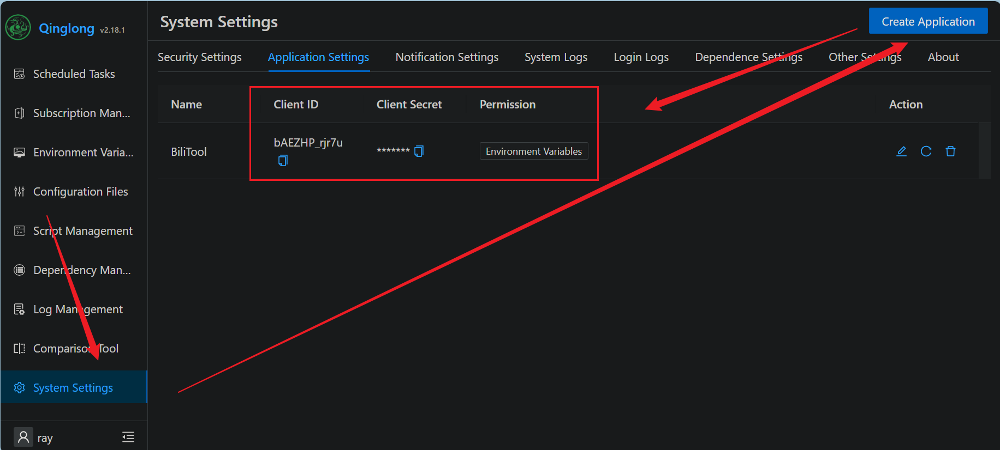
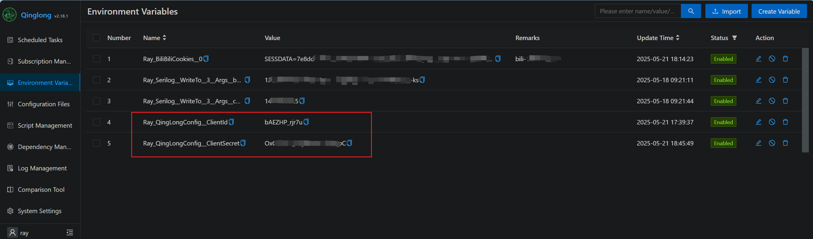
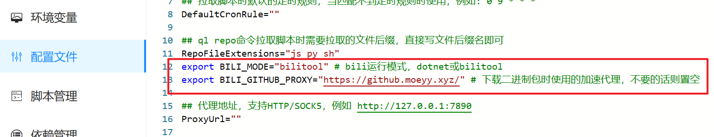

# 在青龙中运行

原理是，利用青龙的拉库命令，拉取本仓库源码，自动添加cron定时任务，然后在青龙容器中安装`dotnet`环境或`bilitool`的二进制包，定时运行相应的Task。

开始前，请先确保你的青龙面板是运行正常的。

<!-- TOC depthFrom:2 -->

- [1. 步骤](#1-步骤)
    - [1.1. 登录青龙面板并修改配置](#11-登录青龙面板并修改配置)
    - [1.2. 在青龙面板中添加拉库定时任务](#12-在青龙面板中添加拉库定时任务)
        - [1.2.1. 方式一：订阅管理](#121-方式一订阅管理)
        - [1.2.2. 方式二：定时任务拉库](#122-方式二定时任务拉库)
    - [1.3. 检查定时任务](#13-检查定时任务)
    - [1.4. 配置青龙Client Secret（可选）](#14-配置青龙client-secret可选)
        - [1.4.1. 新建 Application](#141-新建-application)
        - [1.4.2. 密钥配置到环境变量](#142-密钥配置到环境变量)
    - [1.5. Bili登录](#15-bili登录)
- [2. 先行版](#2-先行版)
- [3. GitHub加速](#3-github加速)
- [4. 常见问题](#4-常见问题)
    - [4.1. 安装dotnet失败怎么办法](#41-安装dotnet失败怎么办法)
    - [4.2. Couldn't find a valid ICU package installed on the system](#42-couldnt-find-a-valid-icu-package-installed-on-the-system)
    - [4.3. 提示文件不存在或路径异常，怎么排查](#43-提示文件不存在或路径异常怎么排查)
    - [4.4. The configured user limit (128) on the number of inotify instances has been reached](#44-the-configured-user-limit-128-on-the-number-of-inotify-instances-has-been-reached)

<!-- /TOC -->

## 1. 步骤

### 1.1. 登录青龙面板并修改配置
青龙面板，`配置文件`页。

修改 `RepoFileExtensions="js py"` 为 `RepoFileExtensions="js py sh"`

保存配置。

### 1.2. 在青龙面板中添加拉库定时任务

两种方式，任选其一即可：

#### 1.2.1. 方式一：订阅管理

```
名称：Bilibili
类型：公开仓库
链接：https://github.com/RayWangQvQ/BiliBiliToolPro.git
定时类型：crontab
定时规则：2 2 28 * *
白名单：bili_task_.+\.sh
文件后缀：sh
```

没提到的不要动。

保存后，点击运行按钮，运行拉库。

#### 1.2.2. 方式二：定时任务拉库
青龙面板，`定时任务`页，右上角`添加任务`，填入以下信息：

```
名称：拉取Bili库
命令：ql repo https://github.com/RayWangQvQ/BiliBiliToolPro.git "bili_task_"
定时规则：2 2 28 * *
```

点击确定。

保存成功后，找到该定时任务，点击运行按钮，运行拉库。

### 1.3. 检查定时任务

如果正常，拉库成功后，会自动添加bilibili相关的task任务。


### 1.4. 配置青龙Client Secret（可选）

扫码登录Bili后，需要有权限向青龙的环境变量中持久化Cookie，所以需要添加一个鉴权。

青龙官方说明：https://qinglong.online/api/preparation

#### 1.4.1. 新建 Application

青龙 -> 系统设置 -> 应用设置，点击新建。



#### 1.4.2. 密钥配置到环境变量

将上面2个值添加到环境变量中即可。

Name分别为：

- Ray_QingLongConfig__ClientId
- Ray_QingLongConfig__ClientSecret




### 1.5. Bili登录

在青龙定时任务中，点击运行`bili扫码登录`任务，查看运行日志，扫描日志中的二维码进行登录。


登录成功后，如果已配置了上述的Application，会将cookie保存到青龙的环境变量中：


如果未配置Application，会打印出cookie，请手动自己到环境变量中添加。

首次运行会自动安装环境，时间可能长一点，之后就不需要重复安装了。

## 2. 先行版

青龙拉库时可以指定分支，develop分支的代码会超前于默认的main分支，包含当前正在开发的新功能。

想提前体验新功能，或想要Bug能快速得到解决的朋友，可以尝试切换先行版，但同时也意味着稳定性会相应降低（其实可以忽略不计~🤨）。

```
分支：develop
白名单：bili_dev_task_.+\.sh
```

其他选项同上。

## 3. GitHub加速

拉库时，如果服务器在国内，访问GitHub速度慢，可在仓库地址前加上加速代理进行加速。

如：

```
https://github.moeyy.xyz/https://github.com/RayWangQvQ/BiliBiliToolPro.git
https://gh-proxy.com/https://github.com/RayWangQvQ/BiliBiliToolPro.git
...
```

加速代理地址通常不能保证长期稳定，请自行查找使用。

## 4. 常见问题

### 4.1. 安装dotnet失败怎么办法

首先，青龙有两个版本的镜像：

- alpine：whyour/qinglong:latest
- debian：whyour/qinglong:debian

安装dotnet失败的情况，几乎全发生在alpine版上。。。

所以，如果你“执迷不悟”，就是一定要用alpine版，那请先通过日志自行排查，不行就根据微软官方文档，进入qinglong容器后，手动安装。

如果还不行，那么可以切换到基于`bilitool`的二进制包运行方式，该方式不需要安装`dotnet`，方式：

编辑青龙面板的`配置文件`，新增如下两行：

```
export BILI_MODE="bilitool" # bili运行模式，dotnet或bilitool
export BILI_GITHUB_PROXY="https://github.moeyy.xyz/" # 下载二进制包时使用的加速代理，不要的话则置空
```



bilitool没有先行版的概念，因为只有main分支才会打包，更新会稍慢一点。

另外，alpine版的问题，我不建议来提交issue，因为已经大大超出本项目的scope了，建议可以去给alpine官方或微软的dotnet官方提交issue。

### 4.2. Couldn't find a valid ICU package installed on the system

如 #266 ，需要在青龙面板的环境变量添加如下环境变量：

```
名称：DOTNET_SYSTEM_GLOBALIZATION_INVARIANT
值：1
```

### 4.3. 提示文件不存在或路径异常，怎么排查

需要`docker exec -it qinglong bash`后，查看几个常用路径：

```
/ql
    /data
        /repo
    /scripts
    /shell
```

- `/ql/dada/repo`目录下存储了拉库后，bilitool的源代码
- `/ql/scripts`目录下存储了bilitool的定时运行脚本
- `/ql/shell`目录下是青龙的基础脚本

请cd到相应目录，查看该目录下文件是否存在，状态是否正常。

### 4.4. The configured user limit (128) on the number of inotify instances has been reached

报错：

```
Asp.Net Core - The configured user limit (128) on the number of inotify instances has been reached
```

可以尝试添加如下环境变量解决：

```
DOTNET_USE_POLLING_FILE_WATCHER=1
```

添加后，对配置变更事件的监听，会从监听 Linux 系统的 inotify 事件，变成定时轮询。